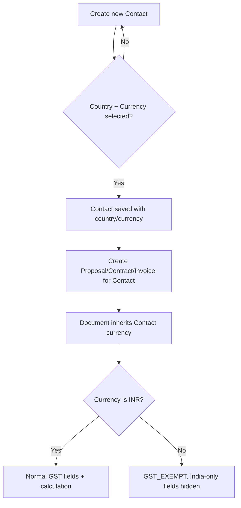

# Per-Contact Currency & Country Configuration

## Summary

Currency and country are currently a single global Workspace setting, and only Invoice has a per-document currency field at all (Proposal and Contract have none — both implicitly assume the workspace's currency). This forces a freelancer with a mix of Indian and international clients to manually override currency on every document, every time. This feature moves country/currency onto the Contact itself: set once when the contact is created, inherited automatically by every Proposal, Contract, and Invoice created for that contact afterward — including the GST auto-behavior that already exists at the workspace level (non-INR forces GST-exempt, India-only tax fields hide).

## Problem Frame

`Workspace.country` / `Workspace.currency` (`pakka-api/prisma/schema.prisma:84-85`) are the only place currency lives today. `Invoice` has its own `currency`/`exchangeRate` fields (`prisma/schema.prisma:629-632`) but they must be passed explicitly on every create call (`invoices.service.ts:101-106`) — nothing reads the workspace or the client automatically. `Proposal` and `Contract` have no currency field whatsoever; amounts are just numbers, and proposal-link emails hardcode `currency: 'INR'` (`proposals.service.ts:359,399`).

GST/tax behavior is already tightly coupled to this India/international distinction, just at the wrong scope: `invoices.service.ts:103-106` auto-forces `GstType.EXEMPT` when currency isn't INR, and `BusinessTab.tsx:157-241` hides India-only fields (tax label, UPI/IFSC, CGST/SGST) when country isn't India. A freelancer serving both markets today has to keep flipping these workspace-level settings back and forth, or manually override currency per document, because there is no concept of "this specific client is international" anywhere in the data model.

A client raised exactly this friction: they want to mark a contact as Indian or international once, and have currency (and by extension GST) follow automatically from then on — matching the freelancer's actual mixed client base.

## Key Decisions

- **Country/currency lives on the Contact, not per-document.** Set once at Contact creation; every Proposal/Contract/Invoice created for that contact inherits it automatically. No per-document override field is added in this pass — the earlier per-document Invoice `currency` field stays as the underlying storage mechanism, but the freelancer never has to touch it manually once the Contact is set.
- **GST auto-behavior follows the Contact's country/currency**, exactly as it does today at the workspace level — non-INR currency still auto-forces `GstType.EXEMPT`, India-only fields still hide for non-India contacts. Only the source of truth moves from `Workspace` to `Contact`.
- **New Contacts require an explicit country/currency choice at creation — no silent pre-fill.** This forces the freelancer to make the call once per client rather than accidentally inheriting the wrong default. Existing Contacts (created before this ships) are treated as the workspace's current country/currency until someone explicitly edits them — no forced migration, no nag screen.
- **Scope covers all three document types — Proposal, Contract, and Invoice** — not Invoice alone. This means Proposal and Contract both gain a `currency` field (mirroring Invoice's existing one), which is new schema work for those two models.
- **The Contact picker mirrors the existing Business Settings picker exactly**: a Country dropdown that auto-suggests a Currency, with Currency independently editable, over the same 5-currency set already supported on Invoice (INR/USD/EUR/GBP/AED). A simplified binary "Indian/International" toggle was considered and rejected — it can't distinguish a US client from a UK client, and the underlying data already supports more precision than that.
- **No retroactive relabeling.** Changing a Contact's currency after the fact does not touch any Proposal/Contract/Invoice already created for that contact — those keep whatever currency they were created with. Only documents created after the change use the new value.

## Actors

- A1. Freelancer / agency workspace owner — sets a Contact's country/currency at creation or via edit; creates Proposals, Contracts, and Invoices that inherit it.

## Key Flows

- F1. New Contact with forced currency choice
  - **Trigger:** Freelancer creates a new Contact.
  - **Steps:** Contact form requires Country + Currency selection (Country auto-suggests a Currency; Currency stays editable) → form cannot be submitted without a value → Contact is saved with that country/currency.
  - **Covers:** R1, R2, R6.

- F2. Document creation inherits Contact currency and GST behavior
  - **Trigger:** Freelancer creates a Proposal, Contract, or Invoice for an existing Contact.
  - **Steps:** document creation reads the Contact's currency → document is stored/rendered in that currency → GST fields (tax label, UPI/IFSC, CGST/SGST) and `GstType` auto-derive from the same India/international check already used today, just keyed off the Contact instead of the Workspace.
  - **Covers:** R4, R5, R7.

## Requirements

**Contact-Level Currency**

- R1. `Contact` gains `country` and `currency` fields, mirroring `Workspace.country` / `Workspace.currency` and the same 5-currency set already supported on `Invoice` (INR/USD/EUR/GBP/AED).
- R2. Creating a new Contact requires an explicit country + currency selection — the form does not submit with a silently-applied default.
- R3. Existing Contacts (created before this ships) read as the workspace's current country/currency until explicitly edited — no forced backfill, no migration prompt.

**Document Inheritance**

- R4. `Proposal` and `Contract` each gain a `currency` field, mirroring `Invoice.currency`.
- R5. Creating a new Proposal, Contract, or Invoice for a Contact automatically sets that document's currency to the Contact's currency at creation time — no manual re-selection required.
- R6. The Contact create/edit form's country/currency picker mirrors the existing Business Settings picker: a Country dropdown that auto-suggests a Currency via the same `getCountryDefaults()` logic, with Currency independently editable afterward.

**GST / Tax Behavior**

- R7. GST auto-derivation for a Proposal/Contract/Invoice — non-INR currency forcing `GstType.EXEMPT`, India-only fields (tax label, UPI/IFSC, CGST/SGST) hiding — keys off the linked Contact's country/currency, using the same logic that today keys off `Workspace.country`/`Workspace.currency`.
- R8. Any document flow with no linked Contact continues to use the Workspace's country/currency and GST behavior unchanged — this feature only changes behavior for Contact-linked documents.

**Display**

- R9. Proposal, Contract, and Invoice display surfaces (editor forms, public/portal view pages) render amounts using the document's own currency symbol/format rather than assuming INR.

**Historical Data**

- R10. Changing a Contact's country/currency after creation does not modify any Proposal, Contract, or Invoice already created for that Contact — only documents created after the change use the new value.

## Acceptance Examples

- AE1. Given a freelancer creating a new Contact, when they attempt to save without selecting a country/currency, then the form blocks submission. Covers R2.
- AE2. Given a Contact created before this feature shipped, when viewed afterward, then its currency reads as the workspace's current currency with no edit prompt forced. Covers R3.
- AE3. Given a Contact set to country=US / currency=USD, when a new Proposal is created for that contact, then the Proposal's currency is USD and its GST fields are hidden/exempt. Covers R4, R5, R7.
- AE4. Given a Contact set to country=IN / currency=INR, when a new Invoice is created for that contact, then GST fields (UPI/IFSC, CGST/SGST) appear and GST computes normally. Covers R7.
- AE5. Given a Contact whose currency was INR when an Invoice was created for them, when the Contact is later switched to USD, then that existing Invoice still displays/uses INR — only documents created after the switch use USD. Covers R10.

## Scope Boundaries

- Per-document currency override once a Contact's currency is set — the toggle lives solely on the Contact in this pass; a document-level override was considered and set aside (see Key Decisions).
- A simplified binary Indian/International toggle — rejected in favor of the full Country + Currency picker (see Key Decisions).
- Mixed-currency line items within a single document — not requested, not addressed.
- Cross-currency reporting rollups (e.g. dashboard totals summing INR and USD documents together) — not addressed; revisit only if it becomes a real pain point.
- Retroactive relabeling or backfill of existing documents when a Contact's currency changes — explicitly rejected (R10).
- An `exchangeRate` field for Proposal/Contract — Invoice already has one; Proposal/Contract are pre-payment documents and don't need one for this pass.

## Dependencies / Assumptions

- Assumes new migrations: `Contact.country` / `Contact.currency` (new columns), `Proposal.currency` / `Contract.currency` (new columns).
- Reuses `ALL_COUNTRIES` / `ALL_CURRENCIES` / `getCountryDefaults()` and the Country→Currency auto-suggest behavior from `pakka-app/src/features/settings/components/BusinessTab.tsx:48-58` as the Contact picker's template.
- Reuses the existing GST auto-derivation logic in `pakka-api/src/modules/invoices/invoices.service.ts:103-106` (`isExport = currency !== 'INR'` → `GstType.EXEMPT`) as the template, re-keyed from workspace currency to Contact currency.
- Assumes every Proposal/Contract/Invoice created going forward is linked to a Contact — R8's fallback exists only in case that assumption is ever false.

## Outstanding Questions

**Deferred to Planning:**

- Whether editing an existing Contact's country/currency needs a confirmation step (since it changes behavior for all future documents) or is a plain field edit with no extra friction.
- Whether Proposal/Contract editor forms need their own India-only field suppression (mirroring `BusinessTab`'s `isIndia` conditional), or whether GST-exemption only affects the generated document content/PDF, not the editor UI itself.
- How the invoice-created-from-signed-Contract flow should source its currency now that both `Contact` and `Contract` carry one — the Contract's currency as set at signing time, or a fresh read of the Contact's *current* currency (which may have changed since the contract was signed).
