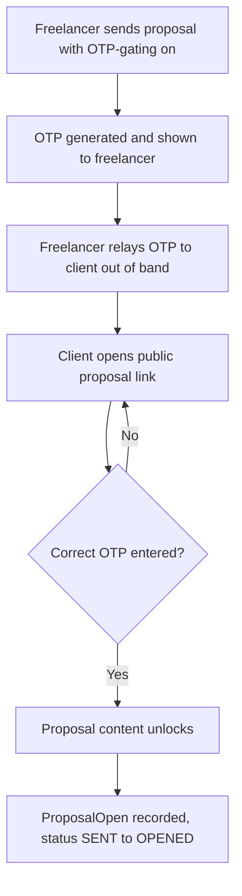
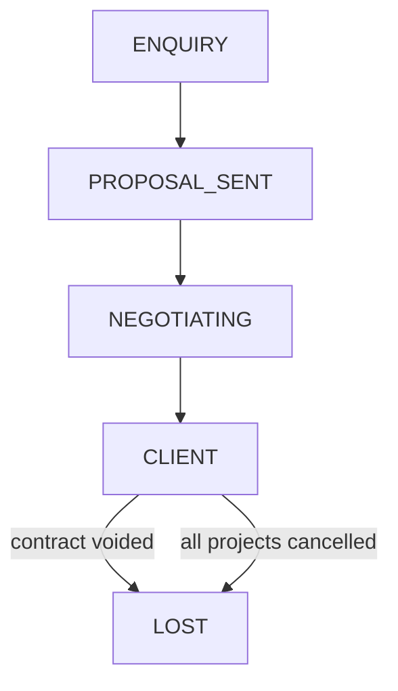

# Status Sync and Proposal View Trust

## Summary

Three related fixes to how ClearWork represents truth in the pipeline. First, Contact, Project, and Proposal statuses stop contradicting each other: Contact's relationship stage and each Project's own operational status render together everywhere, using consistent wording, and the relationship stage can move backward when the underlying deal genuinely falls through. Second, a Proposal's view/open count stops firing on every anonymous page load — an opt-in OTP gate, reusing the existing contract-signing pattern, makes a "viewed" event mean the client actually opened it. Third, `InvoiceStatus.VIEWED` — a status value that exists but is never actually set anywhere — starts firing when a client opens an invoice's public view page.

## Problem Frame

`StageAdvanceService` already advances `Contact.stage` and `ProjectStage` off the same events (`proposal.sent`, `contract.signed`, `invoice.paid`), so the two aren't fully disconnected today. But the sync has real gaps: the "deal won" milestone is labeled differently across surfaces (Contact says "Client", Project says "Active", the Lead Funnel widget says "Won"); `ProjectStage` has `ON_HOLD`/`CANCELLED` values with no `ContactStage` equivalent; and every transition is forward-only, so nothing reflects a voided contract or a cancelled project. The result: looking at a Contact next to its Project or Proposal, there's no single trustworthy answer to "where does this actually stand" — on the internal app or the client portal.

Separately, `POST /proposals/view/:slug/open` is a fully public, undeduplicated endpoint that fires on every page load, including the freelancer's own testing. It creates a `ProposalOpen` record and flips `Proposal.status` from `SENT` to `OPENED` on the very first hit, with no signal distinguishing the intended client from anyone else (including bots or link-preview crawlers). The "opened" signal is not currently trustworthy.

Separately again: `InvoiceStatus` has a `VIEWED` value that is referenced in filters (`invoices.service.ts:191`, `portal.service.ts:223`) and even has a color mapping in the Google Sheets export (`google-sheets.service.ts:98`), but nothing in the codebase ever transitions an invoice into it. It is dead code — the opposite failure mode from Proposal's over-counting: a signal that under-delivers because it was never wired up. A dedicated public invoice view already exists (`GET /invoices/view/:id`, rendered by `InvoiceViewPage.tsx`) but does not currently touch status at all.

## Key Decisions

- **`Contact.stage` and `ProjectStage` stay separate fields, always displayed together.** A Contact can have multiple Projects in different states at once, so a single shared value can't represent both a relationship-level stage and several per-project operational states. The fix is presenting them side by side with distinct labels, not merging them.
- **The "deal won" milestone is standardized to "Client" wherever `Contact.stage`'s `CLIENT` value is shown** (Contact page, Project card/header, Proposal header, client portal). Project's own `ACTIVE` label and the Lead Funnel widget's `Won` label are unchanged — they answer different questions (execution phase, funnel conversion) and aren't being renamed by this work.
- **`Contact.stage` regresses to `LOST`** when a signed Contract is voided, or when every Project belonging to that Contact ends up `CANCELLED` with none left active or completed — but only from `CLIENT` or later. A single cancelled Project among several does not regress the Contact; only "the whole thing fell through" does.
- **OTP-gating on Proposals is opt-in per proposal**, set at send time, not mandatory like it is for Contracts. It reuses the existing contract-send OTP mechanism: an OTP is generated and shown to the freelancer to relay to the client out of band, and the client must enter it before proceeding.
- **View/open tracking only becomes OTP-gated when OTP-gating is enabled.** Proposals left at the default (no OTP) keep today's tracking behavior unchanged — this pass improves trust for OTP-enabled proposals, not all proposals.
- **Invoices do not get OTP-gating.** Unlike Contracts (OTP prevents signature fraud) and Proposals (OTP fixes a measured over-counting problem), there is no equivalent concrete problem for Invoices today — nothing tracks invoice views to poison, and a wrong person paying an invoice isn't a harm. Recurring invoices (`Invoice.isRecurring`) would also need their own answer for relaying a fresh OTP every cycle, which is unsolved. Revisit only if a real privacy need (keeping line-items confidential) shows up later.
- **`InvoiceStatus.VIEWED` gets wired up, nothing more.** The fix is limited to making the existing status value fire correctly on the existing public view page — no new `InvoiceOpen` log table, no IP/user-agent capture, no owner notification. Proposal's fuller tracking apparatus was not requested for invoices and isn't added here.

## Actors

- A1. Freelancer / agency workspace owner — views Contact, Project, and Proposal statuses inside the app; chooses whether to enable OTP-gating on a proposal and relays the OTP to the client.
- A2. Prospective client / contact — views the public proposal link and the client portal; enters the OTP when gating is enabled before proposal content and view-tracking activate.

## Key Flows

- F1. OTP-gated proposal view
  - **Trigger:** Freelancer sends a Proposal with OTP-gating enabled.
  - **Steps:** OTP generated and shown to the freelancer → freelancer relays it to the client out of band → client opens `/p/:slug` → sees an OTP-entry gate instead of the proposal content → client submits the OTP → on a correct match, the proposal content unlocks and the `ProposalOpen` record plus the `SENT` → `OPENED` transition fire for the first time.
  - **Covers:** R8, R9, R10.

- F2. Contact-stage regression
  - **Trigger:** A signed Contract is voided, or a Project update leaves a Contact with zero Projects outside `CANCELLED`.
  - **Steps:** the triggering action emits a domain event → `StageAdvanceService` checks the Contact's current stage → if it is `CLIENT` or later, the stage moves to `LOST`.
  - **Covers:** R3, R4, R5.

## Requirements

**Status Consistency**

- R1. Wherever `Contact.stage` is displayed — Contact page, Project card/header, Proposal header, client portal — the label for its `CLIENT` value reads "Client," standardized across every surface that currently words it differently.
- R2. Project's own operational status and Contact's relationship stage render as two distinct, separately-labeled badges wherever a Project appears in Contact-adjacent context, never merged into one value.
- R3. The client-facing portal presents the same dual-badge treatment as the internal app for any surface that currently shows Project or Proposal status.
- R4. A domain event fires when a Contract moves to `VOID` status (no such event exists today — voiding a contract is currently a plain status update with no emission).
- R5. A mechanism detects when a Contact has no Project left outside `CANCELLED` and fires a corresponding domain event (no aggregate check like this exists today — Project stage updates currently emit nothing).
- R6. `StageAdvanceService` regresses `Contact.stage` to `LOST` on either the contract-voided event or the all-projects-cancelled event, when the Contact's current stage is `CLIENT` or later.

**Proposal View Trust**

- R7. Each Proposal gains an opt-in OTP-gating toggle, off by default, set at send time.
- R8. Enabling OTP-gating at send generates an OTP and displays it to the freelancer for out-of-band relay to the client, matching the existing contract-send OTP display.
- R9. When OTP-gating is enabled, the public proposal view shows an OTP-entry gate in place of the proposal content until a correct OTP is submitted.
- R10. When OTP-gating is enabled, the `ProposalOpen` record and the `SENT` → `OPENED` status transition fire only on correct OTP submission, not on page load.
- R11. When OTP-gating is disabled, proposal viewing and tracking behave exactly as they do today.
- R12. An incorrect OTP submission is rejected with a clear error, without revealing whether the proposal or slug exists.

**Invoice View Status**

- R13. When a client opens an Invoice's public view page while its status is `SENT` or `OVERDUE`, the status transitions to `VIEWED`.
- R14. Opening an Invoice's public view page while its status is `VIEWED`, `PARTIAL`, `PAID`, or `CANCELLED` leaves the status unchanged.

## Acceptance Examples

- AE1. Given a Contact at `CLIENT` with a signed Contract, when the Contract is voided, then `Contact.stage` moves to `LOST`. Covers R4, R6.
- AE2. Given a Contact at `CLIENT` with two Projects, when one Project is marked `CANCELLED` while the other stays `ACTIVE`, then `Contact.stage` stays `CLIENT`. Covers R5, R6.
- AE3. Given a Contact at `CLIENT` with two Projects, when both end up `CANCELLED` with none `ACTIVE`, `SCOPING`, `PROPOSAL_SENT`, `ON_HOLD`, or `COMPLETED`, then `Contact.stage` moves to `LOST`. Covers R5, R6.
- AE4. Given a Proposal with OTP-gating enabled and status `SENT`, when the client visits `/p/:slug` without entering the OTP, then no `ProposalOpen` record is created and `Proposal.status` is unchanged. Covers R9, R10.
- AE5. Given the same Proposal, when the client enters the correct OTP, then a `ProposalOpen` record is created and `Proposal.status` transitions to `OPENED`. Covers R10.
- AE6. Given a Proposal without OTP-gating enabled, when anyone visits `/p/:slug`, then tracking fires exactly as it does today. Covers R11.
- AE7. Given an Invoice at status `SENT`, when a client opens its public view page, then status transitions to `VIEWED`. Covers R13.
- AE8. Given an Invoice at status `PAID`, when anyone opens its public view page again, then status remains `PAID`. Covers R14.

## Scope Boundaries

- A standalone `Deal`/`Engagement` entity owning one canonical stage — reuse of `Contact.stage` instead, for now.
- A workspace-level default that turns OTP-gating on for every new Proposal automatically — this pass is a per-proposal toggle only.
- OTP-gating for Invoices — see Key Decisions for why this was considered and set aside.
- A full `InvoiceOpen` log (IP/user-agent capture, owner notification on each view) — see Key Decisions; only the status transition is in scope.
- Renaming the Lead Funnel widget's "Won" label or Project's "Active" label — see Key Decisions.

## Dependencies / Assumptions

- Assumes a new domain event is added for Contract voiding — none exists today.
- Assumes a new aggregate check is added for "every Project belonging to this Contact is Cancelled" — Project stage updates currently emit no events at all to build this on.
- Reuses the existing contract-OTP send/verify pattern (`generateOtp()`, OTP shown in the send response, OTP-entry gate on the public page) as the template for the Proposal equivalent.
- Reuses the existing dedicated public invoice view (`GET /invoices/view/:id`, `InvoiceViewPage.tsx`) as the hook point for the `VIEWED` transition — no new route or page needed.

## Outstanding Questions

**Deferred to Planning:**

- How long a client's OTP verification persists before they're asked again on a later visit to the same proposal — a single per-session check, or remembered on that device for some period.
- Whether a Contact that reached `CLIENT` with zero linked Projects (e.g., via `invoice.paid` alone) should ever regress via the all-projects-cancelled path, since there's no Project data to evaluate.
