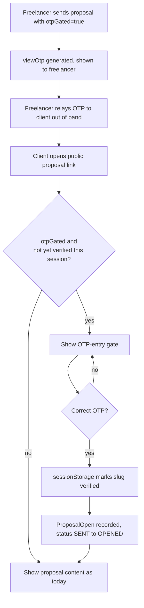

# feat: Status sync and proposal/invoice view trust

**Target repos:** this plan spans two repos — `pakka-api` (NestJS + Prisma backend) and `pakka-app` (React frontend). File paths are prefixed accordingly throughout.

## Summary

Contact's relationship stage and each Project's own operational status render together everywhere, with consistent wording, and the relationship stage can regress when a Contract is voided or every Project for that Contact is cancelled. Proposals gain an opt-in OTP gate — reusing the existing Contract-signing OTP mechanism — so view tracking only counts a real client open. Invoice's dead `VIEWED` status starts firing on its existing public view page.

---

## Problem Frame

See origin doc's Problem Frame (see origin: `docs/brainstorms/2026-07-31-status-sync-and-proposal-view-trust-requirements.md`) for the full framing. One addition surfaced during research: `Project` actually carries two independent status fields that already existed before this plan — `status` (`ACTIVE`/`COMPLETED`/`ON_HOLD`/`CANCELLED`, shown on the main Project page and list, user-edited via a dropdown) and `projectStage` (`SCOPING`/`PROPOSAL_SENT`/`ACTIVE`/`COMPLETED`/`ON_HOLD`/`CANCELLED`, nullable, shown in the Contact page's Project card and kept in sync with Contact's stage by `StageAdvanceService`). Nothing keeps these two fields in agreement with each other today. This plan does not unify them — that's a separate, larger refactor — but the new "all Projects cancelled" check (R5) has to account for both.

---

## Requirements

Carried forward from the origin doc with the same R-IDs (see origin: `docs/brainstorms/2026-07-31-status-sync-and-proposal-view-trust-requirements.md`).

**Status Consistency**

- R1. Wherever `Contact.stage` is displayed — including the new badge this plan adds to the Project card/header and client portal — the label for its `CLIENT` value reads "Client," via the existing shared `STAGE_LABELS` map (already the case everywhere `Contact.stage` is rendered today).
- R2. Project's own operational status and Contact's relationship stage render as two distinct, separately-labeled badges wherever a Project appears in Contact-adjacent context, never merged into one value.
- R3. The client-facing portal presents the same dual-badge treatment as the internal app for any surface that currently shows Project or Proposal status.
- R4. A domain event fires when a Contract moves to `VOID` status.
- R5. A mechanism detects when a Contact has no Project left outside `CANCELLED` (checking both `status` and `projectStage` — see Key Technical Decisions) and fires a corresponding domain event.
- R6. `StageAdvanceService` regresses `Contact.stage` to `LOST` on either the contract-voided event or the all-projects-cancelled event, when the Contact's current stage is `CLIENT` or later.

**Proposal View Trust**

- R7. Each Proposal gains an opt-in OTP-gating toggle, off by default, set at send time.
- R8. Enabling OTP-gating at send generates an OTP and displays it to the freelancer for out-of-band relay to the client, matching the existing contract-send OTP display.
- R9. When OTP-gating is enabled, the public proposal view shows an OTP-entry gate in place of the proposal content until a correct OTP is submitted.
- R10. When OTP-gating is enabled, the `ProposalOpen` record and the `SENT` → `OPENED` status transition fire only on correct OTP submission, not on page load.
- R11. When OTP-gating is disabled, proposal viewing and tracking behave exactly as they do today.
- R12. An incorrect OTP submission is rejected with a clear error, without revealing whether the proposal or slug exists.

**Invoice View Status**

- R13. When a client opens an Invoice's public view page while its status is `SENT` or `OVERDUE`, the status transitions to `VIEWED`.
- R14. Opening an Invoice's public view page while its status is `VIEWED`, `PARTIAL`, `PAID`, or `CANCELLED` leaves the status unchanged.

---

## Key Technical Decisions

- **KTD1. New `contactIsAtLeast(current, 'CLIENT')` helper, separate from the existing `contactIsEarlierThan`.** The existing helper (`pakka-api/src/modules/contacts/stage-advance.service.ts`) is forward-only by construction — it can express "is strictly before a target" but not "is at or past a stage," which regression needs.
- **KTD2. Two new domain events follow the existing `{ entityId, workspaceId }` convention, self-referencing the emitting record.** `contract.voided` (`entityId` = contract id, emitted from `contracts.service.ts` `void()`) and `project.cancelled` (`entityId` = project id, emitted from `projects.service.ts` `update()`, only on a genuine transition into cancelled). This matches every existing event in the codebase (`contract.signed`, `proposal.declined`, etc.) rather than introducing a new convention where `entityId` points to an unrelated model.
- **KTD3. A Project counts as "cancelled" for R5 if either `status === 'CANCELLED'` or `projectStage === 'CANCELLED'`.** The two fields aren't kept in sync with each other (see Problem Frame), so checking only one would miss real-world cancellations made through the other field's UI surface.
- **KTD4. The all-projects-cancelled regression only fires when the Contact has at least one Project.** A Contact with zero Projects (e.g., reached `CLIENT` via `invoice.paid` alone) never regresses via this path — resolves the origin doc's deferred question by treating the vacuous case as "nothing to evaluate," not "everything failed."
- **KTD5. `Proposal` gets three new fields: `otpGated Boolean @default(false)`, `viewOtp String?`, `otpFailedAttempts Int @default(0)`, all writable only through `send()`.** Mirrors Contract's `signerOtp` naming and lifecycle, with one deliberate deviation: `otpGated` is a `send()` parameter, not a generic-update field, so `viewOtp` is always generated in the same write that turns gating on — a gated Proposal can never exist without a matching OTP.
- **KTD6. Proposal's OTP comparison uses `crypto.timingSafeEqual`, not Contract's plain string equality — and every `verifyOtp()` failure path returns the same generic error.** Contract's `sign()` compares OTPs with `!==`; this plan uses the constant-time comparison already established elsewhere in this codebase for other secrets (Razorpay signature checks in `proposals.service.ts`, `portal.service.ts`). This asymmetry with Contract is intentional and scoped to Proposal only — not backported to Contract's own check. Normalizing every failure branch (not-found slug, not-gated, wrong OTP, attempt-limit exceeded) to one identical error is what actually delivers R12; a differently-worded not-found error would otherwise let an attacker enumerate valid slugs.
- **KTD7. No separate OTP expiry field, but a failed-attempt counter (`otpFailedAttempts`) caps brute-force guessing.** The OTP stays valid until the proposal's own lifecycle moves past a viewable state or the freelancer resends (which regenerates the OTP and resets the counter) — matching Contract's "valid until superseded" pattern — but a 6-digit space with no expiry needs an attempt cap independent of this codebase's generic global rate limit (`ThrottlerModule.forRoot([{ ttl: 60_000, limit: 100 }])`, which is not tuned for a sensitive per-secret check and is trivially bypassed with a handful of rotating IPs).
- **KTD8. OTP-verified state persists client-side only, in `sessionStorage` keyed by proposal slug, for that browser tab's session — and the gate bypasses entirely once a Proposal reaches `ACCEPTED`, `DECLINED`, or `EXPIRED`.** No server-side "remember this device" mechanism — resolves the origin doc's deferred question with the simplest option that needs no new backend infrastructure. Known limitation: the flag isn't tied to which OTP was active when set, so a client who verified once, then had the freelancer resend (regenerating the OTP to cut off a leaked code), keeps access in that same browser tab. Accepted for now — closing it would need a per-OTP-generation token instead of a plain boolean flag, which isn't worth the complexity for a resend scenario that's rare and freelancer-initiated.
- **KTD9. Invoice's `VIEWED` transition is a side-effect inside the existing `findByIdPublic()` GET method, implemented as a single conditional `updateMany` rather than a read-then-write.** The side-effect-on-GET is an intentional, narrow deviation from REST's usual side-effect-free GET — the origin doc explicitly scoped this to the existing route rather than a new one, since Invoices have no per-view endpoint the way Proposals do. The atomic-update requirement is separate: a naive read-then-write could race a concurrent payment confirmation and overwrite `PAID` back to `VIEWED`; conditioning the write on `WHERE status IN (SENT, OVERDUE)` at the database layer closes that gap.
- **KTD10. New business-rule code carries inline `// R<N>:` comments referencing this plan's requirement IDs**, following the existing precedent at `pakka-api/src/modules/projects/projects.service.ts:59`.
- **KTD11. The new stage-regression and OTP-verification logic gets real Jest spec files.** `pakka-api` has Jest configured but no service-level tests beyond the default boilerplate (`app.controller.spec.ts`); this introduces the first genuine coverage because the new logic is isolated, easily mockable, and risky enough (silent stage regression, auth-adjacent OTP check) to be worth it — it does not imply retrofitting tests elsewhere. `pakka-app` has no test runner at all; frontend units in this plan rely on manual verification, consistent with how this session's prior frontend work has been verified.

---

## High-Level Technical Design

**Stage regression event flow:**

```mermaid
flowchart TB
  A1[Contract.void()] -->|emits contract.voided| B[StageAdvanceService listener]
  A2[Project.update() transitions into CANCELLED] -->|emits project.cancelled| C[StageAdvanceService listener]
  C --> D{Contact has 1+ Project,\nall status=CANCELLED\nor projectStage=CANCELLED?}
  D -->|no| E[No change]
  D -->|yes| F{Contact.stage is\nCLIENT or later?}
  B --> F
  F -->|no| E
  F -->|yes| G[Contact.stage = LOST]
```

**Proposal OTP verification flow:**



---

## Implementation Units

### U1. Contact-stage regression on Contract-void and all-Projects-cancelled

**Goal:** Wire the two new domain events and teach `StageAdvanceService` to regress `Contact.stage` to `LOST` from `CLIENT` or later.

**Requirements:** R4, R5, R6

**Dependencies:** None

**Files:**
- `pakka-api/src/modules/contracts/contracts.service.ts` (`void()` — emit `contract.voided`)
- `pakka-api/src/modules/projects/projects.service.ts` (`update()` — capture prior `status`/`projectStage` before the write, emit `project.cancelled` on a genuine transition into cancelled)
- `pakka-api/src/modules/contacts/stage-advance.service.ts` (new `contactIsAtLeast` helper; two new `@OnEvent` listeners; update the module docblock's advance map)
- `pakka-api/src/modules/contacts/stage-advance.service.spec.ts` (new)

**Approach:** The `project.cancelled` listener loads the project by `entityId` to get its `contactId` (mirrors how the `contract.signed` listener resolves `contactId`/`projectId` from the contract), then runs the aggregate guard: count that Contact's Projects where neither `status` nor `projectStage` is `CANCELLED`; if that count is zero and the Contact has at least one Project total, and `Contact.stage` is `CLIENT` or later, set it to `LOST`. The `contract.voided` listener does the same final check directly off the contract's own `contactId`. `ProjectsService` has no `EventEmitter2` injected today (constructor takes only `PrismaService`) — add it as a constructor dependency to emit `project.cancelled`.

An automatic regression into `LOST` has no automatic path back out — `contactIsEarlierThan`-based forward advancement treats `LOST` as terminal, so a void-then-reissue workflow (void a signed contract, sign a corrected replacement) leaves the Contact stuck at `LOST` until someone notices. This plan does not build automatic recovery; manual correction already exists via `ContactStagePicker.tsx`'s `VALID_TRANSITIONS`, which already allows `LOST` → `CLIENT` (and `LOST` → `ENQUIRY`) today. Log each automatic regression distinctly (e.g. a structured log line naming the trigger event) so a freelancer reviewing logs can spot and manually correct a false-positive regression.

**Patterns to follow:** `pakka-api/src/modules/contacts/stage-advance.service.ts`'s existing `proposal.declined` listener for the aggregate-count-before-regressing shape; the `contract.signed` listener for entityId-to-relation resolution.

**Test scenarios:**
- Happy path: Contact at `CLIENT` with a signed Contract; Contract voided → Contact regresses to `LOST`. Covers AE1.
- Happy path: Contact at `CLIENT` with two Projects, one `CANCELLED` (via `status`) and one `ACTIVE` (via `projectStage`) → Contact stays `CLIENT`. Covers AE2.
- Happy path: Contact at `CLIENT` with two Projects, both end up cancelled (one via `status`, one via `projectStage`) → Contact regresses to `LOST`. Covers AE3.
- Edge case: Contact at `CLIENT` with zero Projects → the all-projects-cancelled path never evaluates or fires (KTD4).
- Edge case: Contact below `CLIENT` (e.g., `NEGOTIATING`) when all its Projects become cancelled → no regression attempted, since the rule only applies from `CLIENT` or later.
- Edge case: a Project moves `CANCELLED` → `ACTIVE` → `CANCELLED` again → the event fires only on each genuine transition into `CANCELLED`, not on every update while already cancelled.
- Integration: voiding a Contract with no linked Contact (`contactId` null) completes without throwing.

**Verification:** Spec suite passes. Manually void a real signed contract belonging to a `CLIENT`-stage contact in a dev workspace and confirm the contact regresses to `LOST`; confirm a contact with one remaining active project does not regress when a sibling project is cancelled.

---

### U2. Status display consistency (Contact stage badge alongside Project's own status)

**Goal:** Show Contact's relationship stage next to Project's own status wherever a Project renders in Contact-adjacent context, internally and on the client portal.

**Requirements:** R1, R2, R3

**Dependencies:** None

**Files:**
- `pakka-api/src/modules/portal/portal.service.ts` (`getPortalDataForContact()` — include `stage` in the returned `client` object; the legacy `getPortalDataForClient()` path has no Contact record and stays as-is, no `stage` field)
- `pakka-app/src/pages/app/ContactPage.tsx` (pass `contact.stage` as a new prop through to `ContactProjectAccordion`)
- `pakka-app/src/features/contacts/components/ContactProjectAccordion.tsx` (accept the new `contactStage` prop; add a Contact-stage badge next to the existing `projectStage` badge)
- `pakka-app/src/pages/public/ClientPortalPage.tsx` (add a Contact-stage badge next to the existing `status` badge, only when the portal response includes `stage`)

**Approach:** Every current renderer of `Contact.stage` (`ContactPage.tsx`, `ContactsCards.tsx`, `ContactsKanban.tsx`, `ContactsTable.tsx`, `ContactStagePicker.tsx`, `PipelinePage.tsx`, `ContactReviewPanel.tsx`) already imports the shared `STAGE_LABELS`/`STAGE_COLORS` from `pakka-app/src/features/contacts/schemas/contact.schema.ts` and already renders `CLIENT` as "Client" — R1 is a constraint on the new badge this unit adds, not a fix to an existing divergent renderer (`ClientPage.tsx` was an earlier, incorrect target: its `STAGE_LABELS` is fed by `Lead.stage`/Proposal/Contract/Invoice statuses, not `Contact.stage` — the `Client` model has no `stage` field at all, so nothing there needs to change). The actual gap is that `Contact.stage` isn't currently threaded into `ContactProjectAccordion` or the portal payload at all — this unit adds it, importing the shared map so "Client" is correct by construction.

Two presentation decisions, since this is a genuinely new badge, not a copy of an existing one:
- **Null `projectStage`:** `ContactProjectAccordion.tsx` only renders its existing badge when `project.projectStage` is truthy. When it's null, render the Contact-stage badge alone — do not add a placeholder for the missing Project badge.
- **Visual distinction:** `STAGE_COLORS.CLIENT` and `PROJECT_STAGE_COLORS.ACTIVE` (and the portal's `STATUS_BADGE.ACTIVE`) already use the same green pill styling, so a `CLIENT`+`ACTIVE` pairing would render as two identical-looking badges. Give the Contact-stage badge an outline/muted treatment (e.g. a bordered pill instead of a filled one) so it's visually distinct from Project's own status badge regardless of color overlap. Apply this identically across all three touched files, with the Contact-stage badge always rendering first (leftmost).

**Patterns to follow:** `pakka-app/src/pages/app/ContactPage.tsx` for how it already imports and renders the shared `STAGE_LABELS`.

**Test scenarios (manual — no test runner configured in `pakka-app`):**
- A Contact at `CLIENT` stage with a Project in `ACTIVE` `projectStage` shows both badges, visually distinct despite both being green-family, in the Contact page's Project accordion.
- A Project with `projectStage: null` shows only the Contact-stage badge, no placeholder.
- The client portal's project list shows the Contact's stage badge alongside the existing per-project `status` badge, when the contact-based portal payload includes `stage`.

**Verification:** Visually confirm in the running dev app against a seeded Contact with Projects covering a few different `status`/`projectStage` combinations (including one with `projectStage: null`), on both the internal Contact page and the client portal.

---

### U3. Proposal OTP-gating — backend

**Goal:** Add the opt-in OTP toggle, generate and strip the OTP following Contract's exact pattern, and gate `recordOpen()`'s side effects behind successful verification.

**Requirements:** R7, R8, R10, R12

**Dependencies:** None

**Files:**
- `pakka-api/prisma/schema.prisma` (`Proposal`: add `otpGated Boolean @default(false)`, `viewOtp String?`, `otpFailedAttempts Int @default(0)`)
- `pakka-api/prisma/migrations/20260731_001_add_proposal_otp_fields/migration.sql` (new — exact sequence number depends on migration state at implementation time)
- `pakka-api/src/modules/proposals/dto/send-proposal.dto.ts` (new — `@IsOptional() @IsBoolean() otpGated?: boolean`, passed to `send()`; **not** added to `update-proposal.dto.ts`)
- `pakka-api/src/modules/proposals/dto/verify-proposal-otp.dto.ts` (new — mirrors `sign-contract.dto.ts`'s `@IsString() @Length(6, 6) otp`)
- `pakka-api/src/modules/proposals/proposals.service.ts` (`send()` — accept `otpGated` as a parameter, always generate `viewOtp` together with it in the same write; `findBySlug()` — strip `viewOtp`, include `otpGated` in the response; new `verifyOtp(slug, otp, ipAddress?, userAgent?)`; `recordOpen()` — only reachable via `verifyOtp` when gated)
- `pakka-api/src/modules/proposals/proposals.controller.ts` (`POST :id/send` — accept the new DTO body; new `POST view/:slug/verify-otp`, `@Public()`)
- `pakka-api/src/modules/proposals/proposals.service.spec.ts` (new)

**Approach:** `otpGated` is only ever set as a parameter to `send()`, not via the generic `update-proposal.dto.ts` — this guarantees `viewOtp` is always generated in the same write that turns gating on, so a gated Proposal can never exist without a matching OTP. `send()` generates `viewOtp` via the same `generateOtp()` shape as Contract, only when `otpGated` is true, and returns it in the response body the same way Contract's `send()` returns `otp` (never persisted anywhere else in plaintext-readable form beyond that one response). `findBySlug()` always strips `viewOtp`. `verifyOtp()` loads the proposal by slug, and on any failure — slug not found, not gated, wrong OTP, or too many failed attempts — returns the identical generic error (same status code and message) so none of those cases is distinguishable from another (R12). On a correct match it performs exactly what `recordOpen()` does today (create the `ProposalOpen` row, flip `SENT` → `OPENED`) — extract that logic into a shared private method both `recordOpen()` and `verifyOtp()` call. Failed attempts increment `otpFailedAttempts`; past a threshold (e.g. 10), `verifyOtp()` rejects with the same generic error regardless of the OTP submitted, until the freelancer resends (which regenerates both `viewOtp` and resets the counter).

**Technical design (directional):**
```
send(dto):
  viewOtp = dto.otpGated ? generateOtp() : null
  update proposal { status: SENT, otpGated: dto.otpGated ?? false, viewOtp, otpFailedAttempts: 0 }
  return { proposal: { ...updated, viewOtp: undefined }, shareUrl, otp: viewOtp }

findBySlug(slug):
  return { ...proposal, viewOtp: undefined }   // otpGated stays visible; viewOtp never does

verifyOtp(slug, otp):
  proposal = findBySlugOrNull(slug)
  genericError = () => throw BadRequest('Invalid code')   // identical for every failure branch below
  if !proposal: return genericError()
  if !proposal.otpGated: return genericError()
  if proposal.otpFailedAttempts >= MAX_ATTEMPTS: return genericError()
  if !proposal.viewOtp || !timingSafeEqual(proposal.viewOtp, otp): {
    increment otpFailedAttempts
    return genericError()
  }
  return this.recordOpenEffects(proposal)      // shared with recordOpen()

recordOpen(slug):
  if proposal.otpGated: throw Forbidden          // must go through verifyOtp instead
  return this.recordOpenEffects(proposal)
```

**Patterns to follow:** `pakka-api/src/modules/contracts/contracts.service.ts` `generateOtp()`/`send()`/`sign()`; the existing `ip`/`userAgent` extraction in `pakka-api/src/modules/proposals/proposals.controller.ts`'s public `open` route.

**Test scenarios:**
- Happy path: `send()` with `otpGated: true` generates and returns a 6-digit `viewOtp` in the same write; `findBySlug()` never includes `viewOtp` in its response.
- Happy path: `verifyOtp()` with the correct OTP creates a `ProposalOpen` record and transitions `SENT` → `OPENED`. Covers AE5.
- Error path: `verifyOtp()` with an incorrect OTP throws the same generic error as the not-found and not-gated cases, without creating a `ProposalOpen` record or changing status. Covers AE4, R12.
- Error path: `verifyOtp()` on a Proposal with `otpGated: false` rejects with that same generic error.
- Error path: `verifyOtp()` on a nonexistent slug rejects with that same generic error (response parity with the wrong-OTP case — no distinguishable status code or message).
- Error path: `verifyOtp()` with a null `viewOtp` (should be unreachable given the `send()`-only write path, but guarded explicitly) rejects cleanly instead of throwing on `timingSafeEqual`.
- Edge case: after `MAX_ATTEMPTS` failed submissions, further correct-or-incorrect submissions are rejected until the freelancer resends the proposal.
- Edge case: `send()` with `otpGated: false` behaves exactly as it does today — no `viewOtp` generated, `recordOpen()` unchanged. Covers AE6, R11.
- Integration: a second `verifyOtp()` call with the same correct OTP after an earlier success still succeeds — the OTP isn't invalidated on first use, since (unlike Contract's one-shot sign) a client may revisit a Proposal multiple times.

**Verification:** Spec suite passes. Manually send a Proposal with OTP-gating on, confirm the OTP appears in the API response, confirm the public view is blocked without it, confirm a correct submission unlocks tracking and creates exactly one `ProposalOpen` row, and confirm repeated wrong submissions eventually lock out further attempts.

---

### U4. Proposal OTP-gating — frontend

**Goal:** Let the freelancer opt in and see the OTP after sending; gate the public proposal page behind an OTP-entry form when required.

**Requirements:** R7, R9, R11, R12

**Dependencies:** U3

**Files:**
- `pakka-app/src/features/proposals/schemas/proposal.schema.ts` (add `otpGated` to the relevant types)
- `pakka-app/src/features/proposals/components/ProposalEditor.tsx` (opt-in toggle near the send action, passed as part of the send request per U3; display the OTP after send)
- `pakka-app/src/pages/public/ProposalViewPage.tsx` (OTP-entry gate when `otpGated` and not yet verified this session; sessionStorage persistence per KTD8)

**Approach:** Reuse `ContractEditor.tsx`'s OTP-display treatment and `ContractSignPage.tsx`'s OTP-entry form as direct structural templates. `ProposalViewPage.tsx`'s current `recordOpen()` call (fired unconditionally on mount) becomes conditional: when `otpGated` and no verified flag exists in `sessionStorage` for that slug, render the entry gate instead of the proposal content and call the new `verifyOtp` endpoint on submit; on success, set the `sessionStorage` flag and render content exactly as today. On a rejected submission, show an inline error (mirroring `ContractSignPage.tsx`'s "Incorrect OTP. Please check and try again."), clear the input, and keep the gate up — never render proposal content on failure.

The gate bypasses entirely when `proposal.status` is `ACCEPTED`, `DECLINED`, or `EXPIRED`: the outcome is already settled, so re-verifying on a later revisit (e.g. a client checking their acceptance confirmation, or downloading a PDF) only adds friction without adding trust value.

**Patterns to follow:** `pakka-app/src/features/contracts/components/ContractEditor.tsx` (OTP display after send); `pakka-app/src/pages/public/ContractSignPage.tsx` (OTP-entry form: digit-only 6-char input, inline error state, submit-disabled-until-complete).

**Test scenarios (manual — no test runner configured in `pakka-app`):**
- Sending a Proposal with the toggle on shows the OTP to the freelancer, matching Contract's visual treatment.
- Opening the gated public link without the OTP shows the entry form, not the proposal content.
- Entering an incorrect OTP shows an inline error, clears the input, and keeps the gate up — the proposal content and its "declined" state are never revealed. Covers R12.
- Entering the correct OTP unlocks the content and does not re-prompt on a subsequent reload within the same browser tab session.
- Opening a non-gated Proposal's public link behaves exactly as it does today (no gate shown).
- Opening a gated Proposal that's already `ACCEPTED` skips the gate entirely, even in a fresh session with no `sessionStorage` flag set.

**Verification:** Manually run the full flow in the running app: send a gated proposal, copy the OTP, open the public link in a separate/incognito session, confirm the gate, submit the OTP, confirm unlock and exactly one `ProposalOpen` record via the API.

---

### U5. Invoice VIEWED wiring

**Goal:** Make the dead `InvoiceStatus.VIEWED` value fire correctly on the existing public view page.

**Requirements:** R13, R14

**Dependencies:** None

**Files:**
- `pakka-api/src/modules/invoices/invoices.service.ts` (`findByIdPublic()` — conditional status transition)
- `pakka-api/src/modules/invoices/invoices.service.spec.ts` (new)

**Approach:** Inside `findByIdPublic()`, after loading the invoice, perform the transition as a single atomic conditional update (`prisma.invoice.updateMany({ where: { id, status: { in: ['SENT', 'OVERDUE'] } }, data: { status: 'VIEWED' } })`) rather than a read-then-write — a plain read-then-write would let a concurrent payment confirmation (`markPaid()`/`recordPayment()`) land between the read and the write, and the stale-based write would clobber `PAID` back to `VIEWED`. The `WHERE status IN (...)` clause means the write only lands if the invoice is still in a viewable status at commit time; any other status passes through untouched (KTD9). No new route, no new log table.

**Patterns to follow:** `pakka-api/src/modules/proposals/proposals.service.ts` `recordOpen()`'s `SENT` → `OPENED` transition, as the closest existing analog for a status flip triggered by a public view.

**Test scenarios:**
- Happy path: Invoice at `SENT` → viewing transitions it to `VIEWED`. Covers AE7.
- Happy path: Invoice at `OVERDUE` → viewing transitions it to `VIEWED`.
- Edge case: Invoice at `PAID`, `CANCELLED`, `PARTIAL`, or already `VIEWED` → viewing leaves status unchanged. Covers AE8.

**Verification:** Spec suite passes. Manually open a real `SENT` invoice's public link and confirm its status flips to `VIEWED`.

---

## Scope Boundaries

Carried forward from origin (see origin: `docs/brainstorms/2026-07-31-status-sync-and-proposal-view-trust-requirements.md`):

- A standalone `Deal`/`Engagement` entity owning one canonical stage — reuse of `Contact.stage` instead.
- A workspace-level default that turns OTP-gating on for every new Proposal automatically — per-proposal toggle only.
- OTP-gating for Invoices, and a full `InvoiceOpen` log — considered and set aside in the brainstorm.
- Renaming the Lead Funnel widget's "Won" label or Project's "Active" label.

### Deferred to Follow-Up Work

- Unifying `Project.status` and `Project.projectStage` into one field — a real, separate inconsistency surfaced during this plan's research, but a larger refactor than this plan's scope (see Problem Frame).
- A Google Sheets export conditional-formatting rule for `VIEWED` sits under the Proposals sheet's rule block (`pakka-api/src/modules/google-sheets/google-sheets.service.ts:98`) rather than Invoices, and is itself unreachable there since `ProposalStatus` has no `VIEWED` value. Pre-existing, unrelated dead code — not touched by this plan.

---

## Risks & Dependencies

- `Project.status`/`projectStage` staying unsynced is a pre-existing condition this plan works around (KTD3) rather than fixes. If a future change makes one field authoritative, the either-field check in U1 should be revisited.
- U4 depends on U3's backend endpoints existing first; sequence accordingly.
- This is the first service-level Jest coverage introduced in `pakka-api` beyond the default boilerplate (KTD11) — no existing `TestingModule` setup pattern to copy for mocking `PrismaService`/`EventEmitter2`; expect minor first-time setup cost in U1/U3/U5.
- Reassigning a Project's `contactId` away from a Contact via the general `update()` DTO isn't a "genuine transition into cancelled" and never emits `project.cancelled` — a Contact left with only already-cancelled Projects after losing its one active Project to reassignment (rather than cancellation) won't be re-evaluated for regression under R5. Edge case, not fixed here.
- No fixed left-to-right ordering was specified for the two badges in U2 beyond "Contact-stage first" — low-stakes, but worth confirming during implementation that all three touched files agree.

---

## System-Wide Impact

- `StageAdvanceService` is shared, cross-cutting logic already relied on by every Contact/Project stage transition — U1 adds regression paths alongside its existing forward-only ones. The new `contactIsAtLeast` helper is additive; existing `contactIsEarlierThan`-based transitions are untouched.
- `findByIdPublic()` on Invoices (U5) gains a write side-effect on what has been a pure read — low risk since the transition is conditional and idempotent (repeated views of an already-`VIEWED` invoice are no-ops), but worth knowing for anyone who assumed that endpoint was side-effect-free.

---

## Sources / Research

- `pakka-api/src/modules/contacts/stage-advance.service.ts` — existing `@OnEvent` listeners, `contactIsEarlierThan`/`projectIsEarlierThan` helpers (forward-only), the `proposal.declined` aggregate-guard shape used as the template for R5/R6.
- `pakka-api/src/modules/contracts/contracts.service.ts` — `generateOtp()`, `send()`, `sign()` (OTP template for U3); `void()` (current no-emission gap, U1).
- `pakka-api/src/modules/proposals/proposals.service.ts` — `send()`, `findBySlug()`, `recordOpen()` (current unconditional-tracking gap, U3).
- `pakka-api/src/modules/invoices/invoices.service.ts` — `findByIdPublic()` (no existing side effects, U5); `markOverdueInvoices()` line 191 already treats `VIEWED` as a payable-equivalent status.
- `pakka-api/prisma/schema.prisma` — `Project.status` (`ProjectStatus`) vs `Project.projectStage` (`ProjectStage`) both existing independently; `Proposal`, `ProposalOpen`, `Invoice`/`InvoiceStatus` model shapes.
- `pakka-app/src/features/contracts/components/ContractEditor.tsx`, `pakka-app/src/pages/public/ContractSignPage.tsx` — OTP UI templates for U4.
- `pakka-app/src/features/contacts/components/ContactStagePicker.tsx` — `VALID_TRANSITIONS` confirms `LOST` → `CLIENT`/`ENQUIRY` is already a supported manual transition (U1's accepted recovery path for false-positive regressions).
- `pakka-api/src/modules/portal/portal.service.ts` — `getPortalDataForContact()`'s `client` object currently has no `stage` field; the legacy `getPortalDataForClient()` path has no Contact record at all (U2).
