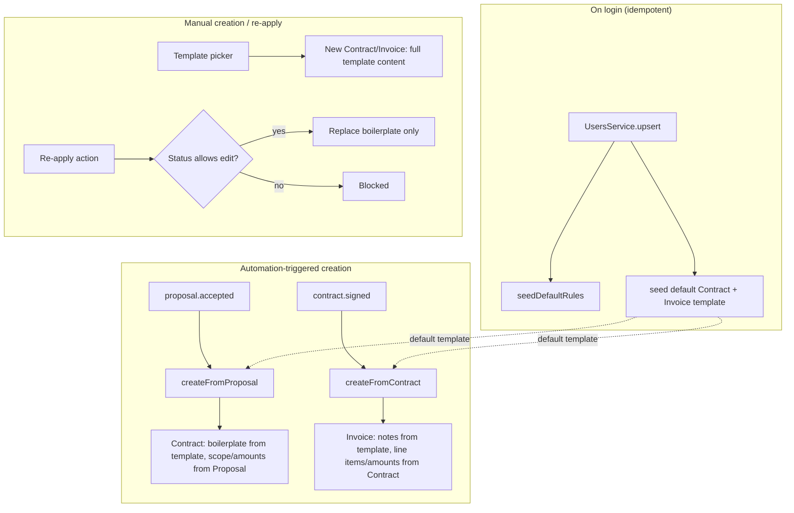

# feat: Contract & Invoice templates, automation defaults, and re-apply

**Target repos:** this plan spans two repos — `pakka-api` (NestJS + Prisma backend) and `pakka-app` (React frontend). File paths are prefixed accordingly throughout.

## Summary

Contract and Invoice get the same templating system Proposal already has — create, save-as-template, and pick from a library with a right-side preview — plus a per-workspace default template per document type that the existing Proposal→Contract and Contract→Invoice automation applies for boilerplate content. A new "re-apply template" action lets a member swap the template on an already-created, still-editable Contract or Invoice. Unlike Proposal's templates (virtual constants, no mutable state), Contract/Invoice system templates are real per-workspace rows so "default" can be a mutable flag on the row itself, seeded idempotently on login — the same mechanism already used for automation-rule seeding — so existing workspaces get one automatically, no separate backfill script needed.

---

## Problem Frame

`ContractsService.createFromProposal()` and `InvoicesService.createFromContract()` hardcode boilerplate today — fixed clause wording, fixed fallback strings — regardless of which client or service the document is for (see origin doc's Problem Frame, `docs/brainstorms/2026-07-31-contract-invoice-templates-requirements.md`). Research narrowed exactly what "boilerplate" means for each entity and surfaced two things the origin doc couldn't have known: Invoice has no field to hold template-supplied wording at all today, and the existing Proposal-templates feature has a latent workspace-scoping bug this plan should not copy.

---

## Requirements

Carried forward from the origin doc with the same R-IDs (see origin), plus R10 (new, surfaced during planning).

**Template library**

- R1. Workspace members can create, edit, and delete Contract templates and Invoice templates, workspace-shared like existing Proposal templates (category, usage tracking); the seeded system template per type is never deletable (KTD10).
- R2. A member can save an existing Contract or Invoice as a new template.
- R3. Creating a new Contract or Invoice offers a template picker with a right-side preview of the selected template's content before applying it, mirroring the Proposal template picker.
- R4. Each workspace has one default Contract template and one default Invoice template, present from the start.

**Automation default**

- R5. A member can mark exactly one Contract template and one Invoice template as the automation default, from the template library. Setting a new default replaces the previous one — only one default per document type at a time.
- R6. When `proposal.accepted` automation creates a Contract, and when `contract.signed` automation creates an Invoice, the generated document's boilerplate content (clauses, wording, terms) comes from the current default template.
- R7. Scope, deliverables, payment schedule, and amounts on an automation-generated Contract/Invoice continue to come from the source Proposal/Contract being converted, never from the template.

**Re-apply**

- R8. A member can re-apply a different template to an existing Contract or Invoice, as long as its status still allows editing (same edit-lock rules already enforced today).
- R9. Re-applying a template replaces only boilerplate content; the document's existing scope, deliverables, amounts, payment schedule, and status are unchanged.

**Rollout**

- R10. Workspaces that existed before this ships get their default Contract/Invoice template the same way new workspaces do — seeded on next login, not left without one.

---

## Key Technical Decisions

- **KTD1 — Fix the workspace-scoping bug, don't mirror it.** `ProposalTemplatesController` resolves the workspace as the raw `user.id` (`pakka-api/src/modules/proposal-templates/proposal-templates.controller.ts:17-45`) instead of `resolveWorkspaceId(user)` (`pakka-api/src/modules/users/resolve-workspace-id.ts:7-11`), which every other document controller uses. For a team member whose `activeWorkspaceId` differs from their own `id`, Proposal templates silently scope to the wrong workspace today. The new Contract/Invoice template controllers use `resolveWorkspaceId(user)` from the start; fixing Proposal's existing bug is out of scope for this plan (see Scope Boundaries).

- **KTD2 — System templates are real per-workspace rows, not virtual constants.** Proposal's `SYSTEM_TEMPLATES` (`pakka-api/src/modules/proposal-templates/system-templates.ts`) are a hardcoded array merged into `list()` at read time — they have no `workspaceId` and no mutable state. Contract/Invoice system templates need mutable state (`isDefault`), which a shared constant can't hold per workspace, so each workspace gets one real seeded row per document type instead. (Considered and rejected: a `Workspace.defaultContractTemplateId`/`defaultInvoiceTemplateId` pointer with a virtual-constant fallback, mirroring `User.activeWorkspaceId`'s shape — rejected because it still needs a real row to point *at* once a member customizes the default's content, so it defers the same row-creation problem rather than avoiding it.)

- **KTD3 — Automation reads the default live off the template table; no `AutomationRule` changes.** `AutomationEngine.dispatchAction()` (`pakka-api/src/modules/automations/automation.engine.ts:127-142`) and `default-rules.ts` currently carry no template concept, and per the origin doc's decision (single default, no conditional logic), they don't need one: `createFromProposal()` / `createFromContract()` look up `findFirst({ workspaceId, isDefault: true })` on the relevant template table directly. This avoids a second, cacheable copy of "which template is default" drifting from the template row's own `isDefault` flag, and means no change to `AutomationRule`, `default-rules.ts`, or `dispatchAction()`'s signature.

- **KTD4 — Seed on login, keyed by `resolveWorkspaceId(user)`, not raw `user.id`.** `UsersService.upsert()` (`pakka-api/src/modules/users/users.service.ts:13-44`) already calls `automations.seedDefaultRules(user.id)` idempotently on every login (comment at line 42: "safe to call on every login"). Template seeding is added at the same call site with the same idempotency shape, but keyed by `resolveWorkspaceId(user)` rather than copying that call's raw `user.id` argument — `createFromProposal()`/`createFromContract()` resolve their `workspaceId` via `resolveWorkspaceId(user)` further up the call chain (in `contracts.controller.ts`/`invoices.controller.ts`), so seeding under the caller's own `id` would seed a *different* row than a team member's shared workspace ever reads from `getDefault()`, defeating KTD10's zero-default guarantee for exactly the population KTD1 exists to protect. Existing workspaces get their default template the next time any member logs in, satisfying R10 without a standalone backfill script. (Rejected: a one-off backfill script iterating real `Workspace` rows — no simpler than this, and adds a migration step this avoids; lazy-seeding inside `getDefault()` itself — considered, but seeding on write at a well-understood, already-idempotent call site is easier to reason about than seeding as a side effect of a read.)
  - Idempotency mirrors `AutomationRule`'s own pattern (`@@unique([workspaceId, key])`, `automations.service.ts:74-89`): `ContractTemplate`/`InvoiceTemplate` get a nullable `key` column and `@@unique([workspaceId, key])`, and the seed is a plain `upsert({ where: { workspaceId_key: { workspaceId, key: 'system-default' } }, update: {}, create: {...} })` — safe under concurrent logins, no race window where two default rows could exist.

- **KTD5 — Contract's boilerplate slot is `content.clauses`, matched by array position; Proposal-provided text still wins.** `createFromProposal()` (`pakka-api/src/modules/contracts/contracts.service.ts:66-143`) fills two clause bodies today by array position, not by title lookup — `clauses[0]` is "Payment Terms" (from `proposal.content.pricingNotes` else a hardcoded fallback), `clauses[1]` is "Terms & Conditions" (from `proposal.content.terms` else a hardcoded fallback, lines 115-122). Since R1/R2 let members freely rename or reorder a template's clause titles, matching the default template's clauses onto these two slots also uses array position — `template.content.clauses[0].body` fills the Payment Terms slot, `clauses[1].body` fills Terms & Conditions — never a title-string lookup, which renaming would break. If the template has fewer than 2 clause entries, the missing slot(s) fall back to today's hardcoded string, same as the `getDefault() === null` case. If the Proposal itself carries real `pricingNotes`/`terms` text, that still takes priority over the template. Every other field in this method's `content` (scopeItems, deliverables, exclusions, paymentSchedule, totalAmount, gstAmount, gstType, tdsRate) is real Proposal data and is never touched by the template (R7).

- **KTD6 — Invoice gains a persisted `notes` column; this is its boilerplate slot.** `Invoice.notes` doesn't exist on the Prisma model (`schema.prisma:618-664`) even though `CreateInvoiceDto.notes` and the frontend's `invoice.schema.ts` both already declare it — it's dead end-to-end (`InvoicesService.create()`/`.update()` never read or persist it). This plan adds the column and wires `create()`/`update()` to persist it; the default Invoice template's `notes` text becomes the value used by `createFromContract()` when generating an invoice, the same role Contract's clauses play.

- **KTD7 — Re-apply's edit-lock mirrors each entity's existing guard exactly.** Contract blocks when `status` is `SIGNED` or `VOID` (mirrors the guards already in `send()`/`archive()`/`void()`, `contracts.service.ts:250-251,306-307,321-323`); Invoice blocks only when `status` is `PAID` (mirrors `update()`'s own guard, `invoices.service.ts:319-321`). No new status values or lifecycle states are introduced.

- **KTD8 — A confirmation gate before re-apply overwrites content, via a new `ConfirmModal` variant.** Re-apply replaces boilerplate a member may have already customized on that specific document. `pakka-app/src/components/ConfirmModal.tsx` currently supports only `variant: 'delete' | 'void'`, neither of which fits "you're about to overwrite text" semantically or visually — this plan adds an `'overwrite'` variant (neutral framing, not the red/orange destructive styling) with copy naming exactly what changes: *"Re-applying will replace this [Contract's clauses / Invoice's notes]. Scope, amounts, and status won't change."* Resolves the origin doc's deferred question.

- **KTD9 — One new shared, entity-agnostic template-library UI shell; Proposal's existing components stay untouched.** The picker/card/save-as-template chrome (search, category filter, grid, save form, delete-with-confirm) is identical in shape across all three document types; only the preview panel's content rendering genuinely differs (Contract has clauses/scope, Invoice has just notes/line items). New shared components are built for this shell and used by Contract and Invoice; Proposal's existing `TemplatePickerModal.tsx`/`SaveTemplateModal.tsx`/`TemplateCard.tsx` are left as-is — retrofitting Proposal onto the new shared shell is tangential cleanup, deferred (see Scope Boundaries).

- **KTD10 — System templates are never deletable.** Mirrors Proposal's existing convention exactly: `TemplateCard.tsx` only renders manage actions (edit/delete) when `!template.isSystem` (`pakka-api/src/modules/proposal-templates/proposal-templates.controller.ts` has no delete path for `system:`-prefixed ids either, since those aren't DB rows there). Here system templates *are* DB rows (KTD2), so `remove()` must explicitly reject `isSystem: true` templates rather than relying on their absence from a list. Combined with the existing "can't delete the current default" rule, this guarantees a workspace never drops to zero templates or zero default for a document type.

---

## High-Level Technical Design

**Boilerplate vs. derived-from-source, by entity:**

| Entity | Boilerplate (template-supplied) | Derived from source (never templated) |
|---|---|---|
| Contract | `content.clauses[]` bodies (Payment Terms, Terms & Conditions) — only when the source Proposal has no explicit text for that slot | `scopeItems`, `deliverables`, `exclusions`, `paymentSchedule`, `totalAmount`, `gstAmount`, `gstType`, `tdsRate` |
| Invoice | `notes` (new column) | `lineItems`, `subtotal`, `gstAmount`, `total`, `gstType`, `tdsRate` |

---

## System-Wide Impact

`UsersService.upsert()` (`pakka-api/src/modules/users/users.service.ts:13-44`) runs on every login and gains two more idempotent upsert calls (U4) — the same shape as the existing `seedDefaultRules` call already there, so the added latency is one more single-row upsert per document type, negligible against the auth-sync work already happening on that path.

---

## Scope Boundaries

- AI-powered template import (upload a file, auto-parse) — Proposal has this; Contract/Invoice templates don't, for now (origin doc).
- Automation choosing between templates by condition (service, contact, tag) — single default only (origin doc).
- Retroactive changes to Contracts/Invoices already created before this ships (origin doc).
- Fixing `ProposalTemplatesController`'s existing `resolveWorkspaceId` bug — noted in KTD1, not part of this plan's surface.
- Retrofitting Proposal's template components onto the new shared UI shell (KTD9) — deferred to follow-up work.

---

## Risks & Dependencies

- **Migration tooling is inconsistent in this repo**: `README.md`/`render.yaml` apply migrations via `prisma db push`, while `prisma.config.ts` is wired for `DIRECT_URL`-based `prisma migrate` CLI usage. The currency-configuration plan (`docs/plans/2026-07-31-002-feat-contact-currency-configuration-plan.md`) resolved this by hand-writing the migration SQL and applying via `db push` — follow the same convention here.
- **Nullable-column unique constraint**: `@@unique([workspaceId, key])` with `key` nullable relies on Postgres treating each `NULL` as distinct (confirmed Prisma/Postgres behavior) so user-created templates (`key: null`) never collide with each other or with the seeded row (`key: 'system-default'`).

---

## Implementation Units

### Phase A — Backend foundation

### U1. Schema: ContractTemplate, InvoiceTemplate, Invoice.notes

**Goal:** Add the two new template models and the missing Invoice column.

**Requirements:** R1, R4, R5, R10, KTD2, KTD4, KTD6

**Files:**
- `pakka-api/prisma/schema.prisma` — modify (add `ContractTemplate`, `InvoiceTemplate` models; add `Invoice.notes String?`)
- `pakka-api/prisma/migrations/20260731_003_add_contract_invoice_templates/migration.sql` — create

**Approach:** Mirror `ProposalTemplate` (`schema.prisma:796-811`) for both new models — `id, workspaceId, workspace, name, description, category, content Json, totalAmount Decimal @default(0), usageCount Int @default(0), createdAt, updatedAt` — plus two new columns neither Proposal nor its precedent needs: `isDefault Boolean @default(false)`, `isSystem Boolean @default(false)`, and `key String?` with `@@unique([workspaceId, key])` (KTD4's seed-idempotency key, `null` for every user-created template). Add `Invoice.notes String?` as a plain nullable column, no default. Hand-write the migration SQL following the shape of `pakka-api/prisma/migrations/20260731_002_add_contact_document_currency/migration.sql`; apply via `db push` per this repo's convention (see Risks).

**Patterns to follow:** `ProposalTemplate` model (`schema.prisma:796-811`); `AutomationRule`'s `@@unique([workspaceId, key])` (`schema.prisma:687-709`).

**Test scenarios:**
Test expectation: none — pure schema/migration, no service logic yet.

**Verification:** `npx prisma generate` succeeds; migration applies cleanly to a fresh database; `Invoice`, `ContractTemplate`, `InvoiceTemplate` Prisma Client types include the new fields.

---

### U2. Backend: ContractTemplates module

**Goal:** Full CRUD + save-from-contract + set-default + seed, mirroring `proposal-templates` but fixing the workspace-scoping bug.

**Requirements:** R1, R2, R4, R5, R10, KTD1, KTD2, KTD4, KTD10

**Dependencies:** U1

**Files:**
- `pakka-api/src/modules/contract-templates/contract-templates.module.ts` — create
- `pakka-api/src/modules/contract-templates/contract-templates.controller.ts` — create
- `pakka-api/src/modules/contract-templates/contract-templates.service.ts` — create
- `pakka-api/src/modules/contract-templates/contract-templates.service.spec.ts` — create
- `pakka-api/src/modules/contract-templates/default-content.ts` — create (seed content for the one default template, analogous role to `system-templates.ts` but a single entry, not a virtual-constant library)
- `pakka-api/src/modules/contract-templates/dto/create-template.dto.ts` — create
- `pakka-api/src/modules/contract-templates/dto/update-template.dto.ts` — create
- `pakka-api/src/modules/contract-templates/dto/from-contract.dto.ts` — create

**Approach:** Mirror `pakka-api/src/modules/proposal-templates/` file-for-file (`proposal-templates.controller.ts:1-55`, `proposal-templates.service.ts:1-93`, `dto/create-template.dto.ts`, `dto/update-template.dto.ts`, `dto/from-proposal.dto.ts` → `from-contract.dto.ts`), with these deltas:
- Every controller route resolves `resolveWorkspaceId(user)`, not raw `user.id` (KTD1).
- `list(workspaceId)` returns only real rows (`findMany({ workspaceId })`) — no virtual-constant merge, since system templates are now real rows (KTD2).
- New `setDefault(workspaceId, id)`: in a transaction, `updateMany({ where: { workspaceId, isDefault: true }, data: { isDefault: false } })` then `update({ where: { id }, data: { isDefault: true } })`. Reject (404/403) if the template isn't in the workspace.
- New `getDefault(workspaceId)`: `findFirst({ where: { workspaceId, isDefault: true } })`, returns `null` if none (belt-and-suspenders for KTD3's caller).
- New `seedDefault(workspaceId)`: `upsert({ where: { workspaceId_key: { workspaceId, key: 'system-default' } }, update: {}, create: { workspaceId, key: 'system-default', isSystem: true, isDefault: true, name: 'Standard Contract', ...DEFAULT_CONTRACT_CONTENT } })` (KTD4).
- `remove()` rejects deleting any `isSystem: true` template (KTD10), and separately rejects deleting the current default even when it's not system (400) — a workspace must always have exactly one default per R4/R5; reassign or seed a fresh one instead of allowing zero.

**Patterns to follow:** `pakka-api/src/modules/proposal-templates/` (all files); `resolveWorkspaceId` (`pakka-api/src/modules/users/resolve-workspace-id.ts`); `AutomationsService.seedDefaultRules`'s upsert shape (`automations.service.ts:74-89`).

**Test scenarios:**
- Happy path: `create()` persists a new template scoped to the caller's workspace.
- Happy path: `setDefault()` unsets the previous default and sets the new one, verified via two sequential calls.
- Edge case: `getDefault()` returns `null` for a workspace with no default (pre-seed state).
- Edge case: `seedDefault()` called twice for the same workspace is a no-op the second time (idempotency).
- Error path: `remove()` on the seeded system template is rejected (KTD10), even if it's not currently the default.
- Error path: `remove()` on the current default template (system or not) is rejected.
- Error path: `update()`/`remove()` on a template belonging to a different workspace is rejected (403/404) — this is also the regression check for KTD1's fix.
- Covers AE3: setting Template B as default un-defaults Template A.

**Verification:** All test scenarios pass; a fresh workspace's `getDefault()` returns the seeded row once `seedDefault()` has run.

---

### U3. Backend: InvoiceTemplates module

**Goal:** Same shape as U2, for Invoice.

**Requirements:** R1, R2, R4, R5, R10, KTD1, KTD2, KTD4, KTD6, KTD10

**Dependencies:** U1

**Files:**
- `pakka-api/src/modules/invoice-templates/invoice-templates.module.ts` — create
- `pakka-api/src/modules/invoice-templates/invoice-templates.controller.ts` — create
- `pakka-api/src/modules/invoice-templates/invoice-templates.service.ts` — create
- `pakka-api/src/modules/invoice-templates/invoice-templates.service.spec.ts` — create
- `pakka-api/src/modules/invoice-templates/default-content.ts` — create
- `pakka-api/src/modules/invoice-templates/dto/create-template.dto.ts` — create
- `pakka-api/src/modules/invoice-templates/dto/update-template.dto.ts` — create
- `pakka-api/src/modules/invoice-templates/dto/from-invoice.dto.ts` — create

**Approach:** Identical structure to U2, including the `remove()` guards from KTD10. `InvoiceTemplate.content` holds `{ notes: string, lineItems?: LineItemDto[] }` — `notes` is the boilerplate field (KTD6); `lineItems` is an optional starting point for from-scratch creation only, never applied during automation/re-apply merges.

**Patterns to follow:** U2 (same shape, applied to Invoice).

**Test scenarios:**
- Happy path: `create()` persists a new Invoice template scoped to the caller's workspace.
- Happy path: `setDefault()` unsets the previous default Invoice template and sets the new one.
- Edge case: `getDefault()` returns `null` for a workspace with no default (pre-seed state).
- Edge case: `seedDefault()` called twice for the same workspace is a no-op the second time (idempotency).
- Error path: `remove()` on the seeded system Invoice template is rejected (KTD10).
- Error path: `remove()` on the current default Invoice template is rejected.
- Error path: `update()`/`remove()` on an Invoice template belonging to a different workspace is rejected (403/404).
- Covers AE3's Invoice equivalent: setting a different Invoice template as default un-defaults the previous one.

**Verification:** Same as U2.

---

### U4. Backend: wire seeding into login

**Goal:** New and existing workspaces get their default templates via the existing per-login seed hook.

**Requirements:** R10, KTD4

**Dependencies:** U2, U3

**Files:**
- `pakka-api/src/modules/users/users.service.ts` — modify
- `pakka-api/src/modules/users/users.module.ts` — modify (inject the two new services)

**Approach:** In `UsersService.upsert()`, alongside the existing `await this.automations.seedDefaultRules(user.id);` (line 43), add `const workspaceId = resolveWorkspaceId(user); await this.contractTemplates.seedDefault(workspaceId); await this.invoiceTemplates.seedDefault(workspaceId);` — deliberately keyed by `resolveWorkspaceId(user)`, not the raw `user.id` the existing call uses (KTD4). Same idempotency guarantee as the existing call — safe on every login, satisfies R10 without a standalone backfill script.

**Patterns to follow:** The existing `seedDefaultRules` call site (`users.service.ts:43`); `resolveWorkspaceId` (`pakka-api/src/modules/users/resolve-workspace-id.ts`).

**Test scenarios:**
- Happy path: calling `upsert()` for a brand-new user (owner, `activeWorkspaceId === id`) seeds both default templates under their own workspace.
- Edge case: calling `upsert()` for a team member whose `activeWorkspaceId` differs from their own `id` seeds both default templates under the shared workspace (`resolveWorkspaceId(user)`), not under the member's own `id` — this is the regression check for the KTD4/KTD1 scoping fix.
- Integration: calling `upsert()` twice for the same user (simulating a second login) does not create duplicate default templates.
- Covers R10: simulate an "existing" workspace (no seeded template row) and confirm `upsert()` backfills it.

**Verification:** Test scenarios pass; a workspace created before this unit ships gets a default template on its next simulated login.

---

### Phase B — Backend application logic

### U5. Backend: Contract boilerplate merge in `createFromProposal`

**Goal:** Use the default Contract template's clause text instead of the hardcoded fallback strings.

**Requirements:** R6, R7, KTD3, KTD5

**Dependencies:** U2

**Files:**
- `pakka-api/src/modules/contracts/contracts.service.ts` — modify (`createFromProposal`, lines 66-143)
- `pakka-api/src/modules/contracts/contracts.service.spec.ts` — modify

**Approach:** Before building `content` (line 103), call `this.contractTemplates.getDefault(workspaceId)` (KTD3 — no `AutomationRule` involvement). Replace the two hardcoded fallback strings (lines 117, 121) with `template.content.clauses[0].body` / `clauses[1].body` respectively, matched by array position, not title (KTD5); keep the existing `c.pricingNotes` / `c.terms` priority check unchanged. If `getDefault()` returns `null`, or the template has fewer than 2 clause entries, fall back to today's hardcoded strings for the missing slot(s) — zero regression risk.

**Test scenarios:**
- Happy path: a Proposal with no `pricingNotes`/`terms` produces a Contract whose clauses use the default template's text, not the old hardcoded fallback.
- Edge case: a Proposal with explicit `pricingNotes`/`terms` still wins over the template (KTD5 priority).
- Edge case: `getDefault()` returns `null` → Contract falls back to the pre-existing hardcoded strings unchanged.
- Integration: `scopeItems`/`deliverables`/`exclusions`/`paymentSchedule`/`totalAmount`/`gstAmount` are unaffected by which template is default (R7).
- Covers AE1: default template's wording + Proposal's real scope/schedule/amount both land correctly on the same generated Contract.

**Verification:** Test scenarios pass; existing `createFromProposal` tests continue to pass unmodified except where they explicitly asserted the now-replaced hardcoded fallback text.

---

### U6. Backend: Invoice `notes` persistence + boilerplate merge in `createFromContract`

**Goal:** Make the dead `notes` field real, and use the default Invoice template's `notes` on automation-generated invoices.

**Requirements:** R6, R7, KTD3, KTD6

**Dependencies:** U1, U3

**Files:**
- `pakka-api/src/modules/invoices/invoices.service.ts` — modify (`create()`, `update()`, `createFromContract()`)
- `pakka-api/src/modules/invoices/dto/create-invoice.dto.ts` — modify (confirm `notes` validator, none needed beyond existing)
- `pakka-api/src/modules/invoices/invoices.service.spec.ts` — modify

**Approach:** `create()` and `update()` start persisting `dto.notes` (currently silently dropped). In `createFromContract()`, call `this.invoiceTemplates.getDefault(workspaceId)` and set the generated Invoice's `notes` to the default template's `notes` text when present, `null` otherwise — no hardcoded fallback existed here before, so there's no priority conflict to resolve (unlike Contract/KTD5). `lineItems`/`subtotal`/`gstAmount`/`total`/`gstType`/`tdsRate` are untouched (R7), matching the field classification table above.

**Test scenarios:**
- Happy path: `create()` with `dto.notes` set persists it; `update()` with a new `notes` value overwrites it.
- Regression: `create()`/`update()` without `notes` behave exactly as before (no new required field).
- Happy path: `createFromContract()` sets the generated Invoice's `notes` from the default template.
- Edge case: no default template exists → generated Invoice's `notes` is `null`, matching today's behavior.
- Integration: the multi-milestone branch of `createFromContract()` (one invoice per milestone) applies the same `notes` value to every generated invoice.

**Verification:** Test scenarios pass; `notes` round-trips through create → fetch → update for a manually-created Invoice.

---

### U7. Backend: Re-apply template — Contract

**Goal:** Let a member swap the template on an existing, still-editable Contract.

**Requirements:** R8, R9, KTD7, KTD8

**Dependencies:** U2, U5

**Files:**
- `pakka-api/src/modules/contracts/contracts.controller.ts` — modify (new route)
- `pakka-api/src/modules/contracts/contracts.service.ts` — modify (new method, reuses the merge logic factored out of U5)
- `pakka-api/src/modules/contracts/dto/reapply-template.dto.ts` — create
- `pakka-api/src/modules/contracts/contracts.service.spec.ts` — modify

**Approach:** `POST /contracts/:id/reapply-template` with `{ templateId }`. Service method: load the Contract, reject if `status` is `SIGNED` or `VOID` (KTD7, `ForbiddenException`, mirrors `send()`'s wording style at `contracts.service.ts:250-251`). Load the named template via `this.contractTemplates.findOne(workspaceId, templateId)` (U2's workspace-scoped lookup, which throws `NotFoundException` when the template belongs to a different workspace) — **never** a bare `prisma.contractTemplate.findUnique({ where: { id } })`, which would let a `templateId` from another workspace leak that workspace's template content into the caller's document (the exact bug class KTD1 documents). Replace `content.clauses[0].body`/`clauses[1].body` from the named template by position (same rule as U5, factored into a small shared private helper both call), leave every other field untouched (R9). Frontend prompts the confirmation (KTD8) before calling this endpoint — no server-side confirmation state needed.

**Patterns to follow:** U5's merge logic (factor into a shared private method rather than duplicating); existing status-guard exception style (`contracts.service.ts:250-251,306-307`).

**Test scenarios:**
- Happy path: re-applying a different template on a DRAFT Contract replaces its clauses, leaves scope/amounts/paymentSchedule unchanged.
- Error path: re-applying on a SIGNED Contract is rejected.
- Error path: re-applying on a VOID Contract is rejected.
- Happy path: re-applying on a SENT or DECLINED Contract succeeds (not blocked, per KTD7).
- Error path: re-applying with a `templateId` from a different workspace is rejected.
- Covers AE2: re-apply blocked on SIGNED, consistent with the existing edit-lock rule.

**Verification:** Test scenarios pass.

---

### U8. Backend: Re-apply template — Invoice

**Goal:** Same as U7, for Invoice.

**Requirements:** R8, R9, KTD7, KTD8

**Dependencies:** U3, U6

**Files:**
- `pakka-api/src/modules/invoices/invoices.controller.ts` — modify (new route)
- `pakka-api/src/modules/invoices/invoices.service.ts` — modify (new method, reuses U6's merge logic)
- `pakka-api/src/modules/invoices/dto/reapply-template.dto.ts` — create
- `pakka-api/src/modules/invoices/invoices.service.spec.ts` — modify

**Approach:** `POST /invoices/:id/reapply-template` with `{ templateId }`. Reject if `status === PAID` (KTD7, mirrors `update()`'s guard at `invoices.service.ts:319-321`). Load the named template via `this.invoiceTemplates.findOne(workspaceId, templateId)` (U3's workspace-scoped lookup) — same reasoning as U7, never a bare `findUnique({ where: { id } })`. Replace `notes` from the named template, leave `lineItems`/amounts/status untouched.

**Test scenarios:**
- Happy path: re-applying a different template on a DRAFT invoice replaces `notes`, leaves line items/amounts/status unchanged.
- Happy path: re-applying on a SENT, VIEWED, PARTIAL, or OVERDUE invoice succeeds (not blocked, per KTD7 — only `PAID` blocks).
- Error path: re-applying on a PAID invoice is rejected.
- Error path: re-applying with a `templateId` from a different workspace is rejected.

**Verification:** Test scenarios pass.

---

### Phase C — Frontend

### U9. Frontend: shared template-library UI shell

**Goal:** One reusable picker/card/save-as-template shell, parameterized per entity, used by Contract and Invoice.

**Requirements:** R1, R2, R3, R5, KTD9

**Dependencies:** U2, U3

**Files:**
- `pakka-app/src/features/templates/components/TemplateLibraryCard.tsx` — create
- `pakka-app/src/features/templates/components/TemplatePickerShell.tsx` — create
- `pakka-app/src/features/templates/components/SaveAsTemplateModal.tsx` — create
- `pakka-app/src/features/templates/types.ts` — create (generic `LibraryTemplate` shape: `id, name, description, category, isSystem, isDefault, usageCount, createdAt, updatedAt`)
- `pakka-app/src/components/ConfirmModal.tsx` — modify (add an `'overwrite'` variant, per KTD8)

**Approach:** Extract the entity-agnostic parts of `pakka-app/src/features/proposals/components/TemplatePickerModal.tsx` (search, category-filter pills, grid layout) and `TemplateCard.tsx` (name/category inline edit, delete-with-confirm, "System" badge, usage count) into new components taking a generic `LibraryTemplate[]` plus render-prop slots for the preview panel and the "Set as default" action (new — no Proposal equivalent). Do not modify Proposal's existing components (KTD9) — this is new, additive code.

`TemplateLibraryCard`'s manage actions: hide edit/delete when `isSystem` (mirrors `TemplateCard.tsx`'s `!template.isSystem` gate); additionally hide delete (but not edit) when `isDefault` is true, since the backend rejects deleting the current default regardless of `isSystem` — surface this client-side rather than letting the member hit an unexplained 400. "Set as default" renders only in manage mode (not while picking a template for a new document); it is disabled with no action when the card is already the default, and shows a loading state for the duration of its mutation, consistent with the existing delete-with-confirm control's busy state.

**Patterns to follow:** `pakka-app/src/features/proposals/components/TemplatePickerModal.tsx`, `TemplateCard.tsx`, `SaveTemplateModal.tsx` (read, don't edit).

**Test scenarios:**
Test expectation: none — presentational shell, covered by U10/U11's integration usage.

**Verification:** Storybook-free manual check: shell renders a template grid, search/filter work, "Set as default" slot renders when passed.

---

### U10. Frontend: Contract Templates

**Goal:** Wire the shared shell into Contract creation, management, and re-apply.

**Requirements:** R1, R2, R3, R5, R8, KTD8

**Dependencies:** U7, U9

**Files:**
- `pakka-app/src/features/contracts/hooks/useContractTemplates.ts` — create
- `pakka-app/src/features/contracts/components/ContractTemplatePreview.tsx` — create
- `pakka-app/src/features/contracts/schemas/contract.schema.ts` — modify (add `ContractTemplate` type)
- `pakka-app/src/pages/app/ContractsPage.tsx` — modify (template library tab, picker on "New Contract", save-as-template action on `ContractCard`)
- `pakka-app/src/features/contracts/components/ContractEditor.tsx` — modify (re-apply action, confirmation prompt per KTD8)

**Approach:** Mirror `pakka-app/src/features/proposals/pages/ProposalsPage.tsx`'s wiring (template picker state, save-template-for state) using the U9 shell instead of Proposal's own components. Picking a template for a new Contract hands off full `template.content` via router state (mirrors `TemplatePickerModal.tsx:144`'s `navigate(..., {state:{template}})`). The re-apply action on `ContractEditor` is hidden (not shown-disabled) when `status` is `SIGNED` or `VOID` — matching how other locked-state actions already render on this editor — and opens a template picker in "re-apply" mode otherwise; confirming (via `ConfirmModal`'s new `'overwrite'` variant, KTD8) calls the U7 endpoint, then refetches the Contract.

**Patterns to follow:** `pakka-app/src/features/proposals/pages/ProposalsPage.tsx` wiring; `pakka-app/src/features/proposals/hooks/useProposalTemplates.ts`.

**Test scenarios:**
Test expectation: none — UI wiring; covered by manual verification below.

**Verification:** In a running instance: create a Contract template, save an existing Contract as a template, set a template as default (disabled once already default), create a new Contract from a template (preview renders before applying), re-apply a different template on a DRAFT Contract (confirmation modal names what changes, content updates), confirm the re-apply action is absent (not just disabled) on a SIGNED Contract.

---

### U11. Frontend: Invoice Templates

**Goal:** Same as U10, for Invoice.

**Requirements:** R1, R2, R3, R5, R8, KTD8

**Dependencies:** U8, U9

**Files:**
- `pakka-app/src/features/invoices/hooks/useInvoiceTemplates.ts` — create
- `pakka-app/src/features/invoices/components/InvoiceTemplatePreview.tsx` — create
- `pakka-app/src/features/invoices/schemas/invoice.schema.ts` — modify (add `InvoiceTemplate` type, `notes` already declared but confirm it's actually sent on submit)
- `pakka-app/src/pages/app/InvoicesPage.tsx` — modify
- `pakka-app/src/features/invoices/components/InvoiceEditor.tsx` — modify (re-apply action + `notes` field now actually persists)

**Approach:** Same shape as U10, including hiding (not disabling) re-apply when `status === PAID`. `InvoiceEditor.tsx` has no `notes` field today — despite `invoice.schema.ts` declaring `notes` (dead, per U6's finding), the component itself renders no corresponding input. This unit adds a new textarea (`{...register('notes')}`) in the editor and confirms it's wired into the create/update submit payload — completing the second half of KTD6's dead-field chain, not merely "confirming" existing wiring.

**Patterns to follow:** U10 (same shape, applied to Invoice); existing `register()`-bound textarea fields elsewhere in `InvoiceEditor.tsx` for placement/styling convention.

**Test scenarios:**
Test expectation: none — UI wiring; covered by manual verification below.

**Verification:** Same checklist as U10, applied to Invoice, plus: entering text in the new Invoice editor notes field and saving actually persists it (confirms KTD6's frontend half).
