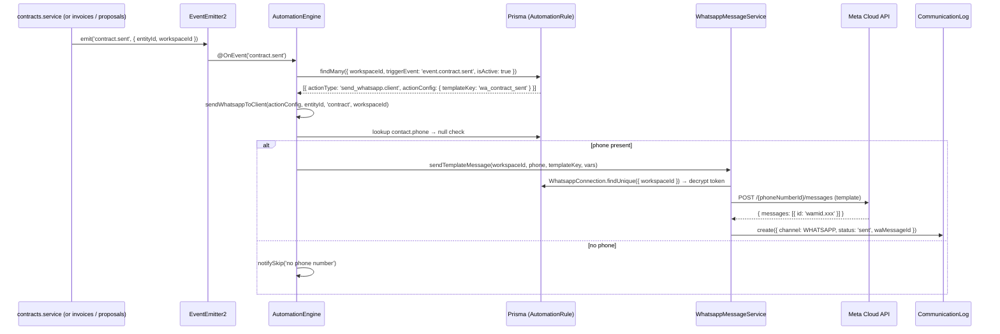
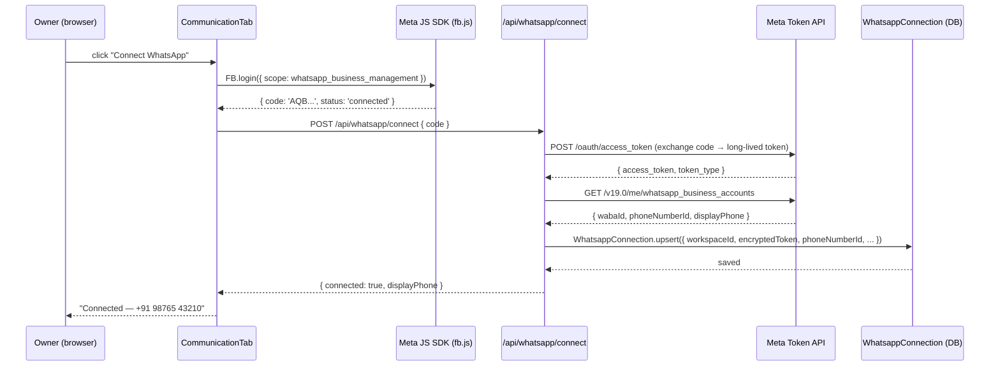

# feat: WhatsApp Business Integration

## Summary

Adds WhatsApp as a second notification channel delivered from each workspace owner's own WhatsApp Business number. Owners connect their WABA via Meta Embedded Signup; ClearWork stores the access token encrypted at rest. The existing AutomationEngine gains a `send_whatsapp.client` action type — no new dispatcher abstraction needed. Seven default WhatsApp rules are seeded at workspace creation (off by default). A new Communication tab in Settings shows connection status and per-event toggles. Meta's delivery-status webhook updates the `CommunicationLog`. Email is untouched for workspaces that never connect.

---

## Problem Frame

ClearWork currently sends all client notifications via email. Indian freelancers communicate heavily via WhatsApp — higher open rates, faster responses, more personal feel. This feature adds WhatsApp as an optional parallel channel for the same transactional events already emailed.

Key constraint: messages must arrive from the **owner's own WhatsApp Business number**, not a shared ClearWork number. ClearWork is the software layer; Meta is the messaging network (same model as Shopify + Stripe).

---

## Architecture Decision

**Extend the AutomationEngine — do not build a new dispatcher.**

Research confirmed the existing `AutomationEngine.dispatchAction()` switch is already channel-agnostic at the rule level. Adding `send_whatsapp.client` costs one new case + one new service. The engine's `AutomationRule.isActive` field is the toggle — 7 new seeded rules (defaulting `isActive: false`) handle per-event WhatsApp enabling without a new data model.

**Credential storage: AES-256-GCM in a dedicated `WhatsappConnection` table.**

Two credential patterns exist in the codebase: plaintext columns on User (Google/Flodesk/ClickUp) and encrypted via `vault-crypto.util.ts` (LeadProviderKey). WhatsApp access tokens are long-lived system credentials — use the encrypted pattern.

(see origin: `docs/brainstorms/2026-08-01-whatsapp-business-integration-requirements.md`)

---

## Requirements Trace

| Req | Implementation Unit |
|-----|---------------------|
| R1–R6 (workspace connection, encryption, revocation) | U2 |
| R7–R10 (template message delivery via Meta Cloud API) | U3 |
| R11 (phone skip guard) | U3, U6 |
| R12 (E.164 normalization) | U6 |
| R13 (no failure propagation) | U3 |
| R14 (exponential backoff retries) | U3 |
| R15–R17 (Settings Communication UI, toggles) | U7 |
| R18–R19 (delivery log, Meta webhook) | U5 |
| R20 (Notification Dispatcher pattern / AutomationEngine extension) | U4 |
| R21 (7 default rules, seeded off) | U4 |

---

## Key Technical Decisions

**KTD1 — `WhatsappConnection` model, not User columns.**
A dedicated table scoped to `workspaceId @unique` makes cross-workspace isolation explicit and keeps the User model from accreting more OAuth fields. Mirrors the `LeadProviderKey` pattern, not the Google/Flodesk pattern.

**KTD2 — `send_whatsapp.client` in the AutomationEngine switch.**
The engine already has `sendEmailToClient()` which resolves entity → contact → email → skip-if-null → send. `sendWhatsappToClient()` follows the same structure: resolve entity → contact → phone → skip-if-null → send. No new listener, no new dispatcher class.

**KTD3 — WhatsApp default rules default to `isActive: false`.**
Email rules default on (they represent existing expected behaviour). WhatsApp rules default off — the owner must explicitly opt in per-event via the toggle grid. This avoids surprise WhatsApp sends on new signups before the owner has connected their WABA.

**KTD4 — Per-event toggle grid reads `AutomationRule.isActive`.**
The frontend Communication Settings tab fetches all rules with `actionType IN ['send_email.client', 'send_whatsapp.client']`, groups by `triggerEvent`, and renders a two-column grid. Toggling patches `isActive` on the corresponding `AutomationRule`. No new toggle entity.

**KTD5 — `CommunicationLog` extended, not replaced.**
The existing `CommunicationLog` model was explicitly designed to hold non-email rows (`migration.sql` comment: "ready to hold WhatsApp/SMS rows later"). Add `WHATSAPP` to `CommunicationChannel` enum and a `waMessageId String?` column for Meta's message ID (used by the delivery webhook to correlate status updates).

**KTD6 — Embedded Signup loads Meta JS SDK inline.**
`CommunicationTab.tsx` loads `https://connect.facebook.net/en_US/sdk.js` on mount via a `<script>` tag. The Connect button calls `FB.login()` with `whatsapp_business_management` + `whatsapp_business_messaging` scopes. On success the short-lived code is POSTed to `/api/whatsapp/connect`; the backend exchanges it and stores credentials.

**KTD7 — `event.project.completed` is a new event.**
E7 (Project Completed) has no existing engine event. `ProjectsService` emits `project.cancelled` today but not `project.completed`. A new event emit must be added to `projects.service.ts` for the WhatsApp rule to fire.

---

## High-Level Technical Design

### Notification dispatch flow



### Embedded Signup connect flow



---

## Output Structure

New directories created in `pakka-api`:

```
src/modules/whatsapp/
  whatsapp.module.ts
  whatsapp-connection.service.ts
  whatsapp-connection.controller.ts
  whatsapp-message.service.ts
  whatsapp-webhook.controller.ts
  dto/
    connect-whatsapp.dto.ts
    whatsapp-webhook.dto.ts
  whatsapp-connection.service.spec.ts
  whatsapp-message.service.spec.ts
  whatsapp-webhook.controller.spec.ts
```

New in `pakka-app`:

```
src/features/whatsapp/
  hooks/
    useWhatsappConnection.ts
    useWhatsappRules.ts
```

---

## Implementation Units

### U1. Prisma schema + migration

**Goal:** Add the `WhatsappConnection` model, extend `CommunicationChannel` enum with `WHATSAPP`, and add `waMessageId` to `CommunicationLog`.

**Requirements:** R1, R4, R5, KTD1, KTD5

**Dependencies:** none

**Files:**
- `pakka-api/prisma/schema.prisma` (modify)
- `pakka-api/prisma/migrations/20260801_001_add_whatsapp_connection/migration.sql` (create)

**Approach:**

Add to `schema.prisma`:

```
model WhatsappConnection {
  id                   String    @id @default(cuid())
  workspaceId          String    @unique
  workspace            Workspace @relation(...)
  phoneNumberId        String
  businessAccountId    String
  encryptedAccessToken String    // AES-256-GCM via vault-crypto.util
  displayPhone         String    // human-readable, e.g. "+91 98765 43210"
  isActive             Boolean   @default(true)
  connectedAt          DateTime  @default(now())
  updatedAt            DateTime  @updatedAt
  @@map("whatsapp_connections")
}
```

Add `WHATSAPP` to the `CommunicationChannel` enum (Postgres enum ALTER requires a migration).

Add `waMessageId String?` to `CommunicationLog` for delivery webhook correlation.

The migration SQL must:
1. `CREATE TABLE whatsapp_connections`
2. `ALTER TYPE "CommunicationChannel" ADD VALUE 'WHATSAPP'` (Postgres enum add is append-only and safe — no table rewrite)
3. `ALTER TABLE communication_logs ADD COLUMN wa_message_id TEXT`

**Patterns to follow:**
- `prisma/migrations/20260731_003_add_contract_invoice_templates/migration.sql` for naming and FK style
- `LeadProviderKey` model for the encrypted-token shape

**Test scenarios:**
- After migration, `prisma.whatsappConnection.create(...)` succeeds with all required fields
- `communicationLog.create({ channel: 'WHATSAPP', waMessageId: 'wamid.xxx', ... })` persists without error
- `whatsappConnection` relation on `Workspace` resolves correctly

**Verification:** `npx prisma migrate dev` succeeds; `npx prisma validate` passes; `npx tsc --noEmit --skipLibCheck` clean.

---

### U2. WhatsappConnectionModule (backend)

**Goal:** Backend module to connect (Embedded Signup code exchange), disconnect (revoke + delete), and read the WhatsApp connection status for a workspace.

**Requirements:** R1–R6, R12 (token revocation), KTD1

**Dependencies:** U1

**Files:**
- `pakka-api/src/modules/whatsapp/whatsapp.module.ts` (create)
- `pakka-api/src/modules/whatsapp/whatsapp-connection.service.ts` (create)
- `pakka-api/src/modules/whatsapp/whatsapp-connection.controller.ts` (create)
- `pakka-api/src/modules/whatsapp/dto/connect-whatsapp.dto.ts` (create)
- `pakka-api/src/modules/whatsapp/whatsapp-connection.service.spec.ts` (create)
- `pakka-api/src/app.module.ts` (modify — register WhatsappModule)

**Approach:**

Controller routes (all require JWT auth guard):
- `POST /api/whatsapp/connect` — body `{ code: string }`. Exchanges the Embedded Signup code for a long-lived token, fetches WABA and phone number details from Meta Graph API, encrypts the token via `encryptKey()` from `vault-crypto.util.ts` (same key env var: `VAULT_ENCRYPTION_KEY`), upserts `WhatsappConnection` record. Returns `{ connected: true, displayPhone }`.
- `DELETE /api/whatsapp/connect` — revokes token via `DELETE /{token}` on Meta Debugger endpoint, then deletes `WhatsappConnection` row. Returns 204.
- `GET /api/whatsapp/status` — returns connection status (`{ connected: bool, displayPhone?, connectedAt? }`). Never returns the access token.

`WhatsappConnectionService.getDecryptedToken(workspaceId)` is an internal method (not exposed via controller) for use by `WhatsappMessageService` and the webhook handler.

**Security:** `encryptKey` / `decryptKey` from `vault-crypto.util.ts` are the only callers of the raw token. Controller never returns decrypted token. ConfigService must resolve `VAULT_ENCRYPTION_KEY`.

**Patterns to follow:**
- `src/modules/lead-vault/vault-crypto.util.ts` for encryption/decryption
- `src/modules/google-auth/google-auth.controller.ts` for the OAuth code-exchange pattern
- JWT `@UseGuards(AuthGuard)` from any existing protected controller

**Test scenarios:**
- `connect(workspaceId, code)` exchanges code, stores encrypted token — assert that what's stored is NOT the raw token (encrypted differs from input)
- `disconnect(workspaceId)` deletes the `WhatsappConnection` row; subsequent `getStatus` returns `{ connected: false }`
- `getStatus` returns `connected: true` with `displayPhone` when a connection exists
- `getStatus` returns `connected: false` when no record exists
- `getDecryptedToken` returns the original plaintext token after decrypt
- Meta API call failure on connect → throws a descriptive error, no partial record stored

**Verification:** All spec tests pass. TypeScript clean. Manual: `POST /api/whatsapp/connect` with a sandbox Embedded Signup code returns `{ connected: true }`.

---

### U3. WhatsappMessageService

**Goal:** Service that sends a pre-approved Meta template message to a phone number and logs the attempt to `CommunicationLog`.

**Requirements:** R7–R10, R13, R14, KTD2, KTD5

**Dependencies:** U2 (needs `getDecryptedToken`)

**Files:**
- `pakka-api/src/modules/whatsapp/whatsapp-message.service.ts` (create)
- `pakka-api/src/modules/whatsapp/whatsapp-message.service.spec.ts` (create)
- `pakka-api/src/modules/whatsapp/whatsapp.module.ts` (modify — export `WhatsappMessageService`)

**Approach:**

`sendTemplateMessage(workspaceId, phone, templateKey, vars, entityId?, entityType?, contactId?)`:

1. `getDecryptedToken(workspaceId)` → `{ token, phoneNumberId }` (throws if not connected)
2. Map `templateKey` → Meta template name + component parameters (inline map, not DB)
3. Build Meta Cloud API payload:
   ```
   POST https://graph.facebook.com/v19.0/{phoneNumberId}/messages
   Authorization: Bearer {token}
   { messaging_product: 'whatsapp', to: phone, type: 'template', template: { name, language: 'en', components } }
   ```
4. On 200 success: `CommunicationLog.create({ channel: WHATSAPP, to: phone, waMessageId: response.messages[0].id, status: 'sent', ... })`
5. On transient error (5xx, network): retry up to 3 times with `1000ms / 4000ms / 16000ms` delays
6. On permanent error (4xx): log as `status: 'failed'`, `error: response.error.message`, do not retry
7. Never throw — always resolve (the AutomationEngine must not fail the business operation)

Template variable map (inline, 7 entries):
- `wa_proposal_shared` → `{{1}}` = client name, `{{2}}` = business name, `{{3}}` = proposal link
- `wa_contract_sent` → client name, business name, contract link
- `wa_contract_signed` → client name, business name, contract link
- `wa_invoice_sent` → client name, business name, invoice number, amount, invoice link
- `wa_payment_reminder` → client name, invoice number, amount, due date, invoice link
- `wa_payment_received` → client name, business name, invoice number, amount
- `wa_project_completed` → client name, business name, project name

**Patterns to follow:**
- `src/modules/automations/email.service.ts` for the log-on-send pattern and the `CommunicationLog.create` call shape
- Error handling style: catch + log, never rethrow

**Test scenarios:**
- Happy path: `sendTemplateMessage(...)` with mocked `axios` 200 → `CommunicationLog` created with `status: 'sent'` and `waMessageId` populated
- No connection: `getDecryptedToken` throws → `CommunicationLog` created with `status: 'failed'`, no throw propagated
- Meta API 5xx: retries 3 times then logs `failed` — assert `axios.post` called 3 times
- Meta API 4xx: no retry, logs `failed` immediately — assert `axios.post` called once
- Missing phone: logs `status: 'skipped'`, returns without calling Meta
- Template variable injection: correct `{{1}}` / `{{2}}` values for each templateKey

**Verification:** Spec passes. TypeScript clean. When called with a real sandbox token (manual test), Meta Graph API returns `200` with a `messages[0].id`.

---

### U4. AutomationEngine extension + Default WhatsApp Rules

**Goal:** Add `send_whatsapp.client` to the AutomationEngine dispatch switch; implement `sendWhatsappToClient()`; seed 7 default WhatsApp rules at workspace creation; add the new `event.project.completed` event.

**Requirements:** R20, R21, KTD2, KTD3, KTD4 (rule seeding)

**Dependencies:** U3

**Files:**
- `pakka-api/src/modules/automations/automation.engine.ts` (modify)
- `pakka-api/src/modules/automations/default-rules.ts` (modify)
- `pakka-api/src/modules/automations/automations.module.ts` (modify)
- `pakka-api/src/modules/projects/projects.service.ts` (modify — emit `project.completed`)
- `pakka-api/src/modules/automations/automation.engine.spec.ts` (modify)

**Approach:**

In `dispatchAction()` switch, add:
```
case 'send_whatsapp.client': return this.sendWhatsappToClient(actionConfig, entityId, entityType, workspaceId)
```

`sendWhatsappToClient()` mirrors `sendEmailToClient()` exactly:
- Lookup entity by `entityType` (invoice/proposal/contract/project)
- Resolve `contact?.phone ?? client?.phone`
- If null → `notifySkip(workspaceId, entityId, entityType, '... has no phone — WhatsApp skipped')`
- Build template vars from entity (amounts, links, names)
- Call `this.whatsappMessage.sendTemplateMessage(workspaceId, phone, actionConfig.templateKey, vars, entityId, entityType, contactId)`

Default rules to add (all `isActive: false`, category `whatsapp`):

| Key | triggerEvent | templateKey |
|-----|-------------|-------------|
| `wa.proposal.sent` | `event.proposal.sent` | `wa_proposal_shared` |
| `wa.contract.sent` | `event.contract.sent` | `wa_contract_sent` |
| `wa.contract.signed` | `event.contract.signed` | `wa_contract_signed` |
| `wa.invoice.sent` | `event.invoice.sent` | `wa_invoice_sent` |
| `wa.invoice.due_soon` | `schedule.invoice.due_soon` | `wa_payment_reminder` |
| `wa.invoice.paid` | `event.invoice.paid` | `wa_payment_received` |
| `wa.project.completed` | `event.project.completed` | `wa_project_completed` |

In `projects.service.ts`, find the project status update path and emit `this.eventEmitter.emit('project.completed', { entityId: project.id, workspaceId })` when status changes to `COMPLETED`.

**Patterns to follow:**
- Existing `sendEmailToClient()` in `automation.engine.ts` — line-for-line mirror
- Existing `DEFAULT_AUTOMATION_RULES` entries for shape and `isActive` precedent
- `seedDefaultRules(workspaceId)` upsert uses `workspaceId_key` composite unique — new rules upsert safely on existing workspaces

**Test scenarios:**
- `dispatchAction('send_whatsapp.client', config, entityId, 'invoice', workspaceId)` → calls `sendWhatsappToClient`
- `sendWhatsappToClient` with invoice that has contact.phone → calls `whatsappMessage.sendTemplateMessage`
- `sendWhatsappToClient` with invoice that has no phone → calls `notifySkip`, does NOT call `sendTemplateMessage`
- `sendWhatsappToClient` failure does NOT throw (business operation continues)
- `seedDefaultRules` for a new workspace includes all 7 `wa.*` rules with `isActive: false`
- `seedDefaultRules` called twice (re-upsert) does not duplicate rules
- `project.completed` event fires when project status transitions to `COMPLETED`

**Verification:** Engine spec passes. `seedDefaultRules` spec passes. TypeScript clean.

---

### U5. Meta Delivery Webhook

**Goal:** Receive Meta's delivery-status callbacks, verify signature, and update `CommunicationLog` status to `DELIVERED` / `READ` / `FAILED`.

**Requirements:** R18–R19

**Dependencies:** U1, U2

**Files:**
- `pakka-api/src/modules/whatsapp/whatsapp-webhook.controller.ts` (create)
- `pakka-api/src/modules/whatsapp/dto/whatsapp-webhook.dto.ts` (create)
- `pakka-api/src/modules/whatsapp/whatsapp-webhook.controller.spec.ts` (create)
- `pakka-api/src/modules/whatsapp/whatsapp.module.ts` (modify — register controller)

**Approach:**

Two routes:
- `GET /webhooks/whatsapp` — Meta's challenge verification. Returns `hub.challenge` query param if `hub.verify_token` matches `WHATSAPP_WEBHOOK_VERIFY_TOKEN` env var.
- `POST /webhooks/whatsapp` — Delivery status updates. **No auth guard** (Meta calls this). Signature verified inline: `X-Hub-Signature-256` header = HMAC-SHA256 of raw body with `WHATSAPP_APP_SECRET`. Reject 403 if mismatch.

Parse the notification object:
```
entry[].changes[].value.statuses[{ id: waMessageId, status: 'delivered'|'read'|'failed', errors? }]
```

For each status entry:
- `CommunicationLog.update({ where: { waMessageId }, data: { status, error: errors?.[0]?.title } })`
- Always return `200 OK` to Meta even if no matching log found (idempotent).

**Security:** Raw body must be captured before any body-parsing middleware (`rawBody: true` on the Express route) for HMAC verification. Use `@RawBody()` or configure a raw body middleware on this path.

**Patterns to follow:**
- Razorpay webhook handler for the raw-body + HMAC verification pattern (if it exists); otherwise follow standard Express raw body approach

**Test scenarios:**
- `GET /webhooks/whatsapp?hub.verify_token=correct&hub.challenge=abc123` → returns `'abc123'`
- `GET /webhooks/whatsapp?hub.verify_token=wrong` → returns 403
- `POST` with valid signature + `status: 'delivered'` → updates `CommunicationLog.status` to `'delivered'`
- `POST` with valid signature + `status: 'read'` → updates status to `'read'`
- `POST` with invalid signature → returns 403, does not update DB
- `POST` with `waMessageId` not found in `CommunicationLog` → returns 200 (idempotent, no crash)

**Verification:** Spec passes. TypeScript clean. Manual: use Meta webhook simulator in Graph API Explorer to send a `delivered` event — `CommunicationLog.status` updates.

---

### U6. Phone Normalization

**Goal:** Normalize `Contact.phone` to E.164 on save; surface a validation error on the Contact form for unparseable numbers.

**Requirements:** R12 (E.164), R11 (skip-if-null)

**Dependencies:** U1 (schema defines `phone String?`)

**Files:**
- `pakka-api/src/modules/contacts/contacts.service.ts` (modify)
- `pakka-api/package.json` (add `google-libphonenumber`)
- `pakka-app/src/features/contacts/components/ContactForm.tsx` (modify)

**Approach:**

**Backend** (`contacts.service.ts`):

Install `google-libphonenumber` (`npm i google-libphonenumber`). In `create()` and `update()`, before writing `dto.phone` to the DB:
1. If `dto.phone` is `null` or empty string → pass through as-is
2. Parse with `PhoneNumberUtil.parseAndKeepRawInput(dto.phone, 'IN')` (default country India; if number starts with `+` it's parsed as international)
3. If parse throws `Error` → throw `BadRequestException('Invalid phone number format')`
4. Format with `PhoneNumberUtil.format(parsed, PhoneNumberFormat.E164)` → write the normalized form

**Frontend** (`ContactForm.tsx`):

Add a `phone` field pattern validator in the Zod schema (loose: allows `+`, digits, spaces, hyphens). When the server returns a 400 with "Invalid phone number", surface it on the phone field. No client-side libphonenumber — keep it simple.

**Patterns to follow:**
- Existing `contacts.service.ts` `create()` / `update()` patterns for DTO→DB mapping
- Existing Zod schema in `src/features/contacts/schemas/contact.schema.ts` for field-level validation

**Test scenarios:**
- `+91 98765 43210` (spaces) → normalized to `+919876543210`
- `9876543210` (no country code, 10 digits) → normalized to `+919876543210` (assumes IN)
- `+1 415 555 2671` (US number) → normalized to `+14155552671`
- `abc123` (garbage) → `BadRequestException`
- `null` / `undefined` → passed through without error
- Existing contacts with non-E.164 phones are unaffected (no migration backfill — schema is already `String?`)

**Verification:** Spec passes. Manual: create Contact with `9876543210` → DB stores `+919876543210`.

---

### U7. Communication Settings UI

**Goal:** Replace the `CommunicationTab` stub with full implementation: WhatsApp connection status, Meta Embedded Signup flow, and per-event toggle grid.

**Requirements:** R15–R17, KTD4, KTD6

**Dependencies:** U2 (backend connect/status endpoints), U4 (WhatsApp rules seeded)

**Files:**
- `pakka-app/src/features/settings/components/CommunicationTab.tsx` (modify — replace stub)
- `pakka-app/src/features/whatsapp/hooks/useWhatsappConnection.ts` (create)
- `pakka-app/src/features/whatsapp/hooks/useWhatsappRules.ts` (create)
- `pakka-app/src/pages/app/SettingsPage.tsx` (already has `communication` tab wired)

**Approach:**

**`useWhatsappConnection` hook:**
- `useQuery` → `GET /api/whatsapp/status` → `{ connected, displayPhone?, connectedAt? }`
- `useMutation` connect → `POST /api/whatsapp/connect { code }` → invalidates `whatsapp-status`
- `useMutation` disconnect → `DELETE /api/whatsapp/connect` → invalidates `whatsapp-status`

**`useWhatsappRules` hook:**
- `useQuery` → `GET /api/automations/rules?actionTypes=send_email.client,send_whatsapp.client` → returns all communication rules
- `useMutation` toggle → `PATCH /api/automations/rules/:id { isActive }` → updates rule

**`CommunicationTab` layout (two sections):**

*Section 1 — WhatsApp Business connection:*

```
WhatsApp Business
─────────────────────────────────────────────────────
[MessageCircle icon]  WhatsApp Business
                      Messages are sent from your own
                      business number via Meta.

  ● Connected  (+91 98765 43210)   [Disconnect]
  ○ Not connected                  [Connect WhatsApp]
```

"Connect WhatsApp" button: loads `fb.js` (append `<script>` to `document.head` if not present), calls `window.FB.login({ scope: ... })`. On `authResponse.code`, call `connect.mutate({ code })`. On success, show "Connected" with `displayPhone`.

Transparent copy when not connected:
> "Messages will be sent from your own WhatsApp Business number. Clients see your name and number — not ClearWork. Meta charges standard messaging fees."

*Section 2 — Per-event toggles (visible only when connected):*

```
Event               Email       WhatsApp
──────────────────────────────────────────
Proposal Shared     ✓ (locked)  ○ toggle
Contract Sent       ✓ (locked)  ○ toggle
Contract Signed     ✓ (locked)  ○ toggle
Invoice Sent        ✓ (locked)  ○ toggle
Payment Reminder    ✓ (locked)  ○ toggle
Payment Received    ✓ (locked)  ○ toggle
Project Completed   ✓ (locked)  ○ toggle
```

Toggle PATCH fires immediately (optimistic update). The rows are built from `useWhatsappRules` — match email rule and its corresponding WhatsApp rule by `triggerEvent` prefix matching (e.g., `event.proposal.sent`).

**Patterns to follow:**
- `src/features/settings/components/IntegrationsTab.tsx` for the connection card layout style
- `src/features/notifications/components/NotificationsTab.tsx` for toggle grid style
- `useContacts`, `useProposals` for the TanStack Query hook pattern

**Test scenarios (manual — no unit tests for this UI unit):**
- Connected workspace: both sections visible, toggles reflect current rule `isActive`
- Toggling WhatsApp on for "Invoice Sent" → PATCH fires → toggle shows enabled
- Clicking "Disconnect" → status flips to "Not connected", per-event section hides
- On mobile: section 1 and section 2 stack cleanly, toggles are tappable
- Not-yet-connected framing copy is visible and accurate

**Verification:** Build passes (`npm run build`). TypeScript clean. Manual walkthrough: Connect → see displayPhone → toggle 3 events on → refresh page → toggles persist.

---

## Scope Boundaries

### In scope (this plan)
- WhatsApp as a second channel for the 7 MVP events (E1–E7)
- Per-workspace Embedded Signup connection
- Encrypted credential storage
- Per-event toggle grid in Settings
- Meta delivery webhook (DELIVERED / READ / FAILED status)
- Phone normalization to E.164 at contact save time
- 7 new default WhatsApp rules (seeded off)

### Deferred to Follow-Up Work
- Per-contact WhatsApp opt-out toggle (contact-level preference)
- Communication Timeline tab on Contact page (viewing message history per contact)
- SMS, Push, Slack providers (architecture supports; no implementation yet)
- AI-generated message content
- Delivery analytics dashboard
- Meta partner/reseller billing model (revisit when >60% of paid users connect)

### Out of scope
- Inbound WhatsApp messages / session messages
- Shared ClearWork WhatsApp number
- WhatsApp notifications for team members (owner only)

---

## Open Questions / Prerequisites (blocking before launch)

These are **business/ops actions**, not engineering tasks:

| Item | Who | Notes |
|------|-----|-------|
| Register ClearWork Meta App (Business Verification) | Founder | Required before Embedded Signup flow works |
| Submit 7 message templates to Meta for approval | Founder / Meta portal | 24–48 hours approval time. Template names must match `wa_proposal_shared`, `wa_contract_sent`, etc. |
| Set `WHATSAPP_APP_SECRET` and `WHATSAPP_WEBHOOK_VERIFY_TOKEN` env vars | Infra | Required for webhook signature verification |
| Register webhook URL in Meta App dashboard | Founder | Point to `https://api.clearwork.in/webhooks/whatsapp` (or sandbox URL during dev) |

**Implementation-time decisions (deferred):**
- `google-libphonenumber` default country code: assume `IN` unless number starts with `+` (confirm at U6 implementation time)
- Whether `project.completed` maps to a specific status transition in `ProjectStatus` enum (check schema at U4 time)
- Long-lived token refresh strategy: Meta system-user tokens do not expire; Embedded Signup tokens expire in 60 days. Decide at U2 implementation time (system-user preferred for production).

---

## Risks & Dependencies

| Risk | Mitigation |
|------|-----------|
| Meta App approval takes weeks | Start business verification immediately; dev can use test phone numbers in sandbox without full approval |
| Template rejection by Meta | Pre-test templates against Meta's content policy; keep copy factual and transactional (no promotional language) |
| Embedded Signup requires HTTPS on localhost | Use `ngrok` or Vite's `--host` proxy during local dev |
| Token expiry (60-day Embedded Signup tokens) | Document in ops runbook; add a `connectedAt` + expiry banner in Settings UI for Phase 2 |
| Phone numbers stored as free text (no E.164) on existing contacts | Phone normalization is forward-only (U6 normalizes on new saves); existing dirty data will hit the `notifySkip` path — acceptable for Phase 1 |

---

## System-Wide Impact

- `CommunicationLog` now carries `WHATSAPP` rows — any query that filters `WHERE channel = 'EMAIL'` will correctly exclude them. Existing email analytics are unaffected.
- `seedDefaultRules` adds 7 new rules — existing workspaces get them on next upsert (safe: `workspaceId_key` unique). Rules default off, so no behavioural change for existing users.
- `SettingsPage.tsx` now has a "Communication" tab (Billing tab removed). The Billing feature remains available in `BillingTab.tsx` for future re-enabling via a proper billing integration.

---

## Sources & Research

- Codebase: `src/modules/automations/automation.engine.ts` — confirmed `dispatchAction` switch is the right extension point
- Codebase: `prisma/migrations/20260730_002_rename_email_log_to_communication_log/migration.sql` — migration comment confirms `CommunicationLog` was designed for multi-channel
- Codebase: `src/modules/lead-vault/vault-crypto.util.ts` — confirmed AES-256-GCM pattern is available
- Requirements: `docs/brainstorms/2026-08-01-whatsapp-business-integration-requirements.md`
