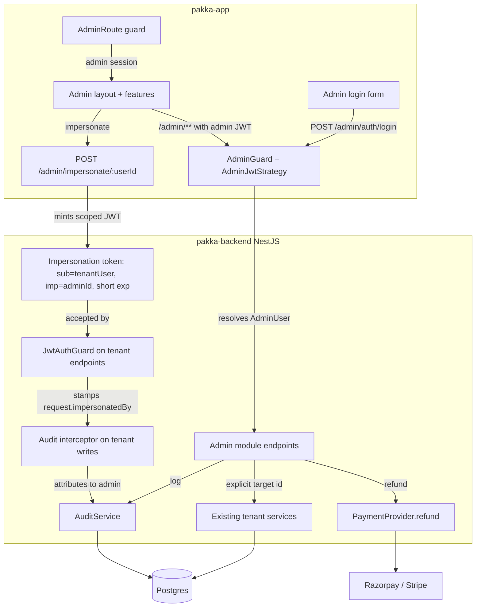

# Pakka Admin Panel - Plan

**Target repos:** `pakka-backend` (NestJS API) and `pakka-app` (React frontend). File paths are repo-relative to each.

## Goal Capsule

- **Objective:** Build a common admin panel for the pakka system — a gated area inside pakka-app that lets internal staff see system-wide data and look up per-user / per-workspace data, and run operational actions. Delivered as a separate `pakka-admin` project (re-implementing a lean subset of pakka-app's design theme) backed by the dedicated admin API already built in the existing NestJS backend.
- **Product authority:** This plan owns the admin panel only. It does not own changes to the customer-facing pakka-app behavior, the existing tenant RBAC model, or re-architecting the billing/payment providers — the providers are extended only as needed (e.g. a `refund` method on the existing provider interface) and otherwise read or acted on as dependencies.
- **Stop conditions:** All R1–R16 satisfied; every U-ID's Verification passes; the Definition of Done holds. The refund and impersonation paths are the risk surface and must pass their test scenarios before the plan is done.
- **Open blockers:** None. Backend superadmin access mode and admin identity model are net-new and are specified in the Planning Contract below.
- **Execution profile:** Backend-first, then frontend. Code, with Jest tests on the backend and runtime/build smoke on the frontend.
- **Product Contract preservation:** unchanged. This run enriches the requirements-only artifact in place to implementation-ready; R/A/AE IDs, Key Decisions, and Scope Boundaries are preserved verbatim.

## Product Contract

### Summary

A superadmin panel embedded inside pakka-app, gated from regular users, that gives internal staff both a system-wide oversight view and a per-user / per-workspace lookup-and-fix console, backed by a new dedicated admin API in the existing NestJS backend. Admins are a separate identity from tenant users; every mutating action is confirmed and audit-logged. v1 ships read views and the four write-action sets together.

### Problem Frame

pakka is a multi-tenant workspace product: every domain entity — contracts, invoices, leads, projects, tasks, expenses, time-entries, threads — is scoped to a `Workspace`, and a user operates inside one active workspace at a time. Today there is no operator surface at all. No admin or superadmin role exists, no `isAdmin` flag, no admin module or route in either repo; the highest privilege is a workspace `OWNER`, and every backend query is scoped through the caller's own `activeWorkspaceId`. When someone needs to answer a support question, see how many workspaces exist, refund a payment, or reproduce a user's bug, there is no path to do it. The panel exists to give internal staff that cross-tenant view and a controlled set of cross-tenant actions, without exposing them to customers and without rebuilding the customer app.

### Actors

- A1. **Superadmin** — full access: all read views and all write actions, including impersonation and billing/refund. Owns the audit trail review.
- A2. **Support staff** — read access across all tenants plus the non-financial write actions (plan overrides, feature flags, record fixes). No impersonation or billing/refund unless elevated. (Role tiers are a planning detail; the requirement is that at least two tiers exist.)

### Requirements

**Access & identity**

- R1. The admin panel is reachable only to authenticated admins via a superadmin-only `/admin` route group inside pakka-app; non-admins never see the route or reach the data.
- R2. Admin identity is separate from tenant `User` accounts — admins log in through a distinct admin identity, not by a flag on an existing tenant user. Admin sessions are isolated from tenant sessions.
- R3. Both the frontend route gate and the backend admin guard enforce admin access; the frontend gate alone is never trusted. Every admin request is authorized server-side as an admin before any cross-tenant data is returned or changed.
- R4. The backend gains a new cross-tenant access mode that routes around per-call `resolveWorkspaceId` tenant scoping by passing an explicit target id instead of the caller's `activeWorkspaceId` (additive — it does not weaken or disable the existing scoping). This access mode exists from day one; only the endpoints built on it are incremental.

**Oversight (system-wide, read)**

- R5. An overview dashboard shows system totals: count of workspaces, count of users (active and inactive), plan distribution across workspaces, and signups over time.
- R6. The overview shows revenue signal derived from billing events (MRR/ARR), churn signal, and top workspaces by usage. Exact metrics are a planning detail; the requirement is that aggregate revenue and churn are visible at the system level.
- R7. Oversight data is exportable (at minimum CSV) for the headline metrics so staff can work with it outside the panel.

**Tenant lookup (read)**

- R8. Staff can search for a user by email or name and open a user detail view showing their profile, their workspaces, membership and role per workspace, plan/subscription status, and last-active signal.
- R9. Staff can list and filter all workspaces and open a workspace detail view showing its members, plan, entity counts (contracts, invoices, leads, projects, and the other workspace-scoped domains), billing/limits, and created/active state.
- R10. From a user detail, staff can reach each of that user's workspaces; from a workspace detail, staff can reach each member's user detail. The two lookup paths are linked in both directions.

**Operational actions (write)**

- R11. Every write action requires explicit confirmation in the UI and is recorded in an audit log with the admin identity, the target tenant/user, the action, a timestamp, and a before/after or reason where the action changes state.
- R12. Staff can override a user's plan and subscription: upgrade, extend, downgrade, set `planExpiresAt`, apply or remove a permanent promo grant, and cancel/reset a subscription. These act on the same fields `effectivePlan()` reads.
- R13. A superadmin can impersonate a tenant user — log in as that user to reproduce their view — without the user's password. Impersonation uses a scoped, auto-expiring admin token, and every action taken during an impersonated session is recorded against the admin identity in the audit trail, not the impersonated user.
- R14. Staff can run billing/refund operations: issue a refund through the existing Razorpay or Stripe payment provider, re-sync a stuck subscription, and replay a billing event. No refund endpoint exists today, so the refund path is new admin-backed machinery built on the existing providers, not a call to an existing refund route. These touch real money and carry the strongest confirmation and audit requirements.
- R15. Staff can fix records and toggle features: flip a feature flag for a workspace, manually verify a stuck contract or invoice, soft-delete or disable a workspace, and force-resend a notification. Soft-delete/disable must be reversible or retain recoverable state; hard-delete of tenant data is out of scope for v1.

**Audit**

- R16. The audit log is readable by superadmins in the panel, filterable by admin, by target tenant/user, by action type, and by time. It is the authoritative record of who did what to which tenant.

### Key Decisions

- **Embedded route in pakka-app over a sibling project** (session-settled: user-approved at brainstorm — chosen over a new `pakka-admin` sibling + vendored theme: gives "same design theme" at zero sharing cost, one deploy, reuses existing auth/Query/shell). **Superseded 2026-08-02:** the user redirected to a separate `pakka-admin` project; see the Approach change note in the Goal Capsule and KTD6. Governs R1, R3.
- **Separate admin identity over a flag on `User`** (session-settled: user-approved — chosen over an `isAdmin` boolean on the existing User table: stronger isolation between operator and tenant access since none exists today). Governs R2, R11, R13.
- **Dedicated incremental admin API over a generic cross-tenant CRUD layer** (session-settled: user-approved — chosen over a full cross-tenant data-access layer built up front: small blast radius, grows view-by-view, each capability is an explicit endpoint). Governs R4, R5–R16.
- **Both oversight and tenant-lookup at equal weight, not one primary** (session-settled: user-directed — chosen over a support-console-first or oversight-first framing: the panel is the one place staff go for both). Governs R5, R8, R9.
- **Full staff read+write, not read-only** (session-settled: user-directed — chosen over read-only or light-ops tiers: commits to admin RBAC tiers, audit, and confirmation flows from v1). Governs A1, A2, R11–R15.
- **All four write-action sets in v1** (session-settled: user-directed — plan/sub overrides, impersonation, billing/refund, feature flags + record fixes all ship at launch). Governs R12–R15.
- **Impersonation audit records the admin, not the impersonated user** — prevents an action taken "as" a user from being indistinguishable from the user's own action. Governs R13, R16.

### Scope Boundaries

**Deferred for later**

- A reusable `@pakka/ui` design-system package extraction. The embedded route reuses the in-app theme directly; extraction is deferred until a third frontend surface proves the carrying cost.
- Generic cross-tenant CRUD over all ~25 workspace-scoped entities. Only explicitly-built admin endpoints ship.
- Advanced analytics beyond core oversight — funnels, cohort retention, per-workspace deep usage, trend alerting. Deferred to a later reporting phase.
- Hard-delete of tenant data from the panel. v1 uses soft-delete/disable with recoverable state.
- An admin-side tenant impersonation *undo* or session-recording replay beyond the audit log.

**Outside this product's identity**

- Changing the customer-facing pakka-app behavior or the existing tenant RBAC model. The admin reads and acts on tenant data; it does not redefine how tenants experience the product.
- Re-architecting billing providers. The admin builds on the existing Razorpay + Stripe machinery; it does not replace it.

**Deferred to Follow-Up Work**

- Admin-side management of `PromoCode` / `BillingConfig` global entities (create/edit promo codes, billing config). Out of v1's write set; the panel reads them for context only.
- Admin notifications (alerting on churn spikes, failed-payment bursts). The audit log is the v1 signal; alerting is later.

### Acceptance Examples

- AE1. **Covers R1, R3.** **Given** a non-admin tenant user is signed in to pakka-app, **When** they navigate to `/admin` or call any admin endpoint, **Then** the route is not rendered and the backend returns an authorization error; no cross-tenant data is returned.
- AE2. **Covers R8, R10.** **Given** staff search for a user by email, **When** they open the user's detail, **Then** they see that user's workspaces, role in each, and plan status, and can navigate into any one workspace.
- AE3. **Covers R9, R10.** **Given** staff open a workspace detail, **When** they view its entity counts and members, **Then** they can navigate from any member back to that user's detail.
- AE4. **Covers R12.** **Given** a user is on a FREE plan with an active subscription problem, **When** a superadmin extends their `planExpiresAt` by 30 days, **Then** the change is confirmed before applying, `effectivePlan()` reflects the extension, and the audit log records the admin, the target user, the field, the old and new value, and the time.
- AE5. **Covers R13, R16.** **Given** a superadmin impersonates a tenant user, **When** any action is taken during the impersonated session, **Then** the audit log attributes the action to the superadmin identity, not the impersonated user. Separately, **Given** the impersonation token's short expiry window has elapsed, **When** the token is presented again, **Then** it is rejected and cannot be reused.
- AE6. **Covers R14.** **Given** a workspace has a paid invoice with a disputed charge, **When** staff issue a refund through the panel, **Then** the refund requires explicit confirmation, is routed through the existing Razorpay or Stripe provider (there is no refund endpoint today, so the admin path creates this capability), and the audit log records the admin, the payment, the amount, and the time.
- AE7. **Covers R15.** **Given** a contract is stuck in a sent-but-unsigned state due to a known bug, **When** staff manually verify it, **Then** the record moves to a verified state, the change is audit-logged, and the original state is recoverable (soft-delete/disabled semantics, not hard-delete).

### Success Criteria

- Staff can answer "how many workspaces/users do we have, what's our MRR, who churned" entirely from the overview dashboard without writing a database query.
- Staff can resolve a single tenant's support issue end-to-end (find user → see their workspace → fix plan/refund/impersonate) without backend access.
- Every mutating action an admin takes is reconstructable from the audit log alone — who, what, which tenant, when, and the state change.
- A non-admin can neither see nor reach any admin capability, verified from both the frontend route and the backend guard.

### Dependencies / Assumptions

- The existing NestJS backend's per-call tenant scoping (`resolveWorkspaceId`) is a server-side guard applied in controllers (controllers resolve the caller's workspace and pass it to services), so the admin cross-tenant access mode is a new admin access path that passes an explicit target id, not a mutation of the existing scoping. Planning estimates it as a real architectural addition.
- The existing Razorpay + Stripe subscription endpoints and webhooks under `/payments/*` are reused for subscription ops. A refund capability does not exist today, so the admin introduces a new refund path built on the existing providers rather than wrapping an existing refund endpoint.
- Admin identity infrastructure (separate login, isolated session, role tiers) is net-new; the system has no admin auth today.
- Assumption: the aggregate revenue/churn metrics in R6 can be derived from existing `BillingEvent` records. If `BillingEvent` coverage is insufficient, R6 narrows to "revenue and churn signal derived from whatever billing data exists," and richer metrics defer.

### Outstanding Questions

- **Resolve Before Planning:** None — the dialogue settled actor tiers, write-action set, identity model, and approach; planning settled the identity storage mechanism.
- **Deferred to Planning:** None remaining.
- **Deferred to Implementation:** Consumed-`jti` replay-guard store backing (in-memory vs Redis); soft-delete vs disable semantics per entity in R15; audit log retention policy; exact oversight chart shapes beyond the R6 set; refund partial-vs-full amount handling per provider (idempotency is pinned in KTD4; the imp-claim forgery constraint is pinned in KTD5).

### Sources / Research

- Grounding dossier: `/tmp/compound-engineering-503/ce-brainstorm/admin-panel/grounding.md` — pakka-app stack and design-theme tokens (`pakka-app/src/index.css`), auth/RBAC model (`pakka-app/src/components/Can.tsx`, `pakka-backend/src/common/guards/workspace-permission.guard.ts`, `pakka-backend/prisma/schema.prisma:33-65`), workspace model and `resolveWorkspaceId` (`pakka-backend/src/modules/users/resolve-workspace-id.ts`), workspace-scoped vs global entities (`pakka-backend/prisma/schema.prisma:99-124`), backend framework and `/api/v1` + `{data}` envelope (`pakka-backend/src/main.ts`), confirmation that no admin surface exists today, billing/limits and `effectivePlan()` (`pakka-backend/src/modules/users/effective-plan.ts`, `pakka-backend/src/modules/workspaces/workspaces.service.ts`). Verification corrected one dossier claim: the payment provider is Razorpay (bound as PAYMENT_PROVIDER in payments.module.ts) + Stripe (separate service) - neither has a refund endpoint today, and no refund endpoint exists under `/payments` today — only subscription lifecycle routes and webhooks (`pakka-backend/src/modules/payments/payments.controller.ts`).
- Planning dossier (backend): `/tmp/compound-engineering-503/ce-brainstorm/admin-panel/plan-backend.md` — auth seam and global guard order (`pakka-backend/src/modules/auth/jwt.strategy.ts`, `pakka-backend/src/common/guards/jwt-auth.guard.ts`, `pakka-backend/src/app.module.ts:135-139`), scoping lives in controllers passing `workspaceId` to services (`pakka-backend/src/modules/clients/clients.service.ts:21-55`), guard/decorator pattern (`pakka-backend/src/common/guards/workspace-permission.guard.ts:8-28`), module convention, payment provider interface + injection (`pakka-backend/src/modules/payments/payment-provider-interface.ts`, `pakka-backend/src/modules/payments/payments.service.ts:1-33`), `effectivePlan()` fields (`pakka-backend/src/modules/users/effective-plan.ts:9-18`), Jest test setup (`pakka-backend/src/app.controller.spec.ts`).
- Planning dossier (frontend): `/tmp/compound-engineering-503/ce-brainstorm/admin-panel/plan-frontend.md` — router/guard seam (`pakka-app/src/router/index.tsx:10-26,132-419`), auth store (`pakka-app/src/store/authStore.ts`), query + axios api client (`pakka-app/src/lib/api.ts:4-27`, `pakka-app/src/lib/queryClient.ts`), theme primitives and `cn` (`pakka-app/src/index.css`, `pakka-app/src/lib/utils.ts:4`), feature-module convention, `ConfirmModal` (`pakka-app/src/components/ConfirmModal.tsx`), recharts `^3.8.1` installed, `WorkspaceProvider` bypass need (`pakka-app/src/contexts/WorkspaceContext.tsx`, `pakka-app/src/App.tsx:71`).

---

## Planning Contract

### Key Technical Decisions

- KTD1. **Admin identity: separate `AdminUser` table + own admin JWT** (session-settled: user-directed — chosen over reusing Supabase with a claim/lookup: strongest isolation; admin accounts have no relationship to tenant `User` rows and the `AdminGuard` resolves `AdminUser` only). A new `AdminUser` Prisma model holds email, hashed password (bcrypt), and `role` (superadmin/support). A dedicated `POST /admin/auth/login` mints an admin JWT signed with a separate secret/scope from the Supabase tenant JWT. A new `AdminJwtStrategy` validates it and a new `AdminGuard` + `@RequireAdmin(tier)` decorator enforce tier-gated access. Because the global `JwtAuthGuard` (JWKS) and `WorkspacePermissionGuard` are registered as `APP_GUARD` and run on every non-`@Public()` route, all `/admin/**` controllers are marked `@Public()` so those global guards skip them, and `AdminGuard` is applied as a controller-level guard (`@UseGuards(AdminGuard)`) on `/admin` controllers — it is the sole authz authority for admin routes. Governs R2, R3, R11, R13.
- KTD2. **Cross-tenant access = new admin controllers passing an explicit target id, not a guard bypass.** Research found tenant scoping lives in controllers (they call `resolveWorkspaceId(user)` and pass `workspaceId` as the first arg to services; services filter Prisma by that param and never resolve it themselves). Admin endpoints therefore live in a new `admin` module whose controllers take an explicit `workspaceId`/`userId` path param and call the *existing* services with that target id — reusing tenant query logic without weakening it. No existing controller or service is mutated to accept "no workspace"; the admin path is additive. Governs R4, R8, R9.
- KTD3. **Audit log = standalone `AuditLog` model + `AuditService`, written on every write path.** `AuditLog` (adminId, adminRole, targetType, targetId, action, before Json?, after Json?, reason?, at) is a top-level model with no `workspaceId` FK (like `BillingEvent`). An `AuditService.log(...)` is called by every admin write endpoint and by the impersonation tenant-action path. Read endpoint supports the R16 filters. This single owner carries the R11/R16 rule; units cite it. Governs R11, R13, R16.
- KTD4. **Refund = new `refund` method on the `PaymentProvider` interface, implemented for Razorpay and Stripe, idempotent on paymentId.** No refund endpoint exists today. Add `refund(paymentId, amount?)` to `PaymentProvider`; Razorpay implements `client.payments.refund(paymentId, { amount? })`, Stripe implements `stripe.refunds.create({ payment_intent, amount })`. An admin `POST /admin/billing/refund` calls the injected provider (the `PAYMENT_PROVIDER` token binds `RazorpayProvider`; `PaymentsService` uses the same token) and writes an audit entry. The refund endpoint is **idempotent on paymentId**: a second refund call for an already-refunded payment short-circuits (returns the existing refund result) rather than re-calling the provider — preventing a retried/replayed request or a double-click from issuing two real-money refunds. Each refund attempt writes an audited `BillingEvent`/`AuditLog` row keyed by the idempotency key so a retried call surfaces "already refunded." Provider-specific idempotency-key mechanics (Stripe `Idempotency-Key` header, Razorpay refund idempotency) are wired into the `refund` signature; exact partial-vs-full amount handling per provider is deferred to implementation. Governs R14.
- KTD5. **Impersonation mints a short-lived token signed with a backend-held `ADMIN_IMPERSONATION_SECRET` (a deliberately-widened second issuer), accepted only for `imp`-bearing tokens on tenant routes.** The backend validates tenant JWTs via Supabase JWKS (asymmetric public keys it does not hold), so it cannot mint a JWKS-verifiable token; instead `JwtStrategy` is extended with a second verification branch keyed on the `imp` claim. A superadmin `POST /admin/impersonate/:userId` mints a JWT with claims `sub` = target tenant user id, `imp` = adminId, `jti` = unique id, `iat`, `exp` (max 15 min), signed with `ADMIN_IMPERSONATION_SECRET`. `JwtStrategy` accepts this token only on tenant endpoints (never `/admin`), stamps `request.impersonatedBy = adminId`, and rejects any token whose `jti` has been consumed (replay guard) or whose `exp` has passed. A global `ImpersonationAuditInterceptor` writes an `AuditLog` entry attributed to the admin when `impersonatedBy` is set, regardless of HTTP method (not only writes — see R13). This is the cross-cutting seam: tenant auth learns a second accepted issuer for `imp`-bearing tokens only, and the audit write happens on the tenant-action path, not only admin endpoints. The isolation boundary holds because the second issuer is backend-held (tenant users cannot produce it) and honored only for impersonation, never to resolve an `AdminUser`. Governs R13, R16.
- KTD6. **Frontend admin = a separate `pakka-admin` project (Vite + React + Tailwind 4 + recharts), re-implementing a lean subset of pakka-app's design theme.** (session-settled: user-directed 2026-08-02 — chosen over an embedded `/admin` route in pakka-app and over a shared `@pakka/ui` package: separate project as the user redirected; lean subset over a shared package to avoid the monorepo/workspace tooling the pakka system doesn't have.) The project owns a small copy of the design tokens (the CSS custom properties + a handful of `@layer components` primitives — `.card`, `.btn-primary`, `.form-input`, `.badge-*`, `.data-table`) it actually needs, plus its own `cn` helper, Zustand admin-auth store, and axios instance hitting `/api/v1/admin/**`. Currency in admin views comes from each target record's own `currency` field, never any tenant workspace context. Governs R1, R8–R10.
- KTD7. **Two admin role tiers: superadmin and support.** Maps to A1/A2. `@RequireAdmin('superadmin')` gates impersonation and billing/refund; `@RequireAdmin('support')` plus read endpoints gate the rest. The `AdminUser.role` enum is the single source; tiers beyond these are out of scope. Governs A1, A2, R13, R14.

### High-Level Technical Design

Admin auth and impersonation flow (the load-bearing cross-cutting seam):

Two distinct JWT verification paths feed the backend: the admin JWT (verified by `AdminJwtStrategy`, resolves `AdminUser`, used only by `/admin/**` endpoints) and the tenant Supabase JWT (verified by `JwtStrategy`, resolves tenant `User`, used by all existing endpoints). The impersonation token is a third shape — tenant-shaped (`sub` = tenant user) but carrying an `imp` claim and signed with the backend-held `ADMIN_IMPERSONATION_SECRET` (a deliberately-widened second issuer, since the backend cannot mint JWKS-verifiable tokens). It is accepted by the existing tenant guard only for `imp`-bearing tokens on tenant routes and intercepted for audit. Keeping these three paths separate is the security boundary; the `AdminGuard` never resolves a tenant `User`, the tenant guard never resolves an `AdminUser`, and the second issuer is honored only for impersonation, never to authenticate an admin.

### Assumptions

- `BillingEvent` records carry enough to compute MRR/ARR and churn for R6; if not, the R6 scope narrows per the Dependencies assumption rather than blocking.
- The existing services' method signatures (taking `workspaceId` as first arg) are stable enough to call directly from admin controllers without a service-layer refactor. If a service tightly couples the caller's identity into a query, the admin unit adds a thin admin-specific query instead of forcing a refactor — a deferred-to-implementation call.
- Admin JWT secret is provisioned via existing config (`ConfigService`); no new secrets manager is in scope.

### Sequencing

Backend-first, in dependency order: data model (U1) → auth (U2) → read API (U3) → audit + non-financial writes (U4) → refund (U5) → impersonation (U6). Frontend starts once the admin auth contract (U2) is stable: admin auth/routing (U7) can begin in parallel with U4–U6; feature modules (U8) depend on U3–U7 endpoints existing. U8 may be sliced per-feature to match backend readiness.

---

## Implementation Units

### U1. Admin data model and migration (pakka-backend)

- **Goal:** Add the `AdminUser` and `AuditLog` Prisma models and a migration.
- **Requirements:** R2, R11, R16.
- **Dependencies:** none.
- **Files:**
  - `pakka-backend/prisma/schema.prisma` — add `AdminUser` (id, email @unique, passwordHash, name, role AdminRole enum {superadmin support}, createdAt, lastLoginAt?) and `AuditLog` (id, adminId, adminRole, targetType, targetId, action, before Json?, after Json?, reason?, at DateTime) models; add `AdminRole` enum; add `archivedAt DateTime?` to the existing `Workspace` model (it has no recoverable-state column today; mirrors the `archivedAt` pattern on child models) so workspace soft-delete (R15/AE7) is implementable.
  - `pakka-backend/prisma/migrations/<ts>_add_admin_user_audit_log/migration.sql` — generated.
  - `pakka-backend/src/modules/admin/admin.module.ts` — new module shell (registered in `app.module.ts`).
  - `pakka-backend/src/app.module.ts` — register `AdminModule`.
- **Approach:**
  1. Add `AdminRole` enum and `AdminUser` model with no relation to tenant `User` — the isolation boundary (per KTD1).
  2. Add `AuditLog` as a top-level model with no `workspaceId` FK (mirrors `BillingEvent`).
  3. Run `prisma migrate dev` to generate the migration.
  4. Create the `AdminModule` shell and register it in `app.module.ts` imports.
- **Patterns to follow:** existing model style in `schema.prisma` (e.g. `BillingEvent` at `schema.prisma:292` for a top-level no-FK model; `User` for `@unique`/`@default` conventions).
- **Test scenarios:**
  - Migration applies cleanly on a dev DB with existing data (`prisma migrate dev` succeeds; `prisma db pull` round-trips the schema).
  - `AdminUser.email` is unique — inserting a duplicate throws a unique-constraint error.
  - `AuditLog` accepts a row with `before`/`after` null and with JSON values.
- **Verification:** `npx prisma migrate dev` succeeds; `npx prisma validate` passes; the new models appear in `npx prisma studio`.

### U2. Admin auth: login, JWT strategy, guard (pakka-backend)

- **Goal:** Admins log in with a separate identity and get an admin JWT; an `AdminGuard` + `@RequireAdmin(tier)` enforce access.
- **Requirements:** R2, R3, R11. Covers AE1.
- **Dependencies:** U1.
- **Files:**
  - `pakka-backend/src/modules/admin/auth/admin-jwt.strategy.ts` — validates admin JWT via the admin secret; resolves `AdminUser`.
  - `pakka-backend/src/modules/admin/auth/admin.guard.ts` — `AdminGuard` reading `@RequireAdmin(tier)` metadata, checking `request.admin.role`.
  - `pakka-backend/src/modules/admin/auth/require-admin.decorator.ts` — `@RequireAdmin('superadmin'|'support')`.
  - `pakka-backend/src/modules/admin/auth/admin-auth.controller.ts` — `POST /admin/auth/login` (email+password → admin JWT).
  - `pakka-backend/src/modules/admin/auth/admin-auth.service.ts` — verify bcrypt, mint JWT.
  - `pakka-backend/src/modules/admin/auth/dto/admin-login.dto.ts` — class-validator DTO.
  - `pakka-backend/src/modules/admin/auth/admin-auth.service.spec.ts` — tests.
  - `pakka-backend/src/modules/admin/admin.module.ts` — wire strategy/guard/service/controller.
  - `pakka-backend/src/app.module.ts` — register `AdminModule` (admin controllers carry `@Public()` + controller-level `@UseGuards(AdminGuard)` per Approach step 5; the admin strategy is a provider, not a global `APP_GUARD`).
- **Approach:**
  1. Add an `ADMIN_JWT_SECRET` config key (separate from Supabase JWKS).
  2. `AdminJwtStrategy` verifies the admin JWT and loads `AdminUser` by id; never loads a tenant `User` (per KTD1).
  3. `AdminGuard` mirrors `WorkspacePermissionGuard`'s Reflector-metadata shape but checks `request.admin.role` against the required tier, treating `superadmin` as satisfying any `@RequireAdmin(...)` tier (hierarchical: superadmin ≥ support, not exact-match, per KTD7); skips workspace membership entirely.
  4. `POST /admin/auth/login` verifies bcrypt password, mints a short-lived admin JWT (e.g. 8h) with `{ sub: adminId, role }`, returns it; writes a login `AuditLog`.
  5. Mark all `/admin/**` controllers `@Public()` so the global `JwtAuthGuard` (JWKS) and `WorkspacePermissionGuard` skip them, and apply `AdminGuard` as a controller-level guard (`@UseGuards(AdminGuard)`) on `/admin` controllers — it is the sole authz authority for admin routes (not global, to avoid touching tenant routes).
- **Patterns to follow:** `jwt.strategy.ts:14-43` (Passport strategy shape), `workspace-permission.guard.ts:8-28` (Reflector metadata guard), `jwt-payload.strategy.ts` (strategy registration), `app.module.ts:135-139` (global guard registration).
- **Test scenarios:**
  - Valid admin email/password returns a 200 with an admin JWT; wrong password returns 401.
  - A request to a `@RequireAdmin('superadmin')` endpoint with a support-tier admin JWT returns 403; with a superadmin JWT returns 200.
  - A request with a *tenant* Supabase JWT to an admin endpoint returns 401 (admin strategy does not accept tenant tokens).
  - A request with no token to an admin endpoint returns 401.
  - An admin JWT reaches an `/admin/**` endpoint (the global JWKS `JwtAuthGuard` skips `@Public()` admin controllers; `AdminGuard` is the sole authz authority).
  - Login writes an `AuditLog` entry with `action: 'admin.login'`.
- **Verification:** Jest suite passes; an admin can log in via the endpoint and call a protected admin route; a tenant user cannot.

### U3. Admin read API: oversight + user/workspace lookup (pakka-backend)

- **Goal:** Cross-tenant read endpoints for the overview dashboard and user/workspace lookup.
- **Requirements:** R4, R5, R6, R7, R8, R9, R10. Covers AE2, AE3.
- **Dependencies:** U2.
- **Files:**
  - `pakka-backend/src/modules/admin/oversight/admin-oversight.controller.ts` — `GET /admin/oversight` (totals, plan distribution, signups over time), `GET /admin/oversight/export` (CSV).
  - `pakka-backend/src/modules/admin/oversight/admin-oversight.service.ts` — aggregate queries over `Workspace`, `User`, `BillingEvent`.
  - `pakka-backend/src/modules/admin/users/admin-users.controller.ts` — `GET /admin/users` (search by email/name), `GET /admin/users/:id` (profile, workspaces, membership, plan, last-active).
  - `pakka-backend/src/modules/admin/users/admin-users.service.ts`.
  - `pakka-backend/src/modules/admin/workspaces/admin-workspaces.controller.ts` — `GET /admin/workspaces` (list/filter), `GET /admin/workspaces/:id` (members, plan, entity counts, billing/limits, state).
  - `pakka-backend/src/modules/admin/workspaces/admin-workspaces.service.ts` — entity-count queries per workspace-scoped model.
  - `pakka-backend/src/modules/admin/dto/*` — pagination/search DTOs.
  - `pakka-backend/src/modules/admin/oversight/admin-oversight.service.spec.ts` — tests.
- **Approach:**
  1. Oversight service runs Prisma `groupBy`/`count` over `Workspace`, `User`, and `BillingEvent` for R5/R6 totals. Revenue/churn derived from `BillingEvent`; if coverage is thin, return what exists (per the Dependencies assumption).
  2. CSV export streams the headline metrics as CSV.
  3. Users service searches `User` by email/name (case-insensitive contains) and assembles workspaces via `WorkspaceMember` + `WorkspaceRole`. Last-active is derived from the most recent workspace-scoped record or session signal available.
  4. Workspaces service lists `Workspace` with filters; detail aggregates entity counts by counting each workspace-scoped model where `workspaceId = target` (the 25+ models from the dossier). Currency/plan come from the workspace's own fields, not the caller's.
  5. Controllers pass the explicit `:id`/`:workspaceId` path param to services — never the caller's `activeWorkspaceId` (KTD2).
- **Patterns to follow:** `clients.controller.ts` + `clients.service.ts:21-55` (controller→service `workspaceId` arg pattern, here with an explicit target id); module convention from `workspaces` module.
- **Test scenarios:**
  - `GET /admin/oversight` returns correct counts against a seeded test DB (3 workspaces, 5 users, known plan distribution).
  - `GET /admin/users?email=foo` returns only matching users; `GET /admin/users/:id` returns that user's workspaces and role per workspace.
  - `GET /admin/workspaces/:id` returns entity counts matching seeded data (e.g. 2 contracts, 3 invoices).
  - A support-tier admin can read all endpoints (200); a non-admin token is rejected (401).
  - CSV export returns parseable CSV with headers.
- **Verification:** Jest suite passes; an admin can search a user and drill into their workspace, and the counts match the DB.

### U4. Audit service + non-financial write actions (pakka-backend)

- **Goal:** The `AuditService` and the plan/subscription override, feature-flag, and record-fix endpoints.
- **Requirements:** R11, R12, R15, R16. Covers AE4, AE7.
- **Dependencies:** U2, U3.
- **Files:**
  - `pakka-backend/src/modules/admin/audit/audit.service.ts` — `log({adminId, adminRole, targetType, targetId, action, before, after, reason})`.
  - `pakka-backend/src/modules/admin/audit/audit.controller.ts` — `GET /admin/audit` (R16 filters: admin, target, action, time).
  - `pakka-backend/src/modules/admin/actions/admin-actions.controller.ts` — plan/sub override, feature-flag toggle, contract/invoice verify, workspace soft-delete/disable, notification force-resend.
  - `pakka-backend/src/modules/admin/actions/admin-actions.service.ts`.
  - `pakka-backend/src/modules/admin/actions/admin-actions.service.spec.ts` — tests.
- **Approach:**
  1. `AuditService.log` writes one `AuditLog` row; every write endpoint calls it with before/after snapshots (KTD3).
  2. Plan/sub override writes `User.plan`, `planExpiresAt`, `subscriptionStatus`, and promo grant fields — the exact fields `effectivePlan()` reads (`effective-plan.ts:9-18`). Capture before/after for audit.
  3. Feature-flag toggle and record-fix endpoints act on the target workspace/entity by explicit id; workspace soft-delete sets the `Workspace.archivedAt` column added in U1 (mirroring the `archivedAt` pattern on child models) rather than deleting rows, so it is recoverable (R15/AE7).
  4. `GET /admin/audit` filters by adminId, targetType/targetId, action, and time range; superadmin-only.
- **Patterns to follow:** `effective-plan.ts:9-18` (fields to override); `workspaces.service.ts` (workspace update pattern); existing `archivedAt` soft-delete columns.
- **Test scenarios:**
  - Extending `planExpiresAt` by 30 days updates the field and `effectivePlan()` reflects the extension; an `AuditLog` row records admin, target, field, old+new value, time. Covers AE4.
  - Cancelling a subscription sets `subscriptionStatus = CANCELLED` and logs it.
  - Soft-deleting a workspace sets `archivedAt` (not a row delete); the workspace is recoverable; logged. Covers AE7.
  - `GET /admin/audit` filtered by admin returns only that admin's entries; filtered by action returns only that action.
  - A support-tier admin can run plan/feature/record actions but a read-only attempt at a superadmin-only path is rejected.
- **Verification:** Jest suite passes; every write produces an audit entry reconstructable from `GET /admin/audit`.

### U5. Refund capability + billing/refund endpoints (pakka-backend)

- **Goal:** A new `refund` provider method and the admin refund/re-sync/replay endpoints.
- **Requirements:** R14. Covers AE6.
- **Dependencies:** U2, U4.
- **Files:**
  - `pakka-backend/src/modules/payments/payment-provider.interface.ts` — add `refund(paymentId, amount?)` to `PaymentProvider`.
  - `pakka-backend/src/modules/payments/razorpay.provider.ts` — implement `refund` via `POST /orders/{id}/refunds`.
  - `pakka-backend/src/modules/payments/stripe.service.ts` — implement `refund` via `stripe.refunds.create`.
  - `pakka-backend/src/modules/admin/billing/admin-billing.controller.ts` — `POST /admin/billing/refund`, `POST /admin/billing/sync-subscription`, `POST /admin/billing/replay-event`. Superadmin-only (`@RequireAdmin('superadmin')`).
  - `pakka-backend/src/modules/admin/billing/admin-billing.service.ts` — calls the injected `PAYMENT_PROVIDER` refund; writes audit.
  - `pakka-backend/src/modules/admin/billing/admin-billing.service.spec.ts` — tests.
- **Approach:**
  1. Add `refund` to the interface; implement on both providers (Razorpay `client.payments.refund(paymentId, { amount? })`; Stripe `refunds.create({ payment_intent, amount })`). Per KTD4.
  2. `POST /admin/billing/refund` takes a payment id + optional amount, calls `provider.refund`, and writes an `AuditLog` (admin, payment, amount, time). Strongest confirmation is enforced in the UI (U8); the endpoint re-validates.
  3. Subscription re-sync calls `provider.getSubscription` and reconciles `User` subscription fields; replay-event re-processes a `BillingEvent`. Both write audit.
- **Patterns to follow:** `razorpay.provider.ts:1-30` (provider method + `headers` pattern), `stripe.service.ts:1-45` (`this.stripe` SDK pattern), `payments.service.ts:1-33` (`@Inject(PAYMENT_PROVIDER)` injection).
- **Test scenarios:**
  - `provider.refund` on Razorpay calls `payments.refund` (mock client); on Stripe calls `refunds.create` with the payment intent (mock SDK).
  - `POST /admin/billing/refund` with a valid payment returns success and writes an `AuditLog` with amount. Covers AE6.
  - A support-tier admin calling refund gets 403; only superadmin succeeds.
  - Refund of an already-refunded payment short-circuits and returns the existing refund result without re-calling the provider (idempotent on paymentId per KTD4).
  - Subscription re-sync updates `User.subscriptionStatus` to match the provider's state and logs it.
- **Verification:** Jest suite passes (providers mocked); an admin can issue a refund against the sandbox provider and the audit entry appears.

### U6. Impersonation (pakka-backend)

- **Goal:** A superadmin can impersonate a tenant user via a scoped, auto-expiring token whose actions attribute to the admin.
- **Requirements:** R13, R16. Covers AE5.
- **Dependencies:** U2, U4.
- **Files:**
  - `pakka-backend/src/modules/admin/impersonation/admin-impersonation.controller.ts` — `POST /admin/impersonate/:userId` (superadmin-only), returns scoped JWT.
  - `pakka-backend/src/modules/admin/impersonation/admin-impersonation.service.ts` — mints token with `sub: userId, imp: adminId, jti, exp` signed with `ADMIN_IMPERSONATION_SECRET`.
  - `pakka-backend/src/modules/admin/impersonation/consumed-jti.store.ts` — replay-guard store for consumed `jti` (in-memory/Redis, per implementation).
  - `pakka-backend/src/modules/auth/jwt.strategy.ts` — extend to accept the impersonation token and stamp `request.impersonatedBy`.
  - `pakka-backend/src/common/interceptors/impersonation-audit.interceptor.ts` — on tenant mutating requests where `request.impersonatedBy` is set, write an `AuditLog` attributed to the admin. New global interceptor.
  - `pakka-backend/src/modules/admin/impersonation/admin-impersonation.service.spec.ts` — tests.
- **Approach:**
  1. `POST /admin/impersonate/:userId` verifies the target tenant user exists, mints a JWT signed with the backend-held `ADMIN_IMPERSONATION_SECRET` carrying claims `sub` = target user id, `imp` = adminId, `jti`, `iat`, `exp` (max 15 min). Per KTD5. The backend cannot use the Supabase JWKS path to mint this token (it holds no Supabase signing key); the second issuer is the explicit, documented widening.
  2. Extend `JwtStrategy` with a second verification branch: when a token carries `imp`, verify it with `ADMIN_IMPERSONATION_SECRET` (not JWKS), resolve the tenant `User` from `sub`, stamp `request.impersonatedBy = adminId`, and reject consumed `jti` / expired `exp`. Accept `imp`-bearing tokens only on tenant endpoints, never `/admin`.
  3. Add a global `ImpersonationAuditInterceptor` that, when `request.impersonatedBy` is present (regardless of HTTP method — not only writes), calls `AuditService.log` with `adminId = imp`, `targetId = tenantUser`, and the action — so impersonated actions attribute to the admin, not the user (R13/AE5). `imp`-bearing tokens are rejected on any route where `JwtAuthGuard` is skipped (`@Public`/unguarded), so impersonation cannot launder actions through an unguarded path.
  4. The token auto-expires; the strategy rejects expired tokens normally.
- **Patterns to follow:** `jwt.strategy.ts:14-43` (strategy validate shape), existing global interceptors in `app.module.ts`.
- **Test scenarios:**
  - A superadmin minting an impersonation token for a tenant user gets a scoped JWT; a support-tier admin gets 403. Covers AE5.
  - A request with the impersonation token is accepted by a tenant endpoint and resolves the tenant user; `request.impersonatedBy` equals the admin id.
  - A tenant mutating action performed with the impersonation token writes an `AuditLog` attributed to the admin, not the tenant user.
  - An expired impersonation token is rejected (401) and cannot be reused.
  - A normal tenant JWT (no `imp` claim) does not set `impersonatedBy` and writes no impersonation audit.
- **Verification:** Jest suite passes; an admin can impersonate, take a tenant action, and the audit attributes it to the admin; the token expires.

### U7. Frontend admin auth, route group, layout (pakka-app)

- **Goal:** Admin login, the `/admin/*` guarded route group, and a dedicated admin layout.
- **Requirements:** R1, R2. Covers AE1.
- **Dependencies:** U2 (admin auth endpoint contract).
- **Files:**
  - `pakka-app/src/features/admin/store/adminAuthStore.ts` — Zustand store for admin session + admin JWT.
  - `pakka-app/src/features/admin/lib/adminApi.ts` — axios instance with its own base URL + admin-JWT interceptor (separate from tenant `lib/api.ts`).
  - `pakka-app/src/features/admin/components/AdminRoute.tsx` — guard rendering `<Outlet/>` only when an admin session exists; else redirect to admin login.
  - `pakka-app/src/features/admin/components/AdminLogin.tsx` — login form hitting `POST /admin/auth/login`.
  - `pakka-app/src/features/admin/components/AdminLayout.tsx` — dedicated admin shell (own sidebar/topbar), reusing theme primitives; NOT wrapped in `WorkspaceProvider`.
  - `pakka-app/src/router/index.tsx` — add the `/admin/*` top-level route group: `AdminRoute → AdminLayout → lazy admin pages`.
  - `pakka-app/src/features/admin/index.ts` — barrel.
- **Approach:**
  1. Separate admin auth store + axios instance so admin and tenant sessions never share state (KTD6).
  2. `AdminRoute` mirrors `ProtectedRoute` (`router/index.tsx:10-26`) but checks the admin store.
  3. Add `/admin` and `/admin/login` routes to `createBrowserRouter` as a new top-level group, lazy-loading admin pages.
  4. `AdminLayout` reuses `.card`, `.btn-primary`, `.data-table`, `cn`, and the design tokens, but provides admin navigation (overview, users, workspaces, audit) instead of the tenant `AppShell`/`BottomNav`.
- **Patterns to follow:** `router/index.tsx:10-26,132-419` (route group + guard + lazy), `store/authStore.ts` (Zustand store), `lib/api.ts:4-27` (axios + Bearer interceptor), `components/layout/AppShell.tsx` (layout shape, adapted).
- **Test scenarios:**
  - An admin can log in at `/admin/login` and is redirected to `/admin`; the admin session persists across reload.
  - A non-admin (or no admin session) navigating to `/admin` is redirected to `/admin/login`; the tenant app is unaffected.
  - Admin requests attach the admin JWT, not the tenant Supabase token.
  - `AdminLayout` renders admin nav and is not wrapped in `WorkspaceProvider` (admin views don't use `useWorkspace()`).
- **Verification:** Build passes (`npm run build`); an admin can log in and reach the admin shell; a tenant user's flow is unchanged.

### U8. Frontend admin feature modules (pakka-app)

- **Goal:** The overview dashboard, user/workspace lookup, write-action UI with confirmation, and audit viewer.
- **Requirements:** R5, R6, R7, R8, R9, R10, R11, R12, R13, R14, R15, R16. Covers AE2–AE7.
- **Dependencies:** U3, U4, U5, U6, U7.
- **Files:**
  - `pakka-app/src/features/admin/overview/` — `OverviewDashboard.tsx` (recharts totals/signups), `RevenueChurnChart.tsx`, `ExportCsvButton.tsx`, `useOverview.ts` (TanStack Query).
  - `pakka-app/src/features/admin/users/` — `UsersSearch.tsx`, `UserDetail.tsx`, `useAdminUsers.ts`.
  - `pakka-app/src/features/admin/workspaces/` — `WorkspacesList.tsx`, `WorkspaceDetail.tsx`, `useAdminWorkspaces.ts`.
  - `pakka-app/src/features/admin/actions/` — `PlanOverrideModal.tsx`, `FeatureFlagToggle.tsx`, `RecordFixModal.tsx`, `RefundModal.tsx`, `ImpersonateButton.tsx`, `useAdminActions.ts` (mutations).
  - `pakka-app/src/features/admin/audit/` — `AuditLogViewer.tsx`, `useAuditLog.ts`.
  - `pakka-app/src/features/admin/schemas/` — zod schemas for admin DTOs.
  - `pakka-app/src/features/admin/index.ts` — barrel.
- **Approach:**
  1. Overview uses recharts (`^3.8.1` already installed) for totals/signups/revenue-churn; CSV export calls `GET /admin/oversight/export`.
  2. User/workspace lookup renders tables with the hand-rolled `<table>` pattern (or `.data-table`); user↔workspace navigation links both ways (R10). Currency formats from each record's own `currency` field, never `useWorkspace()` (KTD6).
  3. Every write action opens `ConfirmModal` (`components/ConfirmModal.tsx`) before calling the mutation; on success, invalidates the relevant query and the audit query. Per R11.
  4. Impersonation stores the scoped token in the *admin* store's impersonation slot and opens the tenant app in a new tab/path that uses the impersonation token; the UI shows an "impersonating — exit" banner. Impersonate is superadmin-only in the UI (gated on admin role).
  5. Audit viewer filters by admin/target/action/time per R16.
- **Patterns to follow:** `features/contacts/` or `features/invoices/` (feature-module convention, hooks + zod + barrel), `components/ConfirmModal.tsx` (confirmation), existing dashboard widgets for recharts usage, `lib/utils.ts:4` `cn`.
- **Test scenarios:**
  - Overview renders counts and a signups chart from `GET /admin/oversight`; CSV export downloads a file.
  - Searching a user by email lists matches; opening one shows workspaces + role + plan; clicking a workspace navigates to its detail and back. Covers AE2, AE3.
  - Plan override requires a ConfirmModal confirm; on confirm, the mutation fires and the audit log refreshes. Covers AE4.
  - Refund requires confirm, shows the amount, and on success appears in the audit log. Covers AE6.
  - Impersonate opens the tenant view with an "impersonating" banner; exiting clears the token. Covers AE5.
  - Audit viewer filters by each of the four dimensions.
- **Execution note:** Smoke-first — verify each screen renders against the running backend and the round-trip (search → detail → action → audit) before unit-level coverage; the backend Jest suites own the behavioral correctness.
- **Verification:** Build passes; an admin can complete the full support loop (find user → workspace → fix plan / refund / impersonate) and see it in the audit viewer.

---

## Verification Contract

- **Backend tests (pakka-backend):** `npm test` (Jest, `.*\.spec\.ts$`). The admin suites in U2–U6 are the primary proof — auth/guard, oversight/lookup counts, audit-on-write, refund (providers mocked), impersonation attribution. A non-admin token rejected from every admin endpoint is the security gate.
- **Frontend (pakka-app):** `npm run build` must pass (no type errors). Runtime smoke against the running backend: admin login → overview → user search → workspace detail → a write action → audit viewer. No frontend unit-test framework is assumed; the backend suites carry correctness.
- **Behavioral gates:** AE1 (non-admin rejected, frontend + backend), AE4 (plan override + audit), AE5 (impersonation attributes to admin, token expires), AE6 (refund + audit), AE7 (soft-delete recoverable) are mandatory and covered by the unit test scenarios above.
- **Security gate:** A tenant Supabase JWT never reaches any `/admin/**` endpoint, and an admin JWT never reaches a tenant-only guarded endpoint; the impersonation token is the only cross-accepted token and only for tenant endpoints with audit interception.
- **Definition-of-done exit:** all U1–U8 Verification sections pass; `npm test` (backend) and `npm run build` (frontend) green; the full support loop smoke completes; no `Resolve Before Planning` items remain.

## Definition of Done

**Global**

- All R1–R16 satisfied per their cited units and test scenarios.
- `npm test` green in `pakka-backend`; `npm run build` green in `pakka-app`.
- The security gate holds: tenant tokens cannot reach admin endpoints; admin tokens cannot reach tenant-guarded endpoints; impersonation tokens are accepted only on tenant endpoints and always audited to the admin.
- The audit log reconstructs every mutating action in a full support-loop smoke.
- No abandoned-attempt or experimental code from dead-end approaches remains in the diff.

**Per-unit**

- Each U1–U8 unit's Verification section passes.
- Every feature-bearing unit's test scenarios are implemented and green; non-feature-bearing scaffolding (U1 schema, U7 layout shell) carry their stated verification.
- Every session-settled decision is cited where its unit instantiates it (KTD1–KTD7 governing the relevant R-IDs), per the Phase 5.1 review checklist.
