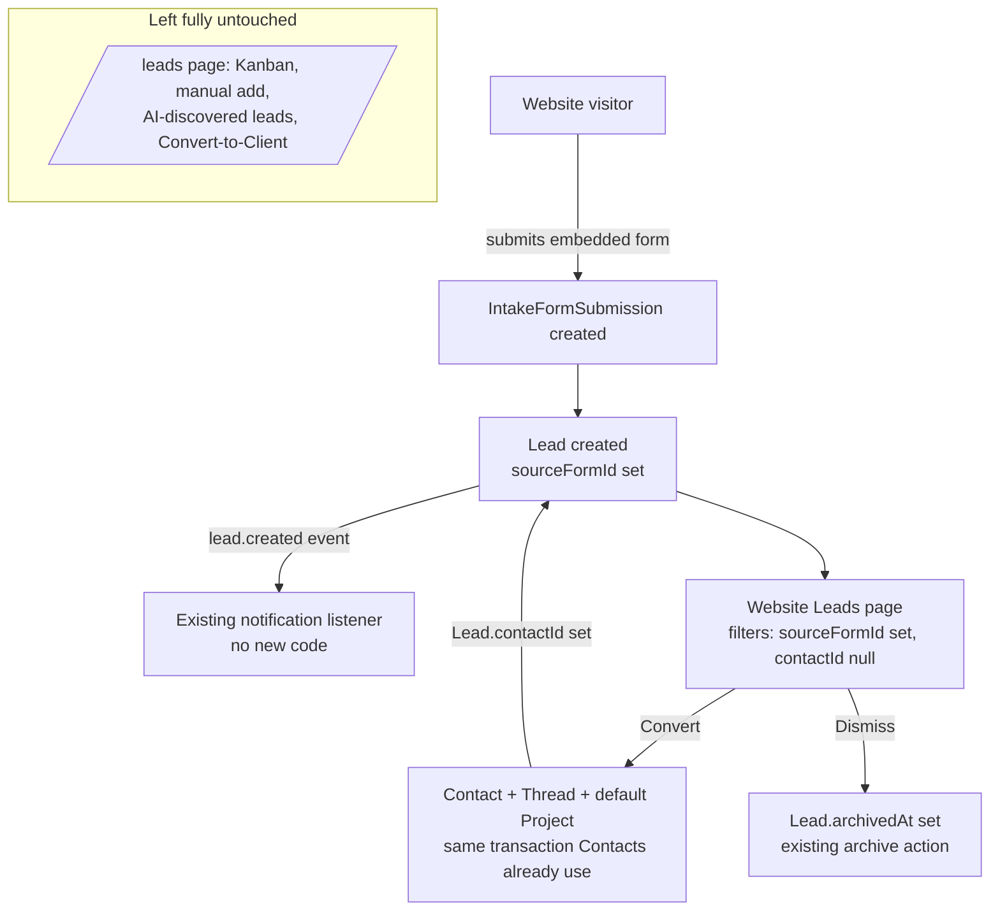

# feat: Website lead capture & review

**Target repos:** `pakka-app` (frontend) and `pakka-api` (backend). File paths below are relative to each repo's root as labeled.

## Summary

Website form submissions create a pending `Lead` row (tagged to the form that produced it) instead of instantly creating a `Contact`. A new, dedicated "Website Leads" page — its own left-nav item — shows only these form-sourced leads for review, with an explicit Convert action that creates a real `Contact`. Everything else already touching the shared `Lead` table (the old `/leads` page, manual lead entry, AI-discovered leads, the legacy Convert-to-Client flow) stays completely untouched.

## Problem Frame

The origin requirements doc scoped this as part of a broader unification: merge manual, AI-discovered, and website-form leads into one reviewed pipeline, and fix the existing Lead "Convert" action (which creates a legacy `Client`) to target `Contact` instead. During planning, that scope was deliberately narrowed — the unified-Contact migration this would have piggybacked on already shipped separately, AI-discovered leads don't belong in a website-form review queue, and touching the shared Convert action risks the currently-working `/leads` page for no benefit to this feature. This plan implements only the website-form-capture half of the origin doc, built so it cannot regress anything already running.

## Key Decisions

- **KD1 — Narrow scope: leave the old Lead surface behaviorally untouched for every existing row (supersedes origin R3, R4, R6, R7).** The old `/leads` page's code, its Kanban/table, manual "Add Lead" (which stays there, not on the new page — R7's "manual add" requirement is satisfied on the old page instead), the AI-discovery "Find Leads" link, and the legacy Convert-to-Client action are not modified, migrated, or merged into anything new. A second, independent Client-auto-creation path found during research (`contracts.service.ts`'s `createFromProposal`) is also left alone. The one necessary exception: the old page's own lead query gains a filter excluding website-form-sourced leads (see U5), so a lead this plan creates can never be reached from the old page's Convert-to-Client action — without this, new rows would silently appear in a Kanban the plan otherwise doesn't touch, undermining the point of the split. This filter changes nothing for any row that existed before this plan, since `sourceFormId` was always null on all of them.
- **KD2 — Reuse the existing `Lead` table via two new nullable columns, not a new table.** `sourceFormId` (tags a lead as website-form-sourced) and `contactId` (marks it converted) are purely additive and null for every existing manual/AI-discovered row — zero behavioral change for code that doesn't reference them.
- **KD3 — The new Convert-to-Contact path is entirely separate code from the existing Convert-to-Client path.** New service method, new DTO, new endpoint, new frontend modal. No shared code, no shared risk.
- **KD4 — `IntakeForm.leadFieldMap` is repointed conceptually, not structurally.** It already maps form fields to `name/email/phone/company/service/budget` — the same field names `Lead` uses. Only the now-redundant `autoCreateLead` toggle is removed; the field-mapping UI and schema stay as-is.
- **KD5 — Country/currency (required by `Contact`, captured by neither `Lead` nor the form) default from the workspace's own settings when present.** The Convert modal collects/overrides them otherwise, mirroring `AddContactModal`'s existing country → currency-suggestion pattern.
- **KD6 — Notifications reuse existing infrastructure; the only new code is a one-line entity-type branch so the notification opens the right page.** `notifications.listener.ts` already has an `@OnEvent('lead.created')` handler that fires an in-app "New enquiry" notification and already loads the lead row — it just needs to set `entityType: 'website-lead'` instead of `'lead'` when `lead.sourceFormId` is set, so the frontend's notification-click route map opens the new review page instead of the old one.
- **KD7 — The FREE-plan active-lead cap applies uniformly, including to form-sourced leads; a workspace at its cap silently skips Lead creation rather than erroring the website visitor.** `LeadsService.create()` already enforces a 3-active-lead cap for manual creation; the new submission path must not silently bypass it, or a workspace could accumulate unlimited leads through its public form regardless of plan. Throwing the same 402 back to an anonymous visitor would be the wrong UX for a public form, though — the visitor doesn't know or care about the workspace's plan. The submission itself (`IntakeFormSubmission`) is still recorded either way; only Lead creation (and its notification) is skipped when the cap is hit.

## Requirements

**Website-form lead capture**
- R1. A website-form submission always creates a Lead row tagged with its source form (see origin R1).
- R2. The `autoCreateLead` toggle is removed from form settings; every submission always creates a pending Lead (see origin R2).
- R3. Submitting a form triggers an in-app notification that opens the new review page, reusing existing notification infrastructure (see origin — new, added during planning per KD6).

**Review and conversion**
- R4. A dedicated Website Leads page, with its own left-nav item, shows only form-sourced leads awaiting review (narrows origin R3/R4 per KD1).
- R5. Each form-sourced lead has an explicit Convert action that creates a real Contact (see origin R5).
- R6. Converting a form-sourced lead reuses the same Contact + Thread + default-Project creation transaction Contacts already use elsewhere, never the legacy Client model (narrows origin R6 per KD1 — applies only via the new endpoint to website-form-sourced leads; manual/AI-discovered leads' existing Convert-to-Client is untouched, KD3).
- R7. A form-sourced lead can be dismissed without converting, using the Lead entity's existing archive behavior.

**Embed discoverability**
- R8. The Website Leads page surfaces a clear entry point into the existing form embed-code panel; no new setup wizard (see origin R8, unaffected by the scope narrowing).

## Key Flows

- F1. **Website visitor submits an embedded form**
  - **Trigger:** A visitor submits the iframe-embedded form on the user's own website.
  - **Steps:** `IntakeForm.submit()` creates the `IntakeFormSubmission` (unchanged) and now always creates a `Lead` tagged with `sourceFormId`; a `lead.created` event fires, producing an in-app notification.
  - **Covered by:** R1, R2, R3

- F2. **Freelancer reviews and converts a lead**
  - **Trigger:** The freelancer opens the Website Leads page.
  - **Steps:** Sees only form-sourced, unconverted leads; clicks Convert; supplies/confirms country and currency; a real Contact (with its default Thread and Project) is created and the lead is marked converted. Or clicks Dismiss, which archives the lead.
  - **Covered by:** R4, R5, R6, R7

## High-Level Technical Design

## Implementation Units

### U1. Backend: Lead schema additions; drop IntakeForm.autoCreateLead

**Goal:** Give `Lead` the two columns this feature needs, and remove the now-unnecessary form toggle — all additive/subtractive with zero effect on existing rows or code paths.

**Requirements:** R1, R2

**Dependencies:** None

**Files (pakka-api):**
- `prisma/schema.prisma` — `Lead` model: add `sourceFormId String?` (+ relation to `IntakeForm`, + `@@index`), add `contactId String?` (+ relation to `Contact`, + `@@index`). `IntakeForm` model: add the matching back-relation `leads Lead[]`; remove `autoCreateLead Boolean @default(false)`. `Contact` model: add the matching back-relation `convertedFromLeads Lead[]`.
- `prisma/migrations/20260803_001_add_lead_source_form_and_contact/migration.sql` (new)

**Approach:** Two `ALTER TABLE "leads" ADD COLUMN` statements (nullable, no default needed), each with a matching FK (`ON DELETE SET NULL`, mirroring the optional-relation FK shape already used throughout this schema for nullable cross-entity references) and index. One `ALTER TABLE "intake_forms" DROP COLUMN "autoCreateLead"`. `leadFieldMap` is untouched. Both new relation fields need an opposite back-relation array field on `IntakeForm` and `Contact` respectively — Prisma's schema validator rejects a one-sided relation, so these aren't optional additions.

**Patterns to follow:** Existing nullable-FK-with-index shape already used for `Lead.clientId`/`Client.leads` in this same model (a matching bidirectional pair), and for other optional relations added across the codebase's unified-contact migrations.

**Test expectation:** none — pure schema/migration change, no behavior yet.

**Verification:** `npx prisma validate` and `npx prisma generate` produce no errors (the back-relation fields are what make this pass). Note: this unit alone leaves `forms.service.ts` and `update-form.dto.ts` referencing the now-removed `autoCreateLead` field — U1 and U2 land together as one deployable change, not as independently-buildable increments. Existing Lead-consuming code that doesn't reference the new fields or `autoCreateLead` (`leads.service.ts`, `discovered-leads.service.ts`, the old `/leads` frontend) is otherwise unaffected.

---

### U2. Backend: form submissions always create a Lead

**Goal:** Every website-form submission produces a pending, source-tagged Lead — never a Contact, never conditional on a toggle.

**Requirements:** R1, R2, R3

**Dependencies:** U1

**Files (pakka-api):**
- `src/modules/forms/forms.service.ts` (`submit()`, replace `createContactFromSubmission` with `createLeadFromSubmission`)
- `src/modules/forms/dto/update-form.dto.ts` (remove `autoCreateLead`)
- `src/modules/notifications/notifications.listener.ts` (`onLeadCreated` — branch `entityType` on `lead.sourceFormId`)

**Approach:** `submit()` drops the `if (form.autoCreateLead)` branch and always calls the new private method. `createLeadFromSubmission` first runs the same FREE-plan active-lead cap check `LeadsService.create()` already enforces (`effectivePlan(user) === 'FREE'` and `count >= 3`, per KD7) — unlike the authenticated create path, hitting the cap here does not throw back to the anonymous visitor; it skips Lead creation (and the notification), while the `IntakeFormSubmission` is still recorded either way. When under the cap, it reuses the exact same field-resolution `get()` closure `createContactFromSubmission` already has (unchanged logic, still driven by `leadFieldMap`), but calls `prisma.lead.create()` instead of `prisma.contact.create()`, setting `sourceFormId: form.id` and `source: 'Form: ${form.title}'` (matching today's existing display string). No `Thread` or `Project` is created here — those only exist once a lead is actually converted (U3). Emits `this.eventEmitter.emit('lead.created', { entityId: lead.id, workspaceId })`, matching `leads.service.ts`'s existing manual-create emit exactly. `onLeadCreated` already loads the lead row to build the notification body — per KD6, it now sets `entityType: lead.sourceFormId ? 'website-lead' : 'lead'` so the notification's click-through (U5) opens the correct page for either source.

**Patterns to follow:** `forms.service.ts`'s existing `createContactFromSubmission` for the field-resolution closure and budget-parsing logic; `leads.service.ts`'s `create()` for the FREE-plan cap check and the `lead.created` emit shape.

**Test scenarios:**
- Happy path: submitting a form with `leadFieldMap` configured for name/email/phone creates a Lead with those fields populated, `sourceFormId` set to the form's id, and `source` set to `"Form: <title>"`.
- Happy path: a submission with no `name` mapping falls back to `respondentName`, then `respondentEmail`, then `"Unknown"` — same fallback chain as today.
- Edge case: a budget-mapped field containing non-numeric text leaves `Lead.budget` unset rather than throwing.
- Edge case: a workspace on the FREE plan already at 3 active leads submits another form response — the `IntakeFormSubmission` is still created, no new `Lead` or notification is created, and the request still returns success to the visitor.
- Integration: a submission (under the cap) emits `lead.created`; the notifications listener creates a `Notification` row with `entityType: 'website-lead'` (not `'lead'`) — exercised via the same listener, no new test infrastructure.

**Verification:** A real form submission produces exactly one Lead row (never a Contact), tagged with `sourceFormId`, and a "New enquiry" notification appears for the workspace that, when clicked, opens the new Website Leads page.

---

### U3. Backend: Convert-to-Contact endpoint on Lead

**Goal:** An isolated, new way to turn a form-sourced Lead into a real Contact — sharing no code with the existing Convert-to-Client path.

**Requirements:** R5, R6, R7

**Dependencies:** U1

**Files (pakka-api):**
- `src/modules/leads/leads.service.ts` (new `convertToContact` method; extend `findAll`'s where-clause with an optional `hasSourceForm` filter)
- `src/modules/leads/leads.controller.ts` (new `POST :id/convert-to-contact` route)
- `src/modules/leads/leads.module.ts` (add `imports: [ContactsModule]` so `ContactsService` can be injected)
- `src/modules/leads/dto/convert-lead-to-contact.dto.ts` (new)
- `src/modules/leads/dto/query-leads.dto.ts` (add optional `hasSourceForm?: boolean`)

**Approach:** `convertToContact(workspaceId, leadId, dto)`: loads the lead scoped to `workspaceId` (404 if missing, matching every other lookup in this service); throws `ConflictException` if `lead.contactId` is already set. Resolves `country`/`currency` from the DTO override, else the workspace's own `country`/`currency`, else — since both can be null on older workspaces — the request is expected to always supply them (the frontend, per KD5, always collects them when workspace defaults are missing). Runs the same atomic transaction shape `ContactsService.create()` already uses elsewhere (Contact + Thread + a default `SCOPING` Project), reusing that transaction rather than writing a parallel Contact-insert — `LeadsModule` currently has no dependency on `ContactsModule`, so this requires adding the import for the injection to resolve at boot. Because it calls `ContactsService.create()` unchanged, the FREE-plan 3-active-contact cap already inside that method also applies to conversion; a workspace at that cap gets the same 402 `PLAN_LIMIT` response `AddContactModal` already knows how to surface. Sets `lead.contactId` to the new Contact's id; does not touch `lead.stage` or `lead.clientId` — this keeps the old `/leads` Kanban's grouping-by-stage behavior completely unaffected for any lead this path touches. Emits `lead.convertedToContact` (a new, distinctly-named event — not the existing `lead.converted`, whose payload shape assumes a `clientId`). `findAll`'s `hasSourceForm: true` maps to `where: { sourceFormId: { not: null } }`; omitting the param leaves the existing query behavior completely unchanged.

**Patterns to follow:** `contacts.service.ts`'s `create()` for the Contact+Thread+Project transaction; `leads.service.ts`'s existing `convertToClient` for the lookup/guard/transaction shape (structure only — no shared code, per KD3).

**Test scenarios:**
- Happy path: converting a lead with `sourceFormId` set and no prior `contactId` creates a Contact, a Thread, and a default `SCOPING` Project, and sets `lead.contactId`.
- Edge case: converting when the request omits country/currency overrides uses the workspace's own `country`/`currency`.
- Edge case: converting the same lead a second time (contactId already set) returns 409 Conflict and creates no duplicate Contact.
- Edge case: converting on a FREE-plan workspace already at 3 active Contacts returns the existing 402 `PLAN_LIMIT` response, and the lead's `contactId` stays unset.
- Error path: converting a lead ID belonging to a different workspace returns 404.
- Integration: `GET /leads?hasSourceForm=true` returns only leads with `sourceFormId` set; the same request without the param returns the full, unfiltered list exactly as before this unit shipped (regression check for the old `/leads` page's existing calls).

**Verification:** Manually converting a real form-sourced lead produces a visitable Contact with a default Project; afterward, manually re-exercise the old `/leads` page's list/Kanban/Convert-to-Client flow and confirm it behaves identically to before this unit shipped.

---

### U4. Frontend: hooks for the new review flow

**Goal:** Data-fetching support for the new page, additive to the existing Leads hooks.

**Requirements:** R4, R5

**Dependencies:** U3

**Files (pakka-app):**
- `src/features/leads/hooks/useLeads.ts` (extend `useLeads`'s params with optional `hasSourceForm`; add `useConvertLeadToContact`)

**Approach:** `hasSourceForm` is forwarded to the query only when defined, matching this hook's existing param-forwarding convention (`source`, `stage`, etc.) — existing callers that omit it see no change. `useConvertLeadToContact` mirrors `useConvertLeadToClient`'s structure (mutation, invalidates `leads` and `contacts` query keys) but navigates to `/contacts/:id` on success instead of `/clients/:id` or `/projects/:id`, and handles a `PLAN_LIMIT` error response the same way `useCreateContact` already does (surfacing the upgrade prompt), since converting can now hit the Contact plan cap (U3).

**Patterns to follow:** `useLeads.ts`'s existing `useConvertLeadToClient` for the mutation shape.

**Test expectation:** none — thin hook layer, covered by U3's endpoint tests and U5's manual verification.

**Verification:** The hook returns the form-sourced-only list when `hasSourceForm` is passed, and the convert mutation succeeds end-to-end against the U3 endpoint.

---

### U5. Frontend: Website Leads page, Convert modal, and nav entry

**Goal:** A place to review and act on form-sourced leads, reachable from its own nav item.

**Requirements:** R4, R5, R6, R7, R8

**Dependencies:** U4

**Files (pakka-app):**
- `src/pages/app/WebsiteLeadsPage.tsx` (new)
- `src/features/leads/components/ConvertLeadToContactModal.tsx` (new)
- `src/router/index.tsx` (add `/website-leads` route)
- `src/components/layout/Sidebar.tsx` (add a new nav entry; add its id to `SECTIONS`)
- `src/pages/app/LeadsPage.tsx` (add `hasSourceForm: false` to its existing `useLeads()` call — see KD1)
- `src/features/notifications/components/NotificationBell.tsx` (add a `'website-lead'` entry to `ENTITY_ROUTES`, pointing at `/website-leads`)

**Approach:** `WebsiteLeadsPage` is a simple reviewable list, not a Kanban — there's no stage concept for a pending review queue. Each row shows name/company/source-form title/submitted date, with Convert and Dismiss actions. Dismiss calls the existing `useArchiveLead`, followed by a brief toast offering Undo via the existing `useUnarchiveLead` — dismissing should not feel like a silent, permanent removal. The list has three explicit states: an empty state ("No leads yet") with the embed-code link doubling as the call to action, a loading skeleton matching the row layout, and an inline error/retry state on fetch failure. A "Get your embed code" link points at `/forms` (R8) — no new setup flow. `ConvertLeadToContactModal` mirrors `ConvertLeadModal`'s override-collection UX (name/email/phone/company pre-filled, editable) plus required country/currency selects following `AddContactModal`'s existing `ALL_COUNTRIES`/`getCountryDefaults`/`currencySymbol` pattern, pre-filled from workspace defaults when present. The new Sidebar entry uses a fresh `id` (e.g. `website-leads`), gated by the existing `Permission.VIEW_LEADS` (matching `contacts`/`pipeline`), placed directly after `contacts` in the unlabeled first section — not uncommenting the existing commented-out `leads` entry, so nothing tied to that old id/permission gets accidentally reactivated. `LeadsPage.tsx`'s existing list call is the one necessary touch to the old page (per KD1): adding `hasSourceForm: false` excludes website-form-sourced leads from its view so its Convert-to-Client action can never reach one — a no-op for every row that existed before this plan.

**Patterns to follow:** `ConvertLeadModal.tsx` for the override-collection form shape; `AddContactModal.tsx` for the country → currency-suggestion select and its `PLAN_LIMIT` handling; `Sidebar.tsx`'s existing `ALL_NAV_ITEMS`/`SECTIONS` shape for the new entry; `ContactHistoryTab.tsx`'s or similar existing skeleton/empty-state conventions on this page for the list's three states.

**Test expectation:** none — this codebase has no frontend automated test suite; verification is manual.

**Verification:** The new nav item shows only form-sourced, unconverted leads, with correct empty/loading/error states. Converting one creates a real Contact and removes it from the pending list; converting on a FREE-plan workspace at its Contact cap surfaces the upgrade prompt instead. Dismissing one archives it (with an Undo option) without creating anything. The `lead.created` notification for a form submission opens the new page, not the old one. The old `/leads` page no longer lists the just-created lead, and its list/Kanban/Convert-to-Client flow otherwise behaves identically to before this unit shipped.

---

### U6. Frontend: remove the Auto-create lead toggle from FormBuilderPage

**Goal:** Match the backend's removal of `autoCreateLead` — the UI no longer offers a toggle that no longer does anything.

**Requirements:** R2

**Dependencies:** U2

**Files (pakka-app):**
- `src/pages/app/FormBuilderPage.tsx` (remove `autoCreateLead` state and its toggle UI; retitle the field-mapping card)
- `src/features/forms/hooks/useForms.ts` (remove `autoCreateLead` from the `IntakeForm` type and update-payload type)

**Approach:** Delete only the toggle sub-UI and its state. The `leadFieldMap` UI stays exactly as-is — it's still functionally used, just unconditionally now. Update the card's title/description copy so it reads as mapping fields into a reviewable lead, not "auto-creating" anything.

**Test expectation:** none — pure UI removal; behavior is covered by U2's backend tests.

**Verification:** Editing a form no longer shows the removed toggle; existing `leadFieldMap` configuration continues to save and load correctly.

---

## Scope Boundaries

**Deferred / out of scope:**
- The old `/leads` page (Kanban, table, manual "Add Lead," AI-discovery "Find Leads" link) and the legacy Convert-to-Client action — left completely untouched, not migrated or merged into anything new (KD1).
- The second silent Lead→Client creation path in `contracts.service.ts`'s `createFromProposal` — out of scope; this plan does not touch Client-conversion anywhere.
- Any guided, platform-specific embed setup wizard — R8 is satisfied by a link into the existing embed panel, not a new flow.
- The prior architectural doc calling for eliminating Lead→Client conversion entirely (`pakka-api/docs/brainstorms/2026-07-07-unified-contact-entity-requirements.md`) — not acted on here; this plan neither advances nor blocks that separate, larger effort.

## Dependencies / Assumptions

- **Assumption:** `Workspace.country`/`Workspace.currency` may both be null on older workspaces. The Convert modal must be able to collect both rather than assuming a default always exists.
- **Assumption:** removing `autoCreateLead` removes the one opt-out a workspace owner had against promoting visitor-submitted PII into the CRM (previously, leaving it off kept a submission in `IntakeFormSubmission` only). This is an accepted, deliberate consequence of R2 — every form now always produces a reviewable Lead — not something this plan works around.
- **Dependency:** the Convert-to-Contact transaction reuses the exact Contact+Thread+Project shape already established in `contacts.service.ts`'s `create()`. If that shape changes in a future, unrelated plan, this unit's approach should be revisited.

## Risks

- Reusing the shared `Lead` table means any future schema change to `Lead` (e.g., a stricter `NOT NULL` migration) must account for `sourceFormId`/`contactId` being legitimately null for the vast majority of existing manual/AI-discovered rows. Not a risk this plan introduces, but worth flagging — `Lead` already has one such pending, currently-blocked migration from earlier work, unrelated to this plan.

## Sources & Research

- `pakka-api/prisma/schema.prisma:412-449` (`Lead`/`LeadStage`), `:319-348` (`IntakeForm`/`IntakeFormSubmission`), `:84-85` (`Workspace.country`/`currency`).
- `pakka-api/src/modules/forms/forms.service.ts:99-170` — `submit()` and `createContactFromSubmission()`, the pattern U2 mirrors.
- `pakka-api/src/modules/leads/leads.service.ts:151-231` — existing `convertToClient`, the structural (not code-sharing) pattern U3 follows.
- `pakka-api/src/modules/contacts/contacts.service.ts` — the canonical Contact+Thread+default-Project transaction U3 reuses.
- `pakka-api/src/modules/notifications/notifications.listener.ts:160-194` — existing `lead.created`/`form.submitted` handlers that already produce in-app notifications and already load the lead row, making the `sourceFormId`-based `entityType` branch (KD6) a one-line addition.
- `pakka-app/src/features/notifications/components/NotificationBell.tsx:52-56` — `ENTITY_ROUTES`, the notification-click route map U5 adds a `'website-lead'` entry to.
- `pakka-api/src/modules/leads/leads.module.ts` / `pakka-api/src/modules/contacts/contacts.module.ts` — confirmed `LeadsModule` does not currently import `ContactsModule`; U3 adds that import so `ContactsService` can be injected.
- `pakka-api/src/modules/leads/leads.service.ts:20-25` — the FREE-plan active-lead cap check U2 reuses; `contacts.service.ts`'s equivalent Contact-cap check inside `create()` is what U3's conversion path inherits for free by calling that method.
- `pakka-api/src/modules/discovered-leads/discovered-leads.service.ts:43` and `pakka-api/src/modules/contracts/contracts.service.ts:90-118` — the AI-discovery Lead-creation path and the second silent Lead→Client path, both confirmed live and both explicitly left untouched (KD1).
- `pakka-app/src/pages/app/LeadsPage.tsx` and `pakka-app/src/features/leads/**` — the existing Lead UI confirmed to have no left-nav entry today (commented out in `Sidebar.tsx:35`), reachable only by direct URL; this plan doesn't add one back, and touches `LeadsPage.tsx` only for the one-line `hasSourceForm: false` filter (U5).
- `pakka-app/src/components/layout/Sidebar.tsx:31-56` — `ALL_NAV_ITEMS`/`SECTIONS` shape the new nav entry follows.
- `pakka-app/src/features/contacts/components/AddContactModal.tsx` — the country → currency-suggestion pattern (`ALL_COUNTRIES`, `getCountryDefaults`, `currencySymbol`) U5's Convert modal reuses.
- `pakka-app/docs/brainstorms/2026-08-02-website-lead-capture-and-review-requirements.md` — origin doc; scope narrowed per KD1, see Problem Frame.
- `pakka-api/docs/brainstorms/2026-07-07-unified-contact-entity-requirements.md` — prior doc calling for full Lead→Client elimination; not advanced by this plan (Scope Boundaries).
