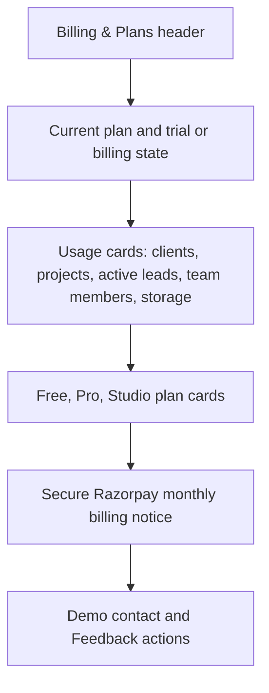
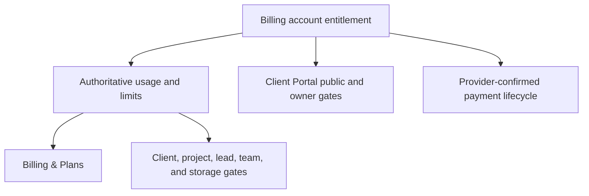

# Pakka Account Billing & Plans - Plan

## Goal Capsule

- **Objective:** Replace Pakka's dormant, inconsistent billing experience with a complete account-wide Billing & Plans product that manages trials, paid plans, usage, limits, and Client Portal access.
- **Product authority:** This plan owns customer-facing billing, account entitlements, usage limits, Client Portal gating, payment lifecycle behavior, and the supporting backend behavior in `pakka-app` and `pakka-backend`. It does not redefine unrelated document sharing or build a new international billing product.
- **Open blockers:** None. The demo/contact and feedback destinations must be configured and testable before release.

---

## Product Contract

### Summary

Pakka will provide an account-wide Billing & Plans destination based on the supplied visual direction, with live plan status, account-wide usage, real Razorpay upgrades, and working support actions.

It will launch Free, Pro, and Studio plans, grant every current and newly registered account Pro access for three months, and enforce limits consistently across every workspace and the Client Portal.

### Problem Frame

The existing billing UI is hidden, uses the obsolete Solo/Studio catalogue, and does not show usage. Plan checks are split across features, use different limits, and cannot safely represent a single account operating in several workspaces.

The Client Portal currently exposes public token-based data and actions without an entitlement boundary. A billing redesign that only changes the page would leave limits bypassable and Portal data available to Free accounts.

### Actors

- A1. **Billing account owner or authorized billing manager** — sees the account plan, usage, trial state, and billing actions.
- A2. **Account team member** — works in one or more account workspaces and receives the same entitlement gates without gaining billing-management authority.
- A3. **Client Portal visitor** — accesses a shared client portal only while the owning account has Pro or Studio access.
- A4. **Payment provider** — confirms paid subscriptions and their lifecycle so Pakka never treats an unverified checkout as a successful upgrade.

### Key Decisions

- **One account plan across all workspaces** (session-settled: user-directed — chosen over workspace-scoped billing: the user requires one plan across every workspace). Governs R1, R2, R6, R12–R18.
- **Free, Pro, and Studio replace the legacy catalogue** (session-settled: user-directed — chosen over retaining Solo/Studio: the new commercial model and feature matrix must match the approved direction). Governs R3, R7–R10.
- **Every current and new account receives a three-month Pro grant** (session-settled: user-directed — chosen over starting accounts on Free: launch users should receive Pro access before subscription). Governs R4, R5, R9, AE1–AE2.
- **Limits preserve data and block future use** (session-settled: user-approved — chosen over automatically deleting or archiving data: people retain their work while seeing a clear upgrade path). Governs R14, AE5–AE6.
- **Client Portal has a real entitlement boundary** (session-settled: user-approved — chosen over an in-app-only upsell: Free accounts must not continue to expose Portal data through public links). Governs R16–R18, AE7–AE8.
- **Every shown billing control must work end to end** (session-settled: user-directed — chosen over a visual-only billing refresh: live data, payment outcomes, feedback, and demo actions must be genuine). Governs R6–R11, R19–R20, AE3–AE4, AE9.

### Requirements

**Account ownership and launch access**

- R1. Every account has one effective billing entitlement that applies to all workspaces and all team members belonging to that account; switching workspaces never changes the plan or resets its usage.
- R2. Only the billing account owner or an authorized billing manager may start, change, or cancel a paid subscription; other team members may see the relevant plan state and receive upgrade guidance without being able to alter billing.
- R3. The catalogue is Free, Pro, and Studio. Free costs ₹0, Pro costs ₹149 per month, and Studio costs ₹650 per month; paid pricing is INR and billed monthly through Razorpay.
- R4. Every current account is moved to a Pro access grant at launch, and every new account receives the same grant on registration. The grant lasts three calendar months and requires no payment method or checkout.
- R5. When a Pro grant expires without a paid subscription, the account becomes Free. The billing surface tells the account owner when the grant ends and offers the paid upgrade path before and after expiry.

**Billing & Plans experience**

- R6. Pakka provides a reachable, authenticated Billing & Plans destination that renders the account's real effective plan, subscription or trial state, renewal or expiry date, and current account-wide usage; no values may be hard-coded or derived from a paginated client list.

- R7. The plan cards use the approved feature contract:

| Plan | Included access |
|---|---|
| Free | Up to 5 clients, 10 projects, 30 active leads, meetings and reminders, 0 team members, 100 MB storage; Client Portal is locked. |
| Pro | Up to 30 clients, 60 projects, 300 active leads, 5 team members, 2 GB storage, Client Portal, project files and payments, and everything in Free. |
| Studio | Unlimited clients, projects, active leads, team members, and storage; priority support and everything in Pro. |

- R8. The current-plan card accurately distinguishes a grant, Free access, an active paid plan, cancellation-at-period-end, payment failure, and paused or expired access. A current plan cannot be purchased again; each valid upgrade action is available and contextual.
- R9. Free-to-Pro, Free-to-Studio, and Pro-to-Studio actions open a valid monthly Razorpay checkout. Pakka changes access only after payment verification or a provider lifecycle event confirms it, then refreshes billing and entitlement-dependent UI across all workspaces.
- R10. Cancellation and re-subscription are working billing actions. A paid cancellation keeps access until the already-paid period ends, then applies Free behavior unless the account re-subscribes.
- R11. The “secure payments by Razorpay” notice, founder/demo contact, and Feedback control are functional. Demo/contact and feedback messages reach a configured, testable destination and report genuine delivery failure rather than false success.

**Usage truth and enforcement**

- R12. The server returns one authoritative account-wide usage and limits summary for the five Billing & Plans metrics. The client displays that contract and refreshes it after relevant mutations.

- R13. Usage uses these visible meanings for the account across its workspaces:

| Metric | Meaning |
|---|---|
| Clients | Non-archived Contact records in the client or past-client stage. |
| Projects | Non-archived projects. |
| Active leads | Non-archived Contact records in the enquiry, proposal-sent, or negotiating stages. |
| Team members | Unique active teammates across account workspaces, excluding the billing owner; a seat cannot be exceeded when an invitation is accepted. |
| Storage | Qualifying stored file bytes owned by the account; the value cannot trust browser-supplied metadata alone or knowingly omit a supported storage source. |

- R14. The same entitlement rules are enforced server-side for every direct and indirect creation path for clients, projects, active leads, teammates, and stored files. A request at capacity fails without creating a partial record and leads the app to the common upgrade experience.
- R15. An account that moves to a plan whose capacity is below its current usage keeps its records and existing membership data. Billing and relevant feature screens visibly show the over-limit state, while new limited records, invitations, uploads, and paid-only actions remain blocked until the account upgrades or reduces use.

**Client Portal entitlement**

- R16. The active contact-facing owner experience visibly includes Client Portal. On Free it shows the approved locked panel with “Unlock the Client Portal from ₹149/month” and an upgrade action; it does not expose a usable portal link. On Pro and Studio it exposes the existing Portal management and sharing actions.
- R17. A Free account's public Client Portal is unavailable to visitors. The entitlement boundary applies consistently to portal data, files, messages, invoice-payment actions, and equivalent token-based Portal actions; visitors see an intentional unavailable state without receiving protected content.
- R18. Portal access resolves from the account entitlement even when a contact belongs to a secondary workspace, and an upgrade or expiry changes Portal access without requiring token regeneration.

**Functional quality**

- R19. All billing states and actions have deliberate loading, empty, permission, checkout-dismissed, payment-failed, webhook-delayed, and retry states. The product never displays a successful plan change until the backend confirms it.
- R20. The Billing & Plans layout follows the supplied visual hierarchy on desktop and remains usable on narrow screens, with accessible labels, keyboard actions, and readable progress values.

### Key Flows

- F1. **Launch or registration grant**
  - **Trigger:** A current account is migrated or a person registers.
  - **Actors:** A1, A4.
  - **Steps:** Pakka gives the account Pro access for three calendar months without checkout, shows the expiry in Billing & Plans, and applies the Pro capabilities across every workspace.
  - **Outcome:** The account receives Pro immediately and falls to Free only after the grant or a paid period ends. Covers R1, R4, R5, R8.

- F2. **Paid upgrade**
  - **Trigger:** A1 selects an available Pro or Studio plan action.
  - **Actors:** A1, A4.
  - **Steps:** Pakka opens the Razorpay monthly checkout, waits for verified confirmation, updates the effective entitlement, and refreshes plan, usage, and gates.
  - **Outcome:** A successful payment enables the purchased plan across all account workspaces; dismissal or failed payment leaves the prior state intact. Covers R2, R3, R8–R10, R19.

- F3. **Limit encounter**
  - **Trigger:** A1 or A2 creates a limited resource, invites a teammate, or uploads a file at capacity.
  - **Actors:** A1, A2.
  - **Steps:** The server checks the account entitlement and authoritative usage before completing the action. Pakka preserves existing data, refuses the new action, and presents the common upgrade path.
  - **Outcome:** Limits cannot be bypassed through another workspace or an indirect creation path. Covers R1, R12–R15.

- F4. **Client Portal on Free**
  - **Trigger:** A1 opens Client Portal for a contact, or A3 follows a portal link after the account is Free.
  - **Actors:** A1, A3.
  - **Steps:** The owner sees the ₹149 Pro upgrade panel. A public Portal request is denied before it returns data or performs a Portal action.
  - **Outcome:** The account can upgrade from the owner view, while the visitor sees an intentional unavailable state. Covers R16–R18.

- F5. **Cancellation or expiry**
  - **Trigger:** A1 cancels a paid plan or a grant or paid period ends.
  - **Actors:** A1, A4.
  - **Steps:** Pakka keeps access through the already-earned end date, then applies Free limits without deleting data and updates every entitlement-controlled surface.
  - **Outcome:** Existing work remains intact, future restricted actions are blocked, and public Portal access closes on Free. Covers R5, R10, R15, R17.

### Acceptance Examples

- AE1. **Covers R4, R5, R8.** **Given** a current account at launch, **When** the migration completes, **Then** it has Pro access for three calendar months without a payment method and Billing & Plans shows the grant expiry.
- AE2. **Covers R1, R4, R6.** **Given** a person registers a new account with multiple workspaces later, **When** they view Billing & Plans in any workspace, **Then** each view shows the same Pro grant and one account-wide usage total.
- AE3. **Covers R7–R10, R19.** **Given** a Free account chooses Studio, **When** its Razorpay checkout is dismissed or fails, **Then** it remains Free. **When** the provider confirms payment, **Then** the account becomes Studio and every workspace refreshes to the new access.
- AE4. **Covers R10, R19.** **Given** a paid account cancels, **When** the cancellation is confirmed, **Then** Billing & Plans shows the final access date and access remains until that date rather than becoming Free immediately.
- AE5. **Covers R12–R15.** **Given** an account has 30 clients on Pro, **When** it tries to create a 31st client, **Then** the server rejects the action, no partial client exists, and the app offers the Pro-to-Studio upgrade path.
- AE6. **Covers R12–R15.** **Given** a trial expires while the account exceeds a Free limit, **When** a user views Billing & Plans, **Then** it shows the actual over-limit usage and retains existing data. **When** the user tries to add another limited item, **Then** the action is blocked until the account upgrades or reduces usage.
- AE7. **Covers R16.** **Given** a Free account owner opens a current Contact, **When** they select Client Portal, **Then** they see the approved locked panel and upgrade action rather than a copyable or usable Portal link.
- AE8. **Covers R17, R18.** **Given** a Portal token belongs to a contact in any workspace of a Free account, **When** a visitor requests portal content, files, messages, or a Portal payment action, **Then** the request returns no protected content and the visitor sees the unavailable state.
- AE9. **Covers R6, R11, R19.** **Given** an owner opens Billing & Plans, **When** they use Feedback or founder/demo contact, **Then** Pakka records or sends the request to its configured destination and reports success only after the destination accepts it.

### Success Criteria

- An account owner can understand their actual plan, trial or billing status, all five usage metrics, and the next available upgrade without leaving Billing & Plans.
- Plan limits hold consistently across all account workspaces and creation routes, verified at the server rather than trusted to the browser.
- A Free account cannot expose Client Portal content or perform Portal actions through an existing public token.
- Every visible billing, upgrade, cancellation, feedback, and demo action reaches a real outcome or reports a clear failure.

### Scope Boundaries

**Deferred for later**

- Annual billing, a new coupon or promotional pricing program, and a foreign-currency or Stripe pricing redesign.
- New white-label Portal functionality beyond preserving any already working behavior.
- Broader product analytics beyond the Billing & Plans usage and lifecycle signals needed here.

**Outside this product's identity**

- Revoking separately shared public proposal, contract-signing, or invoice links; this plan gates the Client Portal surface only.
- Automatically deleting, archiving, or removing a customer's data or existing teammates when their entitlement falls below present usage.

### Dependencies / Assumptions

- Razorpay remains the INR monthly payment authority. The user states there are no live subscriptions at rollout, so the catalogue transition may downgrade all current accounts to the Pro grant rather than preserve an active paid subscription.
- Authoritative storage accounting requires a server-trustworthy view of stored bytes; Attachment metadata alone is insufficient.
- Demo/contact and feedback require configured delivery details and a production-ready outbound delivery path before their controls can claim success.

### Outstanding Questions

- **Resolve Before Planning:** None.
- **Deferred to Planning:** None. The implementation contracts below settle the billing-account resolver, paid-plan migration mechanics, storage accounting, provider mapping, support delivery, and verification approach.

### Sources / Research

- `pakka-app/src/features/billing/components/BillingTab.tsx`, `pakka-app/src/features/billing/components/PlanCards.tsx`, `pakka-app/src/features/billing/hooks/useSubscription.ts`, `pakka-app/src/features/billing/hooks/useCurrentPricing.ts`, `pakka-app/src/pages/app/SettingsPage.tsx`, and `pakka-app/src/router/index.tsx` — current dormant billing UI, routing, and payment client behavior.
- `pakka-backend/prisma/schema.prisma`, `pakka-backend/src/modules/users/resolve-workspace-id.ts`, and `pakka-backend/src/modules/workspaces/workspaces.service.ts` — current user-level plan fields, workspace scoping, and secondary-workspace identity behavior.
- `pakka-backend/src/modules/payments/payments.controller.ts`, `pakka-backend/src/modules/payments/payments.service.ts`, `pakka-backend/src/modules/payments/plan-resolution.service.ts`, `pakka-backend/src/modules/payments/razorpay.provider.ts`, and `pakka-backend/src/modules/payments/stripe.service.ts` — existing payment lifecycle and pricing behavior.
- `pakka-backend/src/modules/contacts/contacts.service.ts`, `pakka-backend/src/modules/projects/projects.service.ts`, `pakka-backend/src/modules/leads/leads.service.ts`, `pakka-backend/src/modules/team/team.service.ts`, and `pakka-backend/src/modules/attachments/attachments.service.ts` — resource creation, current limits, and storage-accounting gaps.
- `pakka-app/src/pages/app/ContactPage.tsx`, `pakka-app/src/pages/public/ClientPortalPage.tsx`, `pakka-backend/src/modules/portal/portal.controller.ts`, `pakka-backend/src/modules/portal/portal.service.ts`, `pakka-backend/src/modules/messages/messages.service.ts`, and `pakka-backend/src/modules/attachments/attachments.service.ts` — active owner Portal UI and public token-based Portal surfaces.
